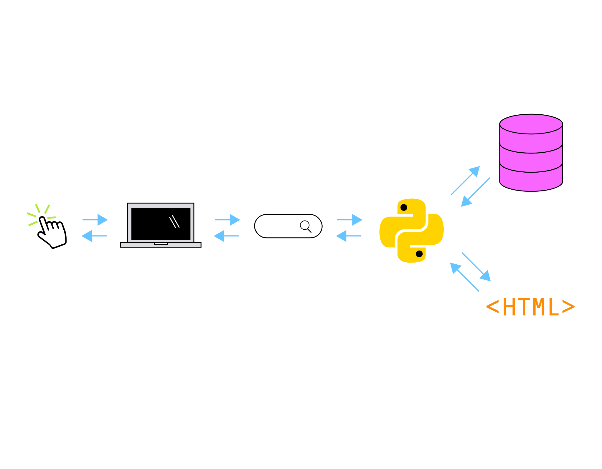

#### CREATING YOUR FIRST DJANGO APP

# [Introduction to Django](https://www.codecademy.com/paths/build-python-web-apps-with-django/tracks/introduction-to-django/modules/introduction-to-django/lessons/creating-your-first-django-app/exercises/introduction-to-django)

Welcome to the world of Django!

Django, pronounced like JANG-go with a silent D, is a high-level web framework that is written with Python — one of the most readable and beginner-friendly programming languages. 
Django can be used to rapidly build complex database-driven websites. 
Like Python, Django is often considered to be strongly opinionated. 
An opinionated software has guidelines and defaults, such as code structure, project structure, for developing code. 
Django’s opinionated approach means specific ways of writing code and a steeper learning curve to apply the 
[“Django philosophy“](https://docs.djangoproject.com/en/3.1/misc/design-philosophies/). 
However, it comes with advantages when onboarding new teammates to a project and debugging code because of how structured a Django project is.

Django is an open-source project, supported by the 
[Django Software Foundation](https://www.djangoproject.com/foundation/)
, and has a strong community of contributors. 
It has been used by many well-known data-heavy websites such as Instagram, Youtube, and Dropbox. 
In this lesson, we’ll create together our first Django app! 
More importantly, we’ll experience first-hand how its design helps to take applications from concept to completion using its “batteries included” approach.

# [What is a Web Framework?](https://www.codecademy.com/paths/build-python-web-apps-with-django/tracks/introduction-to-django/modules/introduction-to-django/lessons/creating-your-first-django-app/exercises/what-is-a-web-framework)

Let’s first establish what it means when we say ***Django is a web framework***.

Web frameworks are a type of software development tool that makes it easier and faster to develop web applications. 
They are a type of code library that provides code and patterns for database access, as well as templating systems for content. 
They promote code reuse, so we don’t have to write as much code to get a project running. 
Some features most web frameworks include are:
* URL routing
* Input form management and validation
* Templating engines for HTML and CSS
* Database configuration
* Web security
* Session repository and retrieval

Out of the box, Django comes with an admin panel, a user authentication system, a database, 
and something called object-relational mapper (ORM) that helps a web application interact with a database. 
These are some of the “batteries” included in Django to help build projects faster without having to worry about which tools to use.

Later we’ll see how we can bootstrap a fully featured web application in only a handful of commands.

# [How Django Works](https://www.codecademy.com/paths/build-python-web-apps-with-django/tracks/introduction-to-django/modules/introduction-to-django/lessons/creating-your-first-django-app/exercises/how-django-works)

Before we create our first Django web app, let’s take a little look into how Django works underneath the hood. 
The Django project describes itself as an MTV framework, using Models, Templates and Views. 
Let’s break down these components:
* The model portion deals with data and databases, it can retrieve, store, and change data in a database.
* The template determines how the data looks on a web page.
* The view describes the data to be presented, and passes this information to the template.

With the basics of the components explained let’s understand how they work together when we visit a Django website. 
When a request comes to a web server, it’s passed to Django to figure out what is requested. 
A client requests a URL, let’s use codecademy.com as an example, Django will take the web address and pass it to its urlresolver. 
Django will try to match the URL to a list of patterns, and if there is a match, then pass the request to the associated view function.

Imagine a mail carrier delivering a letter. 
They walk down the street checking each house number until they find the exact one on the letter. 
Once they find the house, they deliver the letter. 
That’s how the urlresolver works!

When we land on the right page, Django uses data from the model and feeds it into the view function to determine what data is shown. 
That data is given to the template and presented to us via the web page.

This is a bit of a simplified version of what Django is doing underneath the hood, but a key takeaway is that Django follows this MTV pattern.

