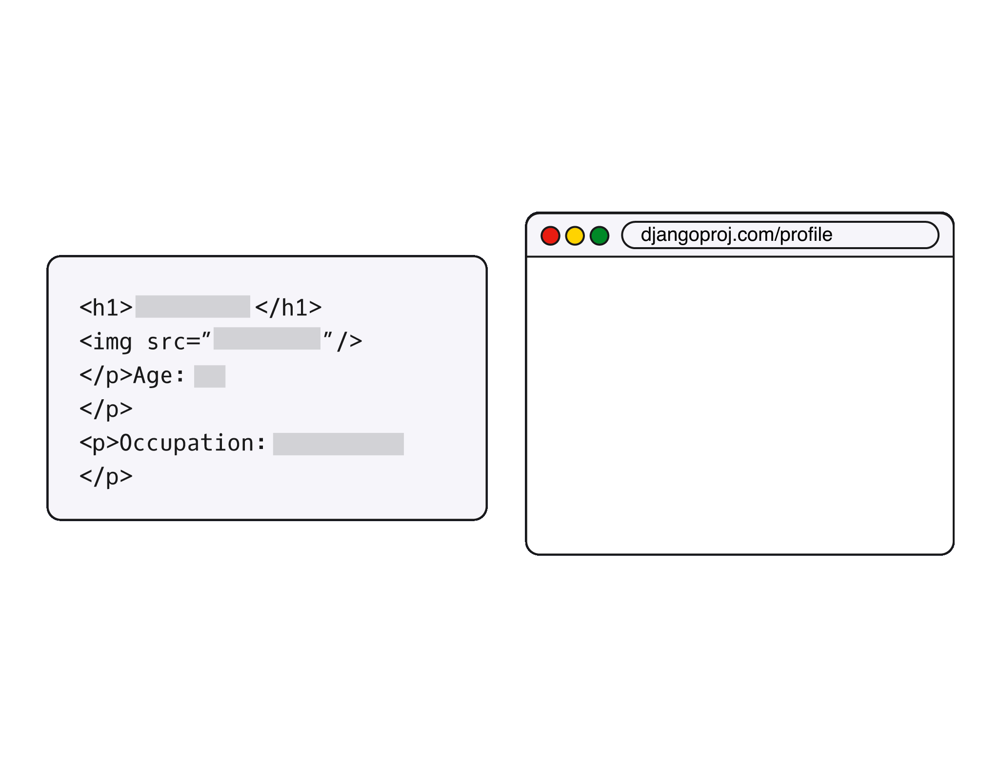

#### TEMPLATES

# [What is a Template?](https://www.codecademy.com/paths/build-python-web-apps-with-django/tracks/templates-in-django/modules/django-templates/lessons/django-templates-lesson/exercises/what-is-a-template)

In Django, *templates* are going to be the user facing content. 
These templates are made mostly of HTML, and are usually just HTML files. 
However, Django templates usually have added *Django Template Language*, or *DTL*, modifications. 
We’ll be going into DTL later though, so don’t worry too much about it right now.

In order to create templates, they have to be stored in the application in a folder called **templates/**. 
Another folder needs to be created inside of this **templates/** folder that uses the same name of the application. 
All of the templates will go into this folder named after the application. 
The full file path to a template should look like this:
```
projectname/
 |-- appname/
     |-- templates/
          |-- appname/
              |-- first_template.html
```
In this lesson we’ll go over creating templates 
and getting the full use of the DTL inside of those templates to make it easier to design the front end of any Django application.


