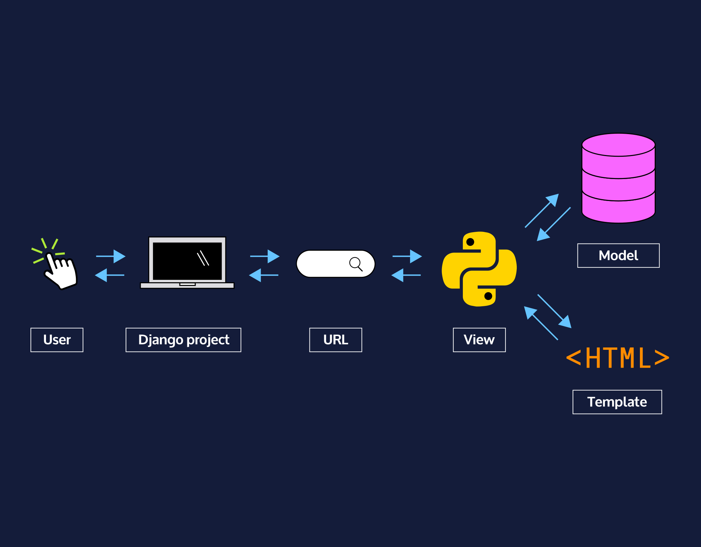

# [The Convenience of Templates](https://www.codecademy.com/paths/build-python-web-apps-with-django/tracks/templates-in-django/modules/django-templates/informationals/django-the-convenience-of-templates)

Django allows makes it easier for developers to create templates!

Django uses templates to display information to users. 
In conventional web development, web pages are written with HTML. 
But if templates were written in pure HTML then we don’t really need Django.

Rather, Django gives us [Django Template Language (DTL)](https://docs.djangoproject.com/en/3.1/ref/templates/language/) 
which lets us inject variables, logic, and control flow inside of our HTML - supercharging our HTML files to do so much more than provide static content.

