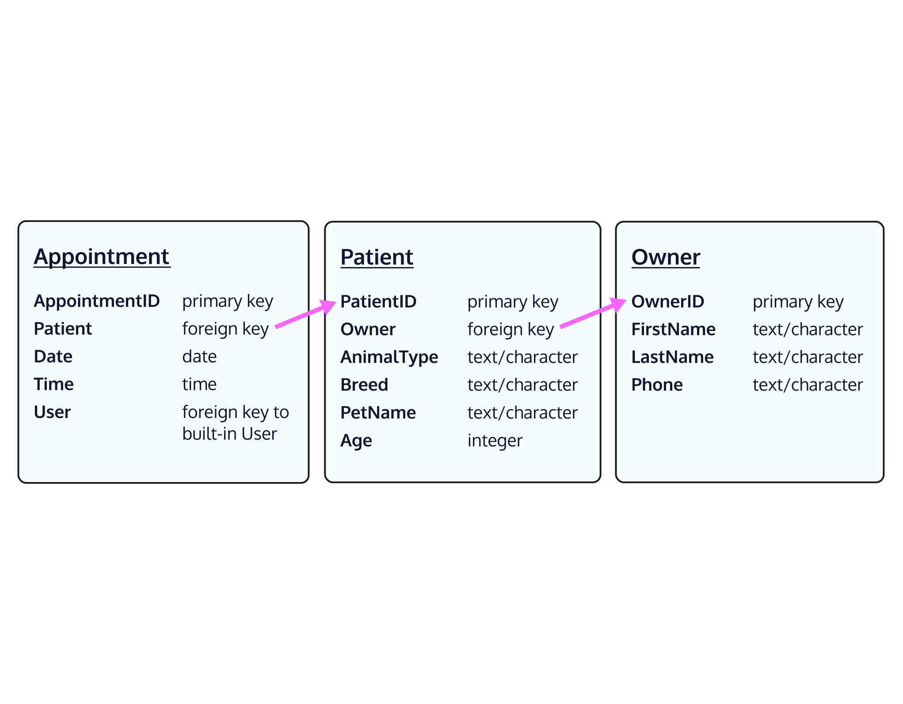

#### MODELS AND DATABASES

# [Creating a Schema](https://www.codecademy.com/paths/build-python-web-apps-with-django/tracks/data-in-django/modules/django-models-and-databases/lessons/django-models-and-databases/exercises/creating-a-schema)

Before we start writing code and committing information to our database, we need to take some time to consider the shape of the data that goes in. 
Some key questions are:
* What models do we want to create?
* What model properties do we need to keep?
* How do different models relate to each other?

As mentioned earlier, thinking through this process means that we’re coming up with a schema, which is a layout of the structure of our database represented by tables, 
similar to [spreadsheets](https://en.wikipedia.org/wiki/Spreadsheet#Usage). 
Each table stores the specific and crucial information about a model.

Let’s work through a concrete example. 
For our web app, we want to create a Vet Office tool to help book appointments. 
So we have to ask ourselves (and/or our developer friends) what information do we need to make an “appointment”?

First, we need a table for appointments. 
And we know that an appointment has a date and time, and also a patient (pet). 
We’d also want each appointment to be unique, so each one should have their own ID. 
After constructing our appointment table, we’d realize we need to also store patient information! 
Like appointments, we’d have to figure out what information is vital for storage.

This thought process continues until we’ve mapped out how our tables should look like. 
By end of this process, we’ll have a completed schema — take a glance over at the provided image.

In this schema, we can see how different models **relate** to each other — an owner has patients (pets), and patients have appointments. 
These relationships are maintained by our SQLite *relational database* by connecting different tables together.

For this lesson, we’ll simplify the process and focus on the two models `Owner` and `Patient` (`Appointment` will be created in a later lesson).

Look over the provided image to see the shape of our schema used in the Vet Office project.

