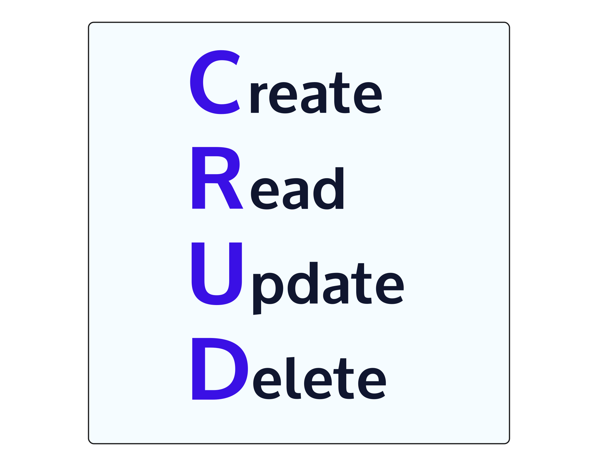

#### CRUD FUNCTIONALITY

# [What is CRUD?](https://www.codecademy.com/paths/build-python-web-apps-with-django/tracks/data-in-django/modules/django-models-and-databases/lessons/django-crud-functionality/exercises/django-what-is-crud)

So far we’ve set up our models and database. 
But now it’s important that we are able to interact with our database to:
* **Create** new information
* **Read** specific information
* **Update** information
* **Delete** information

These are the four basic functions of a database also known as *CRUD*. 
Being able to perform these actions on our database allows us to have more control over our website and introduce more complexity.

In order for us to communicate with the database and perform CRUD functionalities, we can use *Structured Query Language*, also known as [SQL](https://www.codecademy.com/learn/learn-sql). 
We can think of it as a bridge connecting our project and the database together. 
Raw SQL can be time-consuming but since we’re using the Django framework, any SQL needed is handled through the [QuerySet API](https://docs.djangoproject.com/en/3.1/ref/models/querysets/). 
This API, provided by Django, converts our Python queries into SQL to communicate with the database.

As we progress throughout this lesson, we will learn how to:
* Perform each concept of CRUD
* Learn useful querying methods
* Query two tables at the same time

