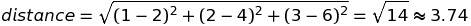

# [Distance](https://www.codecademy.com/paths/build-chatbots-with-python/tracks/retrieval-based-chatbots/modules/nlp-word-embeddings/lessons/word-embeddings/exercises/distance)
The key at the heart of word embeddings is distance.

There are a variety of ways to find the distance between vectors.

## Manhattan distance (city block distance)
Defined as the sum of the differences across each individual dimension of the vectors.

manhattan distance between x, y three-dimenzional vector:

vector x = [1, 2, 3]

vector y = [2, 4, 6]

manhattan distance = |1 - 2| + |2 - 4| + |3 - 6| = 1 + 2 + 3 = 6

## Euclidean distance (straight line distance)
With this distance metric, we take the square root of the sum of the squares of the differences in each dimension.

### *One* dimension
*d(x, y) = |x - y|* 

### *n* dimension

## Cosine distance
Cosine distance is concerned with the angle between two vectors, rather than by looking at the distance between the points, or ends, of the vectors.

Two vectors that point in the same direction have no angle between them, and have a cosine distance of `0`.

Two vectors that point in opposite directions have a cosine distance of `1`.
