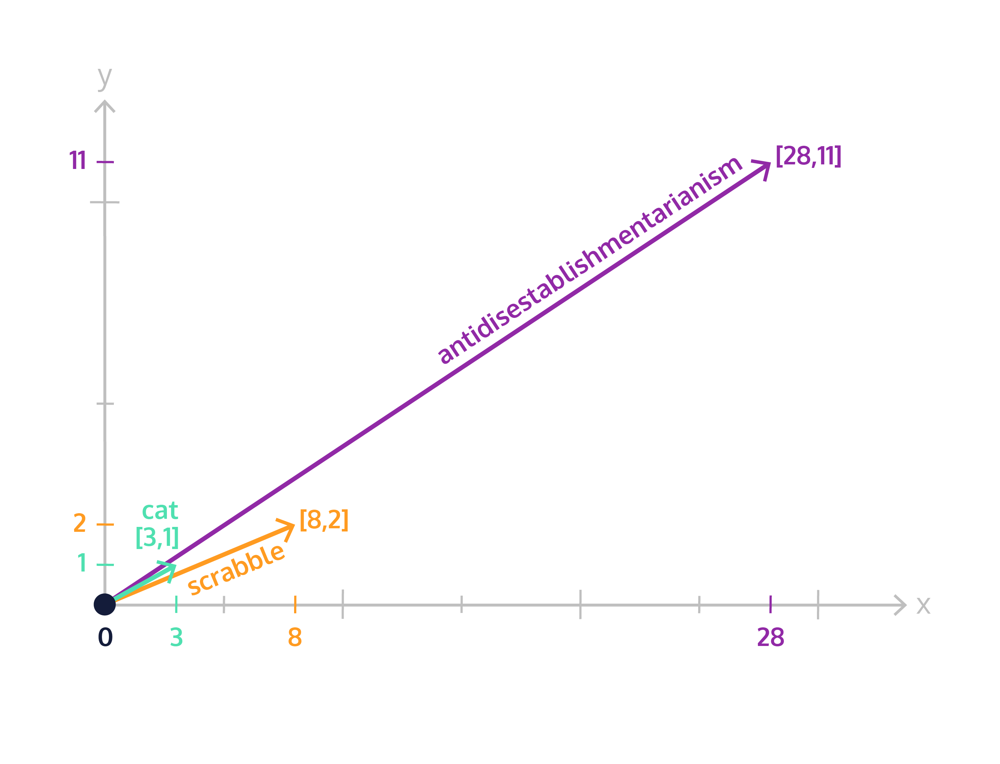

#### [Word Embeddings](https://www.codecademy.com/paths/build-chatbots-with-python/tracks/retrieval-based-chatbots/modules/nlp-word-embeddings/lessons/word-embeddings/exercises/introduction)
# [Vectors](https://www.codecademy.com/paths/build-chatbots-with-python/tracks/retrieval-based-chatbots/modules/nlp-word-embeddings/lessons/word-embeddings/exercises/vectors)
Vectors are containers of information.

Depending on the size, or the dimension, of a vector, it can hold varying amounts of data.

## 1-dimensional vector
Stores a single number.

Say we want to represent the length of a word with a vector. We can do so as follows:
```
"cat" ----> [3]
"scrabble" ----> [8]
"antidisestablishmentarianism" ----> [28]
```


## 2-dimensional vector
Now let’s say we also want to record the number of vowels in our words, in addition to the number of letters.
```
"cat" ----> [3, 1]
"scrabble" ----> [8, 2]
"antidisestablishmentarianism" ----> [28, 11]
```
The x-axis is the number of letters, and the y-axis is the number of vowels.

