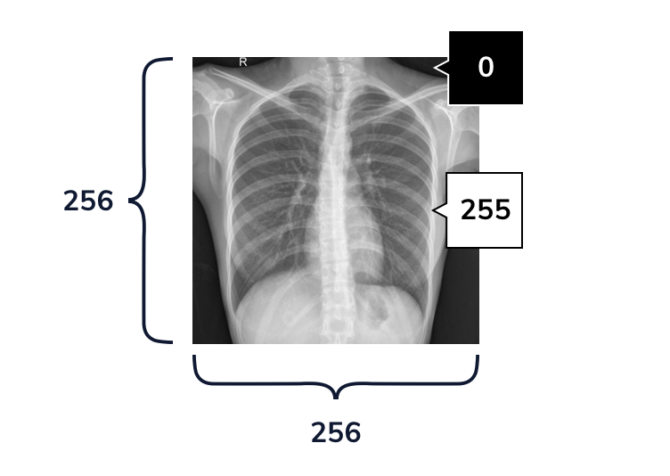

# [Introduction to Image Classification](https://www.codecademy.com/paths/build-deep-learning-models-with-tensorflow/tracks/dlsp-classification-track/modules/dlsp-image-classification/lessons/image-classification/exercises/introduction-to-image-classification)
Neural networks are perfectly suited for image classification.
The task of finding the complex patterns in pixels necessary to map an image to its label.
As a result, image classification is a common application of deep learning.

# [Preprocessing Image Data](https://www.codecademy.com/paths/build-deep-learning-models-with-tensorflow/tracks/dlsp-classification-track/modules/dlsp-image-classification/lessons/image-classification/exercises/preprocessing-image-data)
Our goal is to pass these X-ray images into our network, and to classify them according to their respective labels.
At a high-level, this is very similar to our approach for classifying non-image data.

Now, our features are going to come from image pixels.
Each image will be 256 pixels tall and 256 pixels wide, and each pixel has a value between 0 (black) - 255 (white).



We can use `ImageDataGenerator` to load images from a file path, and to preprocess them. 
```
my_image_data_generator = ImageDataGenerator()
```
The ImageDataGenerator can also preprocess our data.
We do this by passing additional arguments to the constructor.

The most important step is the *pixel normalization*.
Because neural networks struggle with large integer values, we want to rescale our raw pixel values between `0` and `1`.
Our pixels have values in `[0,255]`, so we can normalize pixels by dividing each pixel by `255.0`.

We can also use our ImageDataGenerator for `data augmentation`: generating more data without collecting any new images.
A common way to augment image data is to flip or randomly shift each image by small amounts.
Because our dataset is only a few hundred images, we’ll also use the `ImageDataGenerator` to randomly shift images during training.

For example, we can define another ImageDataGenerator and set its vertical_flip parameter to be True.
```
my_augmented_image_data_generator = ImageDataGenerator(vertical_flip = True)
```
If we use this ImageDataGenerator to load images, it will randomly flip some of those images upside down.

# [Loading Image Data](https://www.codecademy.com/paths/build-deep-learning-models-with-tensorflow/tracks/dlsp-classification-track/modules/dlsp-image-classification/lessons/image-classification/exercises/loading-image-data)


