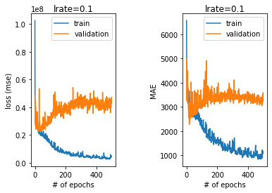

#### HYPERPARAMETER TUNING
## [Manual tuning: epochs and early stopping](https://www.codecademy.com/paths/build-deep-learning-models-with-tensorflow/tracks/dlsp-getting-started-with-tensorflow/modules/dlsp-implementing-neural-networks/lessons/hyperparameter-tuning-neural/exercises/tuning-epochs-early-stopping)
Being an iterative process, gradient descent iterates many times through the training data.

The number of epochs is a hyperparameter representing the number of complete passes through the training dataset. 
This is typically a large number (100, 1000, or larger). If the data is split into batches, in one epoch the optimizer will see all the batches.

Too many epochs can lead to overfitting, and too few to underfitting. 
One trick is to use ***early stopping***: when the training performance reaches the plateau or starts degrading, the learning stops.

To illustrate we can introduce some overfitting by increasing the number of parameters in the neural network model:


We know we are overfitting because the validation error at first decreases but eventually starts increasing. 

We can specify early stopping in TensorFlow with Keras by creating an EarlyStopping callback and adding it as a parameter when we fit our model:
```
from tensorflow.keras.callbacks import EarlyStopping
 
stop = EarlyStopping(
  monitor = "val_loss", # we are monitoring the validation loss to decide when to stop the training
  mode = "min",         # we seek minimal loss
  verbose = 1, 
  patience = 40         # if the learning reaches a plateau, 
                        # it will continue for 40 more epochs in case the plateau leads to improved performance
)
 
history = model.fit(
  features_train, 
  labels_train, 
  epochs = num_epochs, 
  batch_size = 16, 
  verbose = 0, 
  validation_split = 0.2, 
  callbacks = [stop]
)
```
