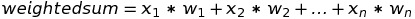

# [Perceptron](https://www.codecademy.com/paths/build-deep-learning-models-with-tensorflow/tracks/dlsp-foundations-deep-learning-and-perceptrons/modules/perceptron/lessons/perceptron/exercises/what-is-perceptron)

Perceptrons are the building blocks of Neural Networks.

The perceptron is an artificial neuron that simulates the task of a biological neuron to solve problems through its own “sense” of the world.

The perceptron comes with its own artificial design and set of parameters, at its core, a single perceptron is trying to make a simple decision.

The perceptron can correct itself based on the result of its decision to make better decisions in the future!

If you combine a bunch of such perceptrons, you will get a neural network that can even make better decisions.

## [Representing a Perceptron](https://www.codecademy.com/paths/build-deep-learning-models-with-tensorflow/tracks/dlsp-foundations-deep-learning-and-perceptrons/modules/perceptron/lessons/perceptron/exercises/represent-perceptron)

So the perceptron is an artificial neuron that can make a simple decision.

The perceptron has three main components:
* **inputs:** Each input corresponds to a feature. (age, height, weight, college degree...
* **weights:** Each input also has a weight which assigns a certain amount of importance to the input. If an input’s weight is large, it means this input plays a bigger role in determining the output. 
* **output:** The perceptron uses the inputs and weights to produce an output. The type of the output varies depending on the nature of the problem. 

### 1. [Weighted Sum](https://www.codecademy.com/paths/build-deep-learning-models-with-tensorflow/tracks/dlsp-foundations-deep-learning-and-perceptrons/modules/perceptron/lessons/perceptron/exercises/weighted-sum)
How are the inputs and weights turned into an output? This is a two-step process, and the first step is finding the weighted sum of the inputs.

 The weighted sum is a number that gives a reasonable representation of the inputs:
 
 

The `x`‘s are the inputs and the `w`‘s are the weights.

`weighted_sum()`

### 2. [Activation Function](https://www.codecademy.com/paths/build-deep-learning-models-with-tensorflow/tracks/dlsp-foundations-deep-learning-and-perceptrons/modules/perceptron/lessons/perceptron/exercises/activation-functions)
After finding the weighted sum, the second step is to constrain the weighted sum to produce a desired output.

The **activation functions** come are special functions that transform the weighted sum into a desired and constrained output.
 
If you want to train a perceptron to detect whether a point is above or below a line, you might want the output to be a `+1` or `-1` label. For this task, you can use the “sign activation function” to help the perceptron make the decision:
* If weighted sum is positive, return `+1`
* If weighted sum is negative, return `-1`

`activation()`

## [Training the Perceptron](https://www.codecademy.com/paths/build-deep-learning-models-with-tensorflow/tracks/dlsp-foundations-deep-learning-and-perceptrons/modules/perceptron/lessons/perceptron/exercises/training-perceptron)
Right now we expect the perceptron to be very bad because it has random weights.
We can train the perceptron to produce better and better results! 
In order to do this, we provide the perceptron a training set — a collection of random inputs with correctly predicted outputs.

In the code, the training set has been represented as a dictionary with coordinates as keys and labels as values:
```
training_set = {
  (18, 49): -1, 
  (2, 17): 1, 
  (24, 35): -1, 
  (14, 26): 1, 
  (17, 34): -1
}
```

We can measure the perceptron’s actual performance against this training set.
By doing so, we get a sense of “how bad” the perceptron is.
The goal is to gradually nudge the perceptron — by slightly changing its weights — towards a better version of itself that correctly matches all the input-output pairs in the training set.
We will use these points to train the perceptron to correctly separate the positive labels from the negative labels by visualizing the perceptron as a line. 

`generate_training_set()` 

## [Training Error](https://www.codecademy.com/paths/build-deep-learning-models-with-tensorflow/tracks/dlsp-foundations-deep-learning-and-perceptrons/modules/perceptron/lessons/perceptron/exercises/training-error)
Now that we have our training set, we can start feeding inputs into the perceptron and comparing the actual outputs against the expected labels!

Every time the output mismatches the expected label, we say that the perceptron has made a **training error** — a quantity that measures “how bad” the perceptron is performing.

The goal is to nudge the perceptron towards zero training error. The training error is calculated by subtracting the predicted label value from the actual label value:

***training error = actual label − predicted label***

For each point in the training set, the perceptron either produces a `+1` or a `-1` (as we are using the *Sign Activation Function*). 
