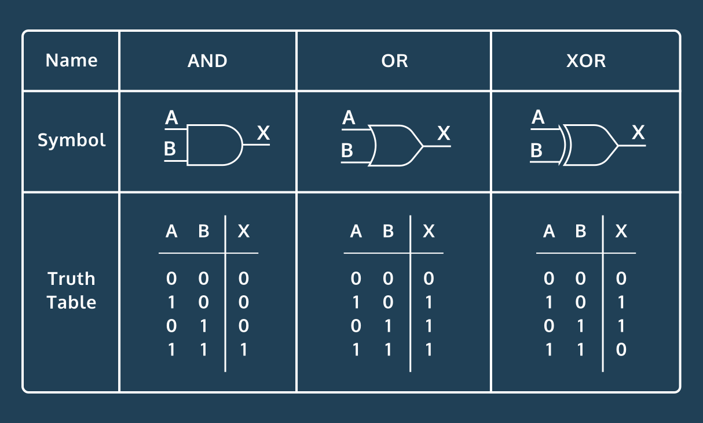

#### FOUNDATIONS OF DEEP LEARNING AND PERCEPTRONS
# [Perceptron Logic Gates](https://www.codecademy.com/paths/build-deep-learning-models-with-tensorflow/tracks/dlsp-foundations-deep-learning-and-perceptrons/modules/perceptron/projects/perceptron-logic-gates)

Given two inputs, an AND gate will output a 1 only if both inputs are a 1.

An OR gate outputs a 1 if any of the inputs is a 1.

An XOR gate outputs a 1 only if one of the inputs is a 1.

#### [Link to Repl](https://repl.it/@lendoo73/PerceptronLogicGates#README.md)
