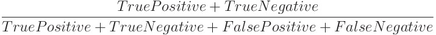
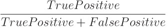
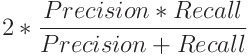
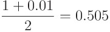
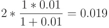

#### ACCURACY, RECALL, PRECISION, AND F1 SCORE

# [Accuracy](https://www.codecademy.com/paths/machine-learning/tracks/introduction-to-supervised-learning-skill-path/modules/accuracy-recall-and-precision-skill-path/lessons/ml-accuracy/exercises/accuracy)

After creating a machine learning algorithm capable of making classifications, the next step in the process is to calculate its predictive power.
In order to calculate these statistics, we’ll need to split our data into a [training set and validation set](https://www.codecademy.com/content-items/ced99a64b810eda769bc48293550fd21).

Let’s say you’re using a machine learning algorithm to try to predict whether or not you will get above a B on a test. 
The features of your data could be something like:
* The number of hours you studied this week.
* The number of hours you watched Netflix this week.
* The time you went to bed the night before the test.
* Your average in the class before taking the test.

The simplest way of reporting the effectiveness of an algorithm is by calculating its accuracy.
Accuracy is calculated by finding the total number of correctly classified points and dividing by the total number of points.

Let’s define those terms in the context of our grade example:
* True Positive: The algorithm predicted you would get above a B, and you did.
* True Negative: The algorithm predicted you would get below a B, and you did.
* False Positive: The algorithm predicted you would get above a B, and you didn’t.
* False Negative: The algorithm predicted you would get below a B, and you didn’t.

# [Recall](https://www.codecademy.com/paths/machine-learning/tracks/introduction-to-supervised-learning-skill-path/modules/accuracy-recall-and-precision-skill-path/lessons/ml-accuracy/exercises/recall)

Accuracy can be an extremely misleading statistic depending on your data. 
Consider the example of an algorithm that is trying to predict whether or not there will be over 3 feet of snow on the ground tomorrow. 
We can write a pretty accurate classifier right now: always predict False. 
This classifier will be incredibly accurate — there are hardly ever many days with that much snow. 
But this classifier never finds the information we’re actually interested in.

In this situation, the statistic that would be helpful is **recall**. Recall measures the percentage of relevant items that your classifier found. In this example, recall is the number of snow days the algorithm correctly predicted divided by the total number of snow days:

# [Precision](https://www.codecademy.com/paths/machine-learning/tracks/introduction-to-supervised-learning-skill-path/modules/accuracy-recall-and-precision-skill-path/lessons/ml-accuracy/exercises/precision)

Recall isn’t a perfect statistic either.
For example, we could create a snow day classifier that always returns True. 
This would have low accuracy, but its recall would be 1 because it would be able to accurately find every snow day. 
But this classifier is just as nonsensical as the one before! 
The statistic that will help demonstrate that this algorithm is flawed is precision.

In the snow day example, precision is the number of snow days the algorithm correctly predicted divided by the number of times it predicted there would be a snow day. The formula for precision is below:

The algorithm that predicts every day is a snow day has recall of 1, but it will have very low precision. 
It correctly predicts every snow day, but there are tons of false positives as well.

Precision and recall are statistics that are on opposite ends of a scale. If one goes down, the other will go up.

# [F1 Score](https://www.codecademy.com/paths/machine-learning/tracks/introduction-to-supervised-learning-skill-path/modules/accuracy-recall-and-precision-skill-path/lessons/ml-accuracy/exercises/f-one)

It is useful to consider the precision and recall of an algorithm, however, we still don’t have one number that can sufficiently describe how effective our algorithm is.
This is the job of the F1 score — **F1 score is the harmonic mean of precision and recall**. 
The harmonic mean of a group of numbers is a way to average them together. 
The formula for F1 score is below:

The F1 score combines both precision and recall into a single statistic. 
We use the harmonic mean rather than the traditional arithmetic mean because we want the F1 score to have a low value when either precision or recall is 0.

For example, consider a classifier where recall = 1 and precision = 0.01. We know that there is most likely a problem with this classifier since the precision is so low, and so we want the F1 score to reflect that.

If we took the arithmetic mean, we’d get:

That looks way too high! But if we calculate the harmonic mean, we get:

The F1 score is now accurately describing the effectiveness of this classifier.
