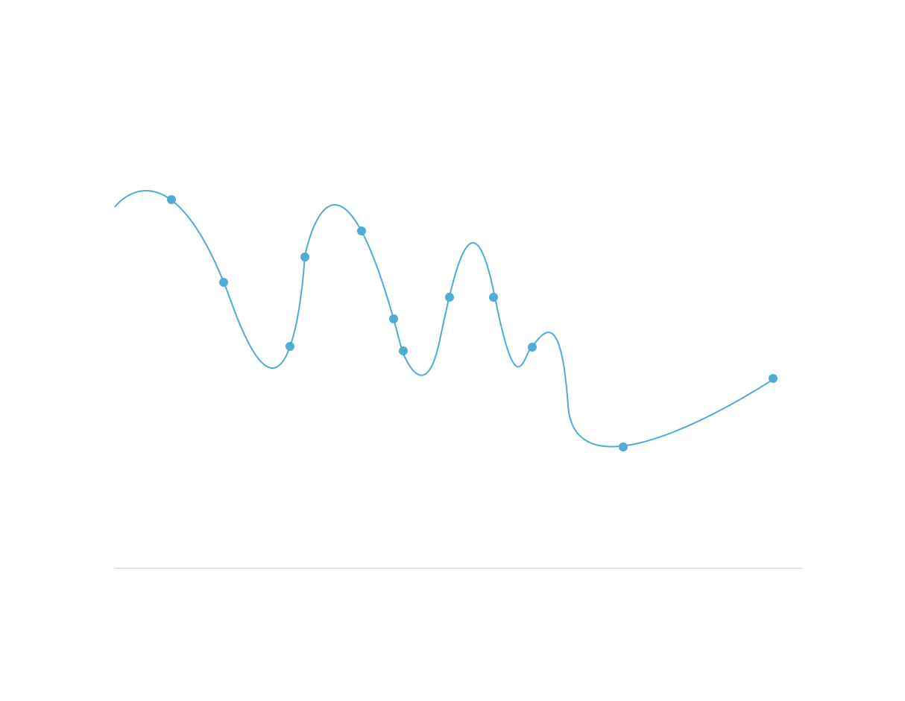
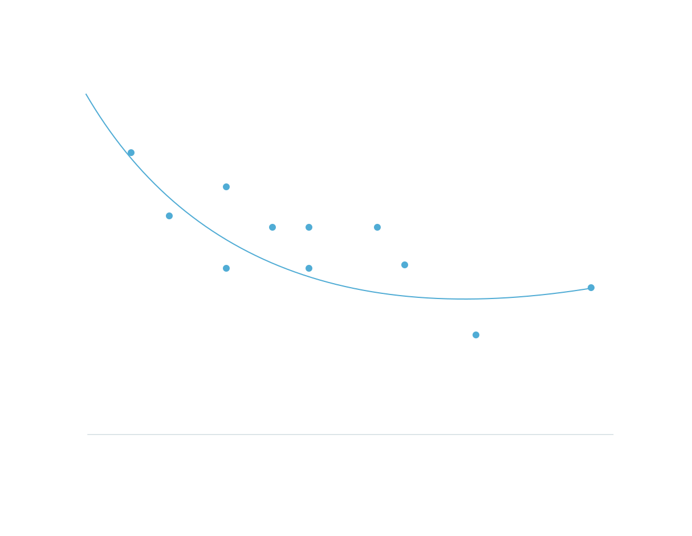
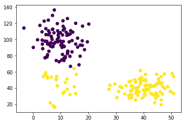
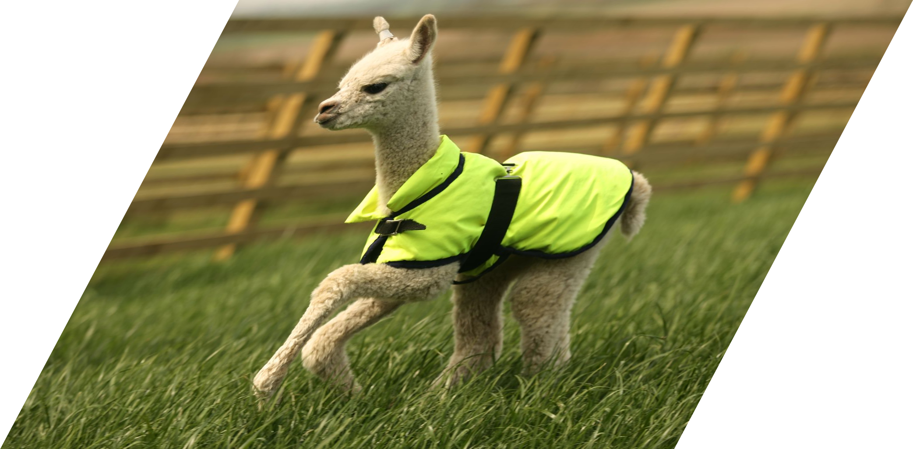

# [The Dangers of Overfitting](https://www.codecademy.com/paths/machine-learning/tracks/introduction-to-supervised-learning-skill-path/modules/accuracy-recall-and-precision-skill-path/articles/the-dangers-of-overfitting)

Learn about how to recognize when your model is fitting too closely to the training data.

Often in Machine Learning, we feed a huge amount of data to an algorithm that then learns how to classify that input based on rules it creates. 
The data we feed into this algorithm, the training data, is hugely important. 
The rules created by the program will be determined by looking at every example in the training data.

Overfitting occurs when we have fit our model’s parameters too closely to the training data:

When we overfit, we are assuming that everything we see in the training data is exactly how it will appear in the real world. 
Instead, we want to be modeling trends that show us the general behavior of a variable:

That said, when we find trends in training data, all we are doing is replicating trends that already exist. 
Our model will learn to replicate data from the real world. 
If that data is part of a system that results in prejudices or injustices, then your machine learning algorithm will produce harmful results as well. 
Some people say that Machine Learning can be a GIGO process — Garbage In, Garbage Out.

We can imagine an example where an ad agency is creating an algorithm to display the right job recommendations to the right people. If they use a training set of the kinds of people who have high paying jobs to determine which people to show ads for high paying jobs to, the model will probably learn to make decisions that leave out historically underrepresented groups of people.

This problem is fundamentally a problem with overfitting to our training set. 
If we overfit to training sets with underrepresentation, we only create more underrepresentation. 
How do we tackle this problem?

## Inspect Training Data First

Find the important aggregate statistics for the variables you’re measuring. 
Find the mean and median of different variables. 
Use groupby to inspect the aggregate statistics for different groups of data, and see how they differ. 
These are the trends that your machine learning model will replicate.

Visualize your training data and look for outstanding patterns.

Compare the aggregate statistics from your specific training set to aggregate statistics from other sources. 
Does your training set seem to follow the trends that are universally present?

## Collect Data Thoughtfully

If you have the power to control the way your data is collected, i.e. if you’re the one collecting the data, make sure that you are sampling from all groups.

Imagine for a massively multiplayer app, rewards and hotspots are set by an algorithm that trains on frequencies of user actions. 
If the people using the app overwhelmingly are in one area, the app will continuously get better and better for people in that area.

Some neighborhoods/areas might be undersampled, or have significantly less datapoints, so the algorithm will fit to the oversampled population. 
Imagine this clustering forming:

The small cluster in the bottom left would probably be a cluster of its own, if it had a comparable amount of samples to the other two clusters. 
To solve this, we can specifically oversample areas that are undersampled, and add more datapoints there. 
Conversely, we can undersample groups that are over-represented in our training set.

## Try to Augment the Training Data

In our [Bayes’ Theorem lesson](https://www.codecademy.com/content-items/67dba901393541693a95b927d62b9842/exercises/intro) 
we discussed that when we have a small total number of an event, this will affect how reliably we can guess if the event will occur. 
Many systems built to detect fraud suffer from this problem. 
Suppose we were creating a machine learning model to detect fraudulent credit card activity. 
On the aggregate, there are very few fraudulent transactions, so the model can reach a very high accuracy by simply predicting that every transaction is legitimate. 
This approach would not solve our problem very well.

One technique is to identify a fraudulent transaction and make many copies of it in the training set, with small variations in the feature data. 
We can imagine that if our training set has only 2 examples of fraud, the algorithm will overfit to only identify a transaction as fraudulent if it has the exact characteristics of those couple of examples. 
When we augment the training data with more fraudulent examples, mildly altered from the ones we know, we reduce the amount of overfitting.

Data augmentation is used most often in image classification techniques. 
Often, we add copies of each picture with an added rotation, shearing, or color jittering.

Let’s imagine we have a huge dataset of animals, and we’re trying to classify which animal is which. 
We may only have one instance of an alpac, but we know that this image, sheared:

and this image rotated:

are all also examples of an alpaca. 
When we add these examples of augmented data to our training set, the model won’t overfit as much.

## Try Restricting the Featureset

If one of your features is more heavily affecting the parameters of the model, try to run your model without that feature.

For example, let’s say you are writing a program to determine if someone’s loan application should be accepted or rejected. 
Your model shows that the most significant variable is their race — with all other features the same, the model has a much higher chance of producing an “accept” prediction on an application from a white applicant than on a non-white applicant. 
This parameter weight may be a sign that the training data contained racial bias. 
We can try to train the model again, with the race data removed from the featureset.

## Reflection

Machine Learning algorithms always must introduce a bias as a function of being programs that are trying to make assumptions and rules by looking at data.

Sometimes the best way to deal with the introduction of bias in a training set is to just acknowledge that it is there. 
As we try to compensate for the bias, our methods of compensation themselves introduce a bias. 
It is important to find a balance. 
The most important thing is to mention the existence of bias in your results, and make sure that all stakeholders know that it exists, so that it is taken into consideration with the decisions made from your model’s results.

