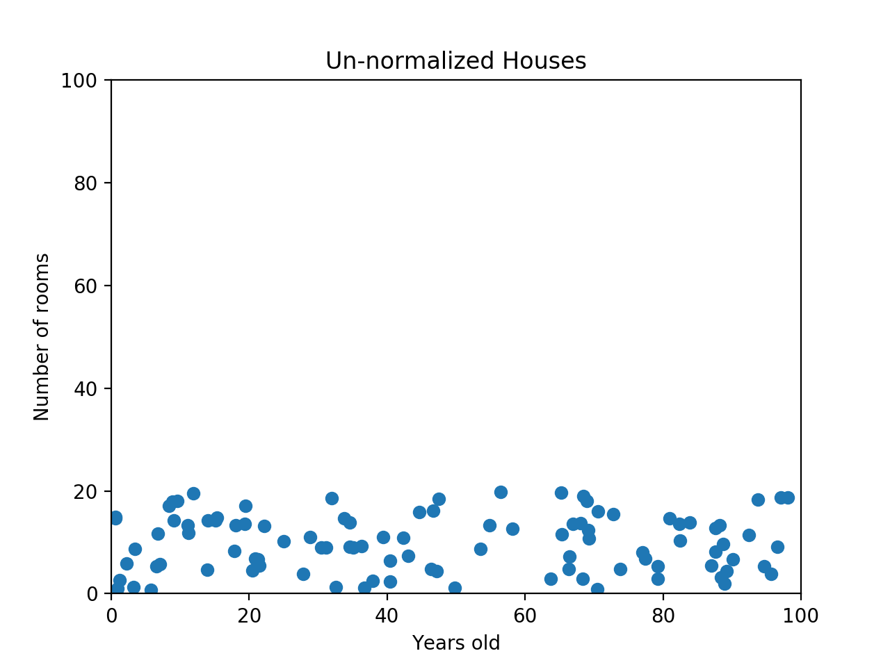
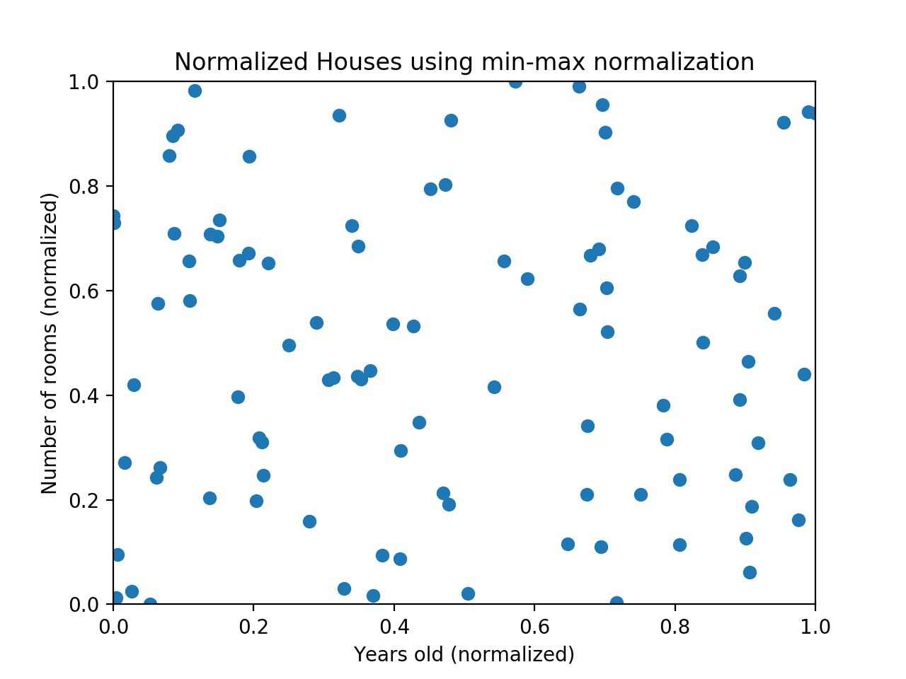
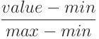

# [Normalization](https://www.codecademy.com/paths/machine-learning/tracks/introduction-to-supervised-learning-skill-path/modules/k-nearest-neighbors-skill-path/articles/normalization)

This article describes why normalization is necessary. It also demonstrates the pros and cons of min-max normalization and z-score normalization.

## Why Normalize?

Many machine learning algorithms attempt to find trends in the data by comparing features of data points. 
However, there is an issue when the features are on drastically different scales.

For example, consider a dataset of houses. 
Two potential features might be the number of rooms in the house, and the total age of the house in years. 
A machine learning algorithm could try to predict which house would be best for you. 
When the algorithm compares data points, the feature with the larger scale will completely dominate the other:

When the data looks squished like that, we know we have a problem.
The machine learning algorithm should realize that there is a huge difference between a house with 2 rooms and a house with 20 rooms. 
But right now, because two houses can be 100 years apart, the difference in the number of rooms contributes less to the overall difference.

As a more extreme example, imagine what the graph would look like if the x-axis was the cost of the house. 
The data would look even more squished; 
the difference in the number of rooms would be even less relevant because the cost of two houses could have a difference of thousands of dollars.

The goal of normalization is **to make every datapoint have the same scale** so each feature is equally important. 
The image below shows the same house data normalized using min-max normalization:

## Min-Max Normalization

For every feature, the **minimum** value of that feature gets transformed into a **0**, the **maximum** value gets transformed into a **1**, and every **other** value gets transformed into a decimal **between 0 and 1**.

If the minimum value of a feature was 20, and the maximum value was 40, then 30 would be transformed to about 0.5 since it is halfway between 20 and 40.
# 
