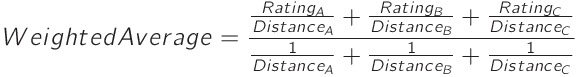

####  Supervised Learning

# [K-Nearest Neighbors Classifier](https://github.com/lendoo73/Challenge-Project-of-CodeCademy/tree/master/python/Learn_the_Basics_of_Machine_Learning/Classification_K_Nearest_Neighbors/K_Nearest_Neighbors)

# [K-Nearest Neighbor Regressor](https://www.codecademy.com/paths/machine-learning/tracks/introduction-to-supervised-learning-skill-path/modules/k-nearest-neighbors-skill-path/lessons/ml-knn-regression/exercises/regression)

## [Regression](https://www.codecademy.com/paths/machine-learning/tracks/introduction-to-supervised-learning-skill-path/modules/k-nearest-neighbors-skill-path/lessons/ml-knn-regression/exercises/regression)

The K-Nearest Neighbors algorithm is a powerful supervised machine learning algorithm typically used for classification. 
However, it can also perform regression.

Instead of classifying a new movie as either good or bad, we are now going to predict its IMDb rating as a real number.

This process is almost identical to classification, except for the final step. 
We are going to find the `k` nearest neighbors of the new movie by using the distance formula. 
However, instead of counting the number of good and bad neighbors, the regressor averages their IMDb ratings.

For example, if the three nearest neighbors to an unrated movie have ratings of `5.0`, `9.2`, and `6.8`, then we could predict that this new movie will have a rating of `7.0`.
#### `(5 + 9.2 + 6.8) / 3 = 7`
```
  sum_rating = 0
  for neighbor in neighbors:
    title = neighbor[1]
    sum_rating += movie_ratings[title]
    avg_rating = sum_rating / k
```

## [Weighted Regression](https://www.codecademy.com/paths/machine-learning/tracks/introduction-to-supervised-learning-skill-path/modules/k-nearest-neighbors-skill-path/lessons/ml-knn-regression/exercises/weighted-regression)

We can be even more clever in the way that we compute the average.
We can compute a weighted average based on how close each neighbor is.

Let’s say we’re trying to predict the rating of movie X and we’ve found its three nearest neighbors:
| Movie | Rating | Distance to movie X |
| :----:  |:------:| :-------------------:|
| A     | 5.0    | 3.2                 |
| B     | 6.8    | 11.5                |
| C     | 9.0    | 1.1                 |

If we find the mean, the predicted rating for X would be 6.93.
However, movie X is most similar to movie C, so movie C’s rating should be more important when computing the average.
Using a weighted average, we can find movie X’s rating:  

  

The numerator is the sum of every rating divided by their respective distances.
The denominator is the sum of one over every distance.
The weighted average has now gone up to 7.9.

## [K-Nearest Neighbor Regressor with Scikit-learn](https://www.codecademy.com/paths/machine-learning/tracks/introduction-to-supervised-learning-skill-path/modules/k-nearest-neighbors-skill-path/lessons/ml-knn-regression/exercises/sklearn-regression)

The `KNeighborsRegressor` class is very similar to `KNeighborsClassifier`.

We first need to create the regressor. We can use the parameter `n_neighbors` to define our value for `k`.

We can also choose whether or not to use a weighted average using the parameter `weights`. 
If `weights` equals `"uniform"`, all neighbors will be considered equally in the average. 
If `weights` equals `"distance"`, then a weighted average is used.
```
classifier = KNeighborsRegressor(
  n_neighbors = 3, 
  weights = "distance"
)
```
Next, we need to fit the model to our training data using the `.fit()` method. 
`.fit()` takes two parameters:
* a list of points, 
* a list of values associated with those points.
```
classifier.fit(
  training_points, 
  training_labels
)
```
Finally, we can make predictions on new data points using the `.predict()` method. 
`.predict()` takes a list of points and returns a list of predictions for those points.
```
unknown_points = [
  [0.2, 0.1, 0.7],
  [0.4, 0.7, 0.6],
  [0.5, 0.8, 0.1]
]
 
guesses = classifier.predict(unknown_points)
```
