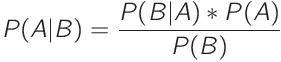
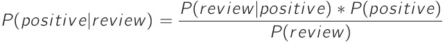
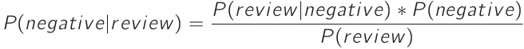

# [The Naive Bayes Classifier](https://www.codecademy.com/paths/machine-learning/tracks/advanced-supervised-learning-skill-path/modules/naive-bayes-classifier-skill-path/lessons/naive-bayes-classifier/exercises/naive-bayes)

A Naive Bayes classifier is a supervised machine learning algorithm that leverages Bayes’ Theorem to make predictions and classifications. 
Recall Bayes’ Theorem:



This equation is finding the probability of `A` given `B`. 
This can be turned into a classifier if we replace `B` with a data point and `A` with a class. 
For example, let’s say we’re trying to classify an `email` as either `spam` or `not spam`. 
We could calculate `P(spam | email)` and `P(not spam | email)`. 
Whichever probability is higher will be the classifier’s prediction. 
Naive Bayes classifiers are often used for text classification.

So why is this a supervised machine learning algorithm? 
In order to compute the probabilities used in Bayes’ theorem, we need previous data points. 
For example, in the spam example, we’ll need to compute `P(spam)`. 
This can be found by looking at a tagged dataset of emails and finding the ratio of spam to non-spam emails.

## [Investigate the Data](https://www.codecademy.com/paths/machine-learning/tracks/advanced-supervised-learning-skill-path/modules/naive-bayes-classifier-skill-path/lessons/naive-bayes-classifier/exercises/intro)

We are going to create a Naive Bayes classifier that can predict whether a review for a product is positive or negative. 
This type of classifier could be extremely helpful for a company that is curious about the public reaction to a new product. 
Rather than reading thousands of reviews or tweets about the product, you could feed those documents into the Naive Bayes classifier and instantly find out how many are positive and how many are negative.

The dataset we will be using for this lesson contains Amazon product reviews for baby products. 
The original dataset contained many different features including the reviewer’s name, the date the review was made, and the overall score. 
We’ve removed many of those features; the only features that we’re interested in are the text of the review and whether the review was “positive” or “negative”. 
We labeled all reviews with a score less than 4 as a negative review.

## [Bayes Theorem I](https://www.codecademy.com/paths/machine-learning/tracks/advanced-supervised-learning-skill-path/modules/naive-bayes-classifier-skill-path/lessons/naive-bayes-classifier/exercises/bayes-theorem-i)

We’re going to write a classifier that can predict whether the review “This crib was amazing” is a positive or negative review. 
We want to compute both `P(positive | review)` and `P(negative | review)` and find which probability is larger. 
To do this, we’ll be using Bayes’ Theorem. 
Let’s look at Bayes’ Theorem for `P(positive | review)`.



The first part of Bayes’ Theorem that we are going to tackle is `P(positive)`. 
This is the probability that any review is positive. 
To find this, we need to look at all of our reviews in our dataset - both positive and negative - and find the percentage of reviews that are positive.  
`P(Positive) = total_positive / total_reviews`

## [Bayes Theorem II](https://www.codecademy.com/paths/machine-learning/tracks/advanced-supervised-learning-skill-path/modules/naive-bayes-classifier-skill-path/lessons/naive-bayes-classifier/exercises/bayes-theorem-ii)

Let’s continue to try to classify the review “This crib was amazing”.

We now want to compute `P(review | positive)`.

In other words, if we assume that the review is positive, what is the probability that the words “This”, “crib”, “was”, and “amazing” are the only words in the review?

To find this, we have to assume that each word is conditionally independent. 
This means that one word appearing doesn’t affect the probability of another word from showing up. 
This is a pretty big assumption!

##### P(“This crib was amazing" ∣ positive) = P(“This" ∣ positive) * P(“crib" ∣ positive) * P(“was" ∣ positive) * P(“amazing" ∣ positive)

`P("crib"|positive)` is the probability that the word “crib” appears in a positive review.
To find this, we need to count up the total number of times “crib” appeared in our dataset of positive reviews.
If we take that number and divide it by the total number of words in our positive review dataset, we will end up with the probability of “crib” appearing in a positive review.
If we do this for every word in our review and multiply the results together, we have `P(review | positive)`.
```py
for word in review_words:
  if word in pos_counter:
    word_in_pos = pos_counter[word]
    pos_probability = pos_probability * word_in_pos / total_pos
```


## [Smoothing](https://www.codecademy.com/paths/machine-learning/tracks/advanced-supervised-learning-skill-path/modules/naive-bayes-classifier-skill-path/lessons/naive-bayes-classifier/exercises/smoothing)

What happens if “crib” was never in any of the positive reviews in our dataset? 
This fraction would then be 0, and since everything is multiplied together, the entire probability `P(review | positive)` would become 0.
If the unclassified review has a typo in it, it is very unlikely that that same exact typo will be in the dataset, and the entire probability will be 0. 
To solve this problem, we will use a technique called ***smoothing***.

In this case, we smooth by adding 1 to the numerator of each probability and `N` to the denominator of each probability. `N` is the number of unique words in our review dataset.
```py
pos_probability = 1
neg_probability = 1

review_words = review.split()

for word in review_words:
  word_in_pos = pos_counter[word]
  word_in_neg = neg_counter[word]
  
  pos_probability *= (word_in_pos + 1) / (total_pos + len(pos_counter))
  neg_probability *= (word_in_neg + 1) / (total_neg + len(neg_counter))
```

## [Classify](https://www.codecademy.com/paths/machine-learning/tracks/advanced-supervised-learning-skill-path/modules/naive-bayes-classifier-skill-path/lessons/naive-bayes-classifier/exercises/classify)

We’ve now completed both parts of the numerator. We now need to multiply them together.  
`P(review | positive) * P(positive)`

Let’s now consider the denominator `P(review)`. In our small example, this is the probability that “This”, “crib”, “was”, and “amazing” are the only words in the review. 
Notice that this is extremely similar to `P(review | positive)`. 
The only difference is that we don’t assume that the review is positive.

However, before we start to compute the denominator, let’s think about what our ultimate question is. 
We want to predict whether the review “This crib was amazing” is a positive or negative review. 
In other words, we’re asking whether `P(positive | review)` is greater than `P(negative | review)`. 
If we expand those two probabilities, we end up with the following equations:




Notice that P(review) is in the denominator of each. 
That value will be the same in both cases! 
Since we’re only interested in comparing these two probabilities, there’s no reason why we need to divide them by the same value. 
We can completely ignore the denominator!

Let’s see if our review was more likely to be positive or negative!
```py
percent_pos = 0.5
percent_neg = 0.5

total_pos = sum(pos_counter.values())
total_neg = sum(neg_counter.values())

pos_probability = 1
neg_probability = 1

review_words = review.split()

for word in review_words:
  word_in_pos = pos_counter[word]
  word_in_neg = neg_counter[word]
  
  pos_probability *= (word_in_pos + 1) / (total_pos + len(pos_counter))
  neg_probability *= (word_in_neg + 1) / (total_neg + len(neg_counter))

final_pos = pos_probability * percent_pos 
final_neg = neg_probability * percent_neg

if final_pos > final_neg:
  print("The review is positive")
else:
  print("The review is negative")
```
## [Formatting the Data for scikit-learn](https://www.codecademy.com/paths/machine-learning/tracks/advanced-supervised-learning-skill-path/modules/naive-bayes-classifier-skill-path/lessons/naive-bayes-classifier/exercises/sklearn)

If you have a dataset of text that has been tagged with different classes, you can give your classifier a brand new document and it will predict what class it belongs to.

We need to first transform our data into a format that scikit-learn can use. 
We’re going to use scikit-learn’s `CountVectorizer` object.

We need to create a `CountVectorizer` and teach it the vocabulary of the training set. This is done by calling the `.fit()` method.

For example, in the code below, we’ve created a CountVectorizer that has been trained on the vocabulary `"Training"`, `"review"`, `"one"`, and `"Second"`.
```py
from sklearn.feature_extraction.text import CountVectorizer

vectorizer = CountVectorizer()
 
vectorizer.fit(["Training review one", "Second review"])
```
After fitting the vectorizer, we can now call its `.transform()` method. 
The `.transform()` method takes a list of strings and will transform those strings into counts of the trained words. 
```py
counts = vectorizer.transform(["one review two review"])
```
`counts` now stores the array `[2, 1, 0, 0]`. 
The word `"review"` appeared twice, the word `"one"` appeared once, and neither `"Training"` nor `"Second"` appeared at all.

But how did we know that the `2` corresponded to `review`? 
You can print `vectorizer.vocabulary_` to see the index that each word corresponds to. 
```py
{'one': 1, 'Training': 2, 'review': 0, 'Second': 3}
```
Finally, notice that even though the word `"two"` was in our new review, there wasn’t an index for it in the vocabulary. 
This is because `"two"` wasn’t in any of the strings used in the `.fit()` method.

We can now use `counts` as input to our Naive Bayes Classifier.

## [Using scikit-learn](https://www.codecademy.com/paths/machine-learning/tracks/advanced-supervised-learning-skill-path/modules/naive-bayes-classifier-skill-path/lessons/naive-bayes-classifier/exercises/sklearn-ii)

Now that we’ve formatted our data correctly, we can use it using scikit-learn’s `MultinomialNB` classifier.

This classifier can be trained using the `.fit()` method. `.fit()` takes two parameters: 
* The array of data points (which we just made) 
* and an array of labels corresponding to each data point.

Once the model has been trained, we can use the `.predict()` method to predict the labels of new points. 
`.predict()` takes a list of points that you want to classify and it returns the predicted labels of those points.

Finally, `.predict_proba()` will return the probability of each label given a point. 
Instead of just returning whether the review was good or bad, it will return the likelihood of a good or bad review.

## [Review](https://www.codecademy.com/paths/machine-learning/tracks/advanced-supervised-learning-skill-path/modules/naive-bayes-classifier-skill-path/lessons/naive-bayes-classifier/exercises/review)

* A tagged dataset is necessary to calculate the probabilities used in Bayes’ Theorem.
* In this example, the features of our dataset are the words used in a product review. 
In order to apply Bayes’ Theorem, we assume that these features are independent.
* Using Bayes’ Theorem, we can find P(class | datapoint) for every possible class. 
In this example, there were two classes — positive and negative. 
The class with the highest probability will be the algorithm’s prediction.

Even though our algorithm is running smoothly, there’s always more that we can add to try to improve performance. 
The following techniques are focused on ways in which we process data before feeding it into the Naive Bayes classifier:
* Remove punctuation from the training set. 
Right now in our dataset, there are 702 instances of `"great!"` and 2322 instances of `"great."`. 
We should probably combine those into 3024 instances of `"great"`.
* Lowercase every word in the training set. 
We do this for the same reason why we remove punctuation. 
We want `"Great"` and `"great"` to be the same.
* Use a **bigram** or **trigram** model. 
Right now, the features of a review are individual words. 
For example, the features of the point `“This crib is great”` are `“This”`, `“crib”`, `“is”`, and `“great”`. 
If we used a ***bigram model***, the features would be `“This crib”`, `“crib is”`, and `“is great”`. 
Using a bigram model makes the assumption of independence more reasonable.

These three improvements would all be considered part of the field ***Natural Language Processing***.

You can find the baby product review dataset, along with many others, on [Dr. Julian McAuley’s website](http://jmcauley.ucsd.edu/data/amazon/).
