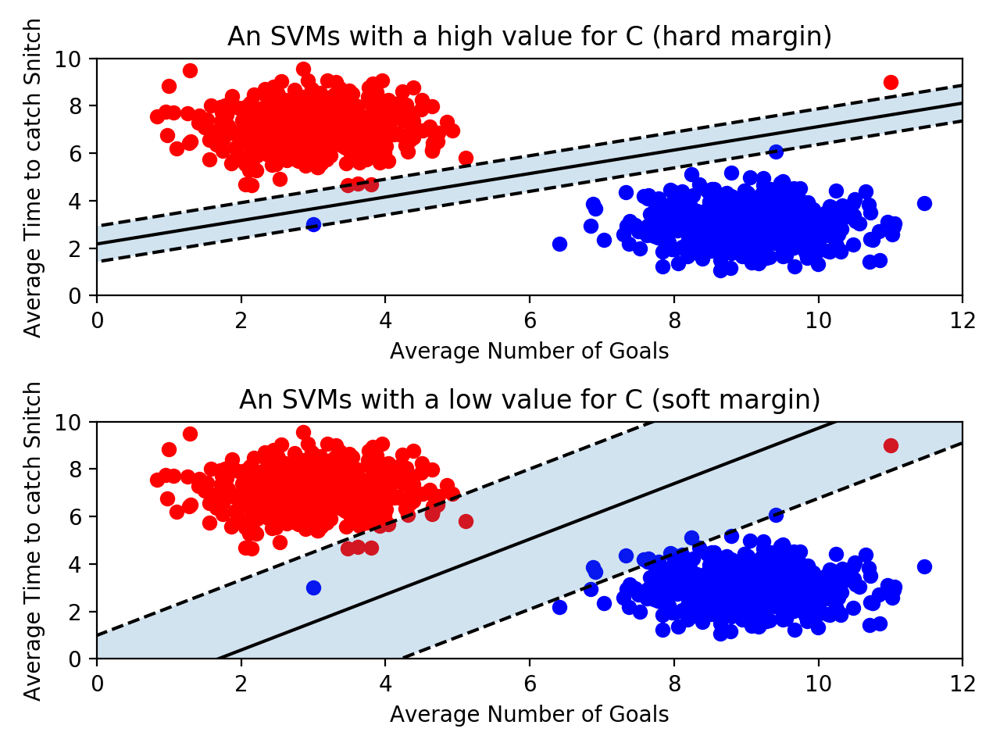
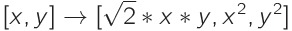
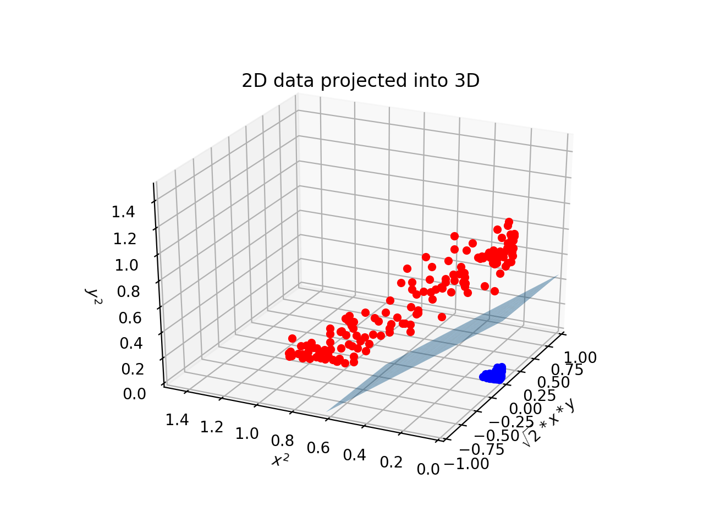
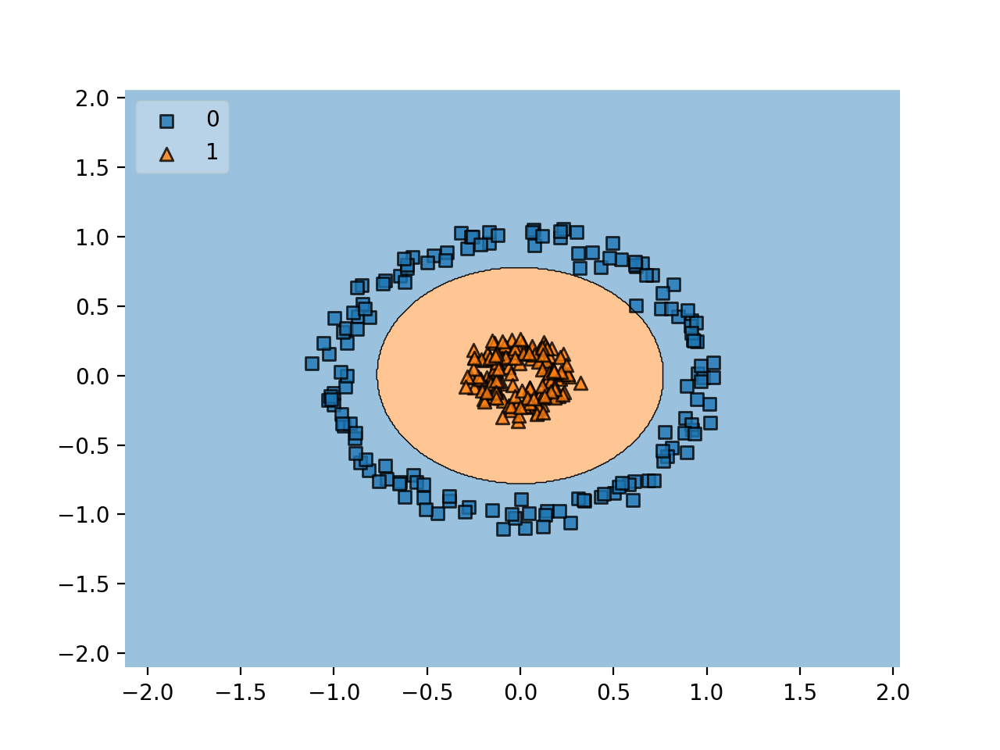
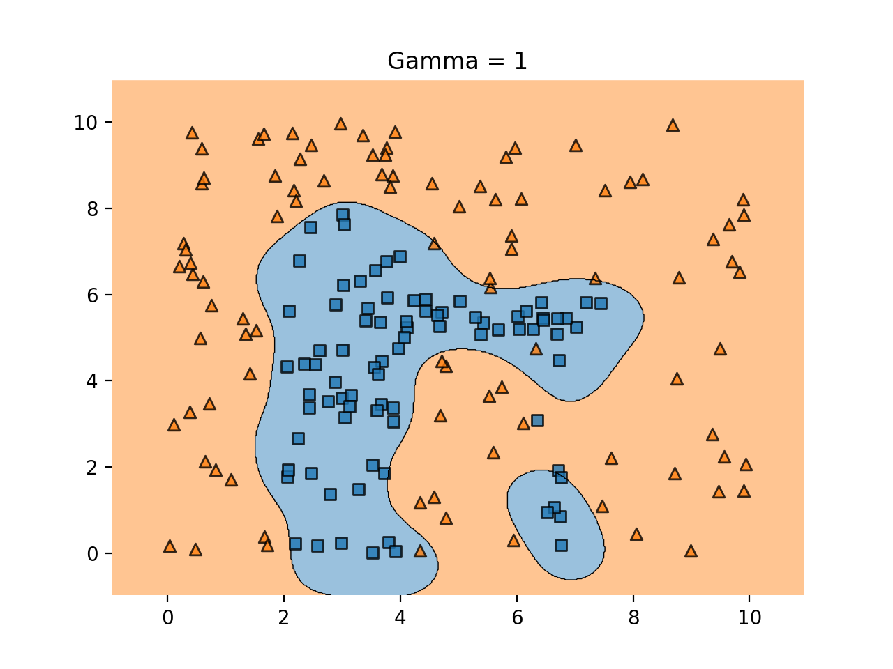
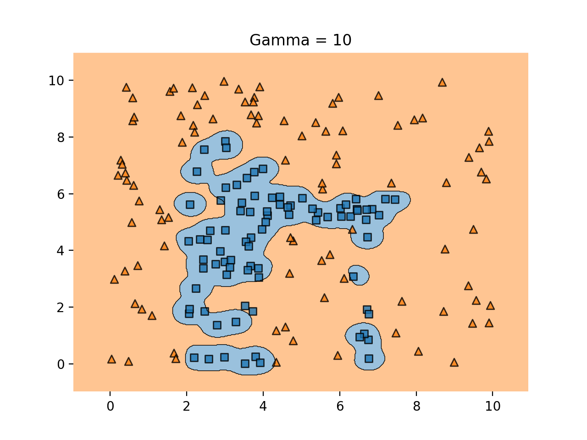
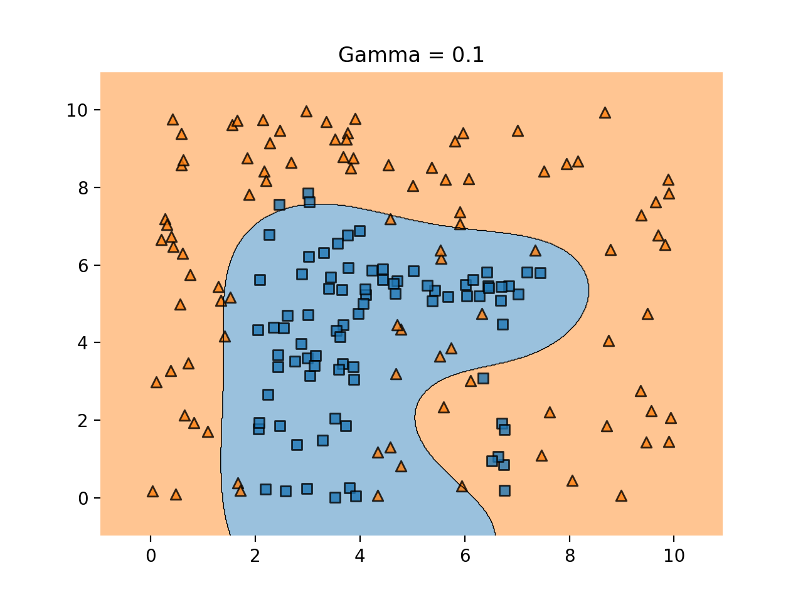

# [Support Vector Machines](https://www.codecademy.com/paths/machine-learning/tracks/advanced-supervised-learning-skill-path/modules/support-vector-machines-skill-path/lessons/machine-learning-support-vector-machine/exercises/decision-boundary)

A **Support Vector Machine (SVM)** is a powerful supervised machine learning model used for classification. 
An SVM makes classifications by defining a decision boundary and then seeing what side of the boundary an unclassified point falls on. 
In the next few exercises, we’ll learn how these decision boundaries get defined, but for now, know that they’re defined by using a training set of classified points. 
That’s why SVMs are supervised machine learning models.

Decision boundaries are easiest to wrap your head around when the data has two features. 
In this case, the decision boundary is a line.


This SVM is using data about fictional games of Quidditch from the Harry Potter universe! 
The classifier is trying to predict whether a team will make the playoffs or not. 
Every point in the training set represents a “historical” Quidditch team. 
Each point has two features — the average number of goals the team scores and the average number of minutes it takes the team to catch the Golden Snitch.

After finding a decision boundary using the training set, you could give the SVM an unlabeled data point, and it will predict whether or not that team will make the playoffs.

Decision boundaries exist even when your data has more than two features. 
If there are three features, the decision boundary is now a plane rather than a line.


As the number of dimensions grows past 3, it becomes very difficult to visualize these points in space. 
Nonetheless, SVMs can still find a decision boundary. 
However, rather than being a separating line, or a separating plane, the decision boundary is called a separating hyperplane.

## [Optimal Decision Boundaries](https://www.codecademy.com/paths/machine-learning/tracks/advanced-supervised-learning-skill-path/modules/support-vector-machines-skill-path/lessons/machine-learning-support-vector-machine/exercises/optimal-decision-boundary)

One problem that SVMs need to solve is figuring out what decision boundary to use. 
After all, there could be an infinite number of decision boundaries that correctly separate the two classes. 


There are so many valid decision boundaries, but which one is best? 
In general, we want our decision boundary to be as far away from training points as possible.

Maximizing the distance between the decision boundary and points in each class will decrease the chance of false classification.


The decision boundary is close to the blue class, so it is possible that a new point close to the blue cluster would fall on the red side of the line.

Out of all the graphs shown here, graph F has the best decision boundary.

## [Support Vectors and Margins](https://www.codecademy.com/paths/machine-learning/tracks/advanced-supervised-learning-skill-path/modules/support-vector-machines-skill-path/lessons/machine-learning-support-vector-machine/exercises/support-vector)

We now know that we want our decision boundary to be as far away from our training points as possible. 
Let’s introduce some new terms that can help explain this idea.

The support vectors are the points in the training set closest to the decision boundary. 
In fact, these vectors are what define the decision boundary. 
But why are they called vectors? 
Instead of thinking about the training data as points, we can think of them as vectors coming from the origin.


These vectors are crucial in defining the decision boundary — that’s where the “support” comes from. 
If you are using `n` features, there are at least `n+1` support vectors.

The distance between a support vector and the decision boundary is called the margin. 
We want to make the margin as large as possible. 
The support vectors are highlighted in the image below:


Because the support vectors are so critical in defining the decision boundary, many of the other training points can be ignored. 
This is one of the advantages of SVMs. 
Many supervised machine learning algorithms use every training point in order to make a prediction, even though many of those training points aren’t relevant. 
SVMs are fast because they only use the support vectors!

## [scikit-learn](https://www.codecademy.com/paths/machine-learning/tracks/advanced-supervised-learning-skill-path/modules/support-vector-machines-skill-path/lessons/machine-learning-support-vector-machine/exercises/sklearn)

Now that we know the concepts behind SVMs we need to write the code that will find the decision boundary that maximizes the margin. 
All of the code that we’ve written so far has been guessing and checking — we don’t actually know if we’ve found the best line. 
Unfortunately, calculating the parameters of the best decision boundary is a fairly complex optimization problem. 
Luckily, Python’s scikit-learn library has implemented an SVM that will do this for us.

Note that while it is not important to understand how the optimal parameters are found, you should have a strong conceptual understanding of what the model is optimizing.

To use scikit-learn’s SVM we first need to create an SVC object. 
It is called an SVC because scikit-learn is calling the model a Support Vector Classifier rather than a Support Vector Machine.
```
classifier = SVC(kernel = 'linear')
```
Next, the model needs to be trained on a list of data points and a list of labels associated with those data points. 
The labels are analogous to the color of the point — you can think of a `1` as a red point and a `0` as a blue point. 
The training is done using the `.fit()` method:
```
training_points = [[1, 2], [1, 5], [2, 2], [7, 5], [9, 4], [8, 2]]
labels = [1, 1, 1, 0, 0, 0]
classifier.fit(training_points, labels) 
```


Calling `.fit()` creates the line between the points.

Finally, the classifier predicts the label of new points using the `.predict()` method. 
The `.predict()` method takes a list of points you want to classify. 
Even if you only want to classify one point, make sure it is in a list: 
```
print(classifier.predict([
  [3, 2]
]))
```
In the image below, you can see the unclassified point `[3, 2]` as a black dot. 
It falls on the red side of the line, so the SVM would predict it is red.


In addition to using the SVM to make predictions, you can inspect some of its attributes. 
For example, if you can print `classifier.support_vectors_` to see which points from the training set are the support vectors.

In this case, the support vectors look like this:
```
[
  [7, 5],
  [8, 2],
  [2, 2]
]
```

## [Outliers](https://www.codecademy.com/paths/machine-learning/tracks/advanced-supervised-learning-skill-path/modules/support-vector-machines-skill-path/lessons/machine-learning-support-vector-machine/exercises/outliers)

SVMs try to maximize the size of the margin while still correctly separating the points of each class. 
As a result, outliers can be a problem.



The size of the margin decreases when a single outlier is present, and as a result, the decision boundary changes as well. 
However, if we allowed the decision boundary to have some error, we could still use the original line.

SVMs have a parameter `C` that determines how much error the SVM will allow for. 
If `C` is large, then the SVM has a hard margin — it won’t allow for many misclassifications, and as a result, the margin could be fairly small. 
If `C` is too large, the model runs the risk of overfitting. 
It relies too heavily on the training data, including the outliers.

On the other hand, if `C` is small, the SVM has a soft margin. 
Some points might fall on the wrong side of the line, but the margin will be large. 
This is resistant to outliers, but if `C` gets too small, you run the risk of underfitting. 
The SVM will allow for so much error that the training data won’t be represented.

When using scikit-learn’s SVM, you can set the value of `C` when you create the object:
```
classifier = SVC(C = 0.01)
```
The optimal value of `C` will depend on your data. 
Don’t always maximize margin size at the expense of error. 
Don’t always minimize error at the expense of margin size. 
The best strategy is to validate your model by testing many different values for `C`.

## [Kernels](https://www.codecademy.com/paths/machine-learning/tracks/advanced-supervised-learning-skill-path/modules/support-vector-machines-skill-path/lessons/machine-learning-support-vector-machine/exercises/kernel)

Up to this point, we have been using data sets that are linearly separable. 
This means that it’s possible to draw a straight decision boundary between the two classes. 
However, what would happen if an SVM came along a dataset that wasn’t linearly separable?


It’s impossible to draw a straight line to separate the red points from the blue points!

Luckily, SVMs have a way of handling these data sets. 
Remember when we set `kernel = 'linear'` when creating our SVM? 
Kernels are the key to creating a decision boundary between data points that are not linearly separable.

Note that most machine learning models should allow for some error. 
For example, the image below shows data that isn’t linearly separable. 
However, it is not linearly separable due to a few outliers. 
We can still draw a straight line that, for the most part, separates the two classes. 
You shouldn’t need to create a non-linear decision boundary just to fit some outliers. 
Drawing a line that correctly separates every point would be drastically overfitting the model to the data.


## [Polynomial Kernel](https://www.codecademy.com/paths/machine-learning/tracks/advanced-supervised-learning-skill-path/modules/support-vector-machines-skill-path/lessons/machine-learning-support-vector-machine/exercises/polynomial-kernel)

That kernel seems pretty magical. 
It is able to correctly classify every point! 

We start with a group of non-linearly separable points that looked like this:


The kernel transforms the data in a clever way to make it linearly separable. 
We used a polynomial kernel which transforms every point in the following way:



The kernel has added a new dimension to each point! 
For example, the kernel transforms the point [1, 2] like this:

![convert \[1, 2\]](images/convert_example.jpg)  
![convert \[1, 2\]](images/convert_example_2.jpg)

If we plot these new three dimensional points, we get the following graph:



All of the blue points have scooted away from the red ones. 
By projecting the data into a higher dimension, the two classes are now linearly separable by a plane. 
We could visualize what this plane would look like in two dimensions to get the following decision boundary.



## [Radial Basis Function Kernel](https://www.codecademy.com/paths/machine-learning/tracks/advanced-supervised-learning-skill-path/modules/support-vector-machines-skill-path/lessons/machine-learning-support-vector-machine/exercises/rbf-kernel)

The most commonly used kernel in SVMs is a **radial basis function (rbf)** kernel. 
This is the default kernel used in scikit-learn’s `SVC` object. 
If you don’t specifically set the kernel to `"linear"`, `"poly"` the `SVC` object will use an rbf kernel. 
If you want to be explicit, you can set `kernel = "rbf"`, although that is redundant.

It is very tricky to visualize how an rbf kernel “transforms” the data. 
The polynomial kernel we used transformed two-dimensional points into three-dimensional points. 
An rbf kernel transforms two-dimensional points into points with an infinite number of dimensions!

We won’t get into how the kernel does this — it involves some fairly complicated linear algebra. 
However, it is important to know about the rbf kernel’s `gamma` parameter.
```
classifier = SVC(
  kernel = "rbf", 
  gamma = 0.5,
  C = 2
)
```
`gamma` is similar to the `C` parameter.
You can essentially tune the model to be more or less sensitive to the training data. 
A higher `gamma`, say `100`, will put more importance on the training data and could result in overfitting. 
A lower `gamma` like `0.01` makes the points in the training data less relevant and can result in underfitting.

The decision boundary when `gamma = 1` looks like this:



The decision boundary when gamma = 10 looks like this:



Now we’re underfitting. The decision boundary looks like this:



## [Review](https://www.codecademy.com/paths/machine-learning/tracks/advanced-supervised-learning-skill-path/modules/support-vector-machines-skill-path/lessons/machine-learning-support-vector-machine/exercises/review)

* SVMs are supervised machine learning models used for classification. 
* An SVM uses support vectors to define a decision boundary. 
Classifications are made by comparing unlabeled points to that decision boundary.
* Support vectors are the points of each class closest to the decision boundary. 
The distance between the support vectors and the decision boundary is called the margin.
* SVMs attempt to create the largest margin possible while staying within an acceptable amount of error.
* The `C` parameter controls how much error is allowed. 
A large `C` allows for little error and creates a hard margin. 
A small `C` allows for more error and creates a soft margin.
* SVMs use kernels to classify points that aren’t linearly separable.
* Kernels transform points into higher dimensional space. 
A polynomial kernel transforms points into three dimensions while an rbf kernel transforms points into infinite dimensions.
* An rbf kernel has a gamma parameter. 
If gamma is large, the training data is more relevant, and as a result overfitting can occur.
