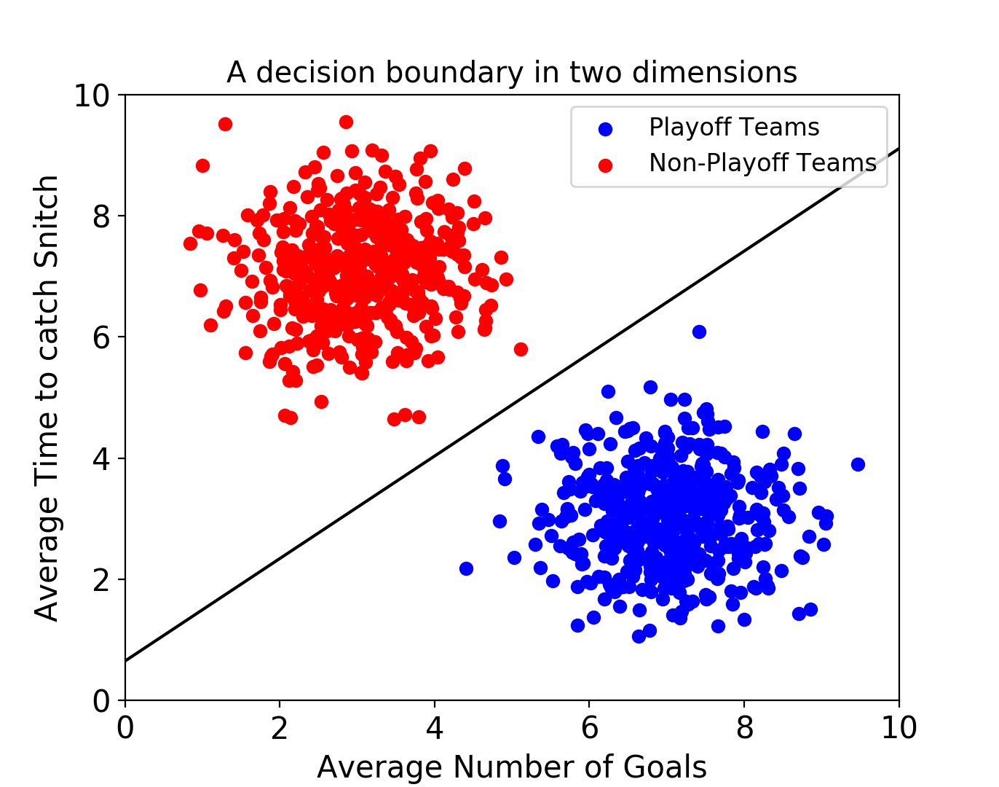
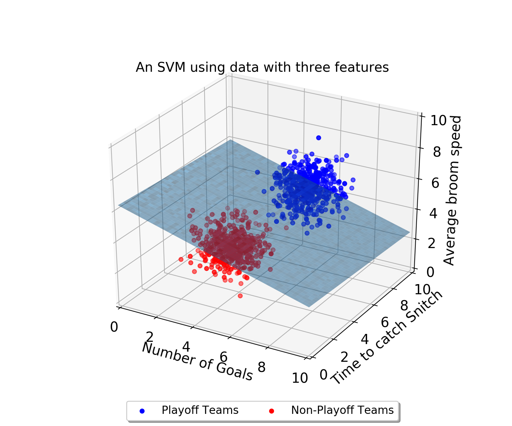
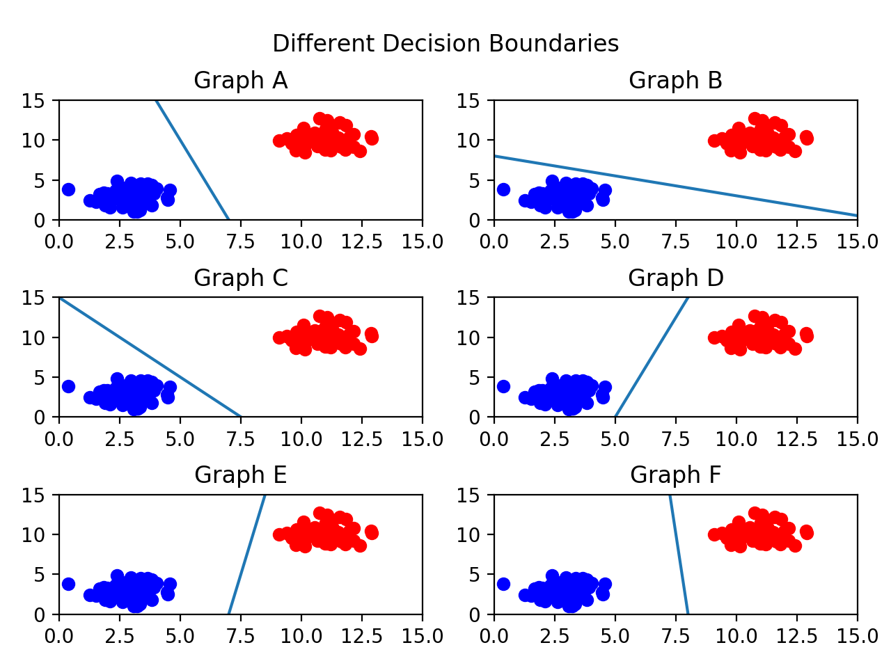
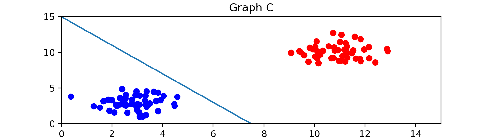
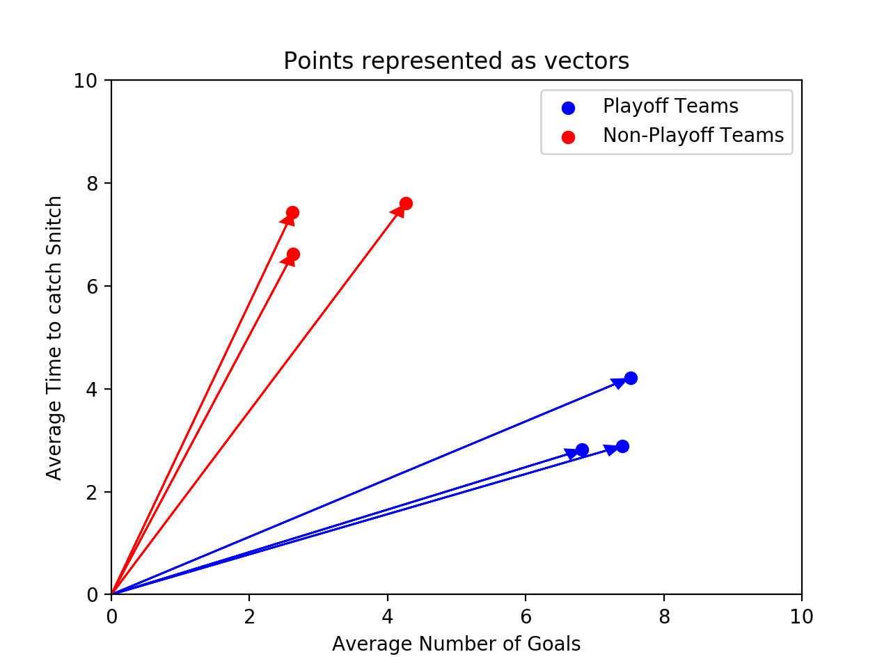
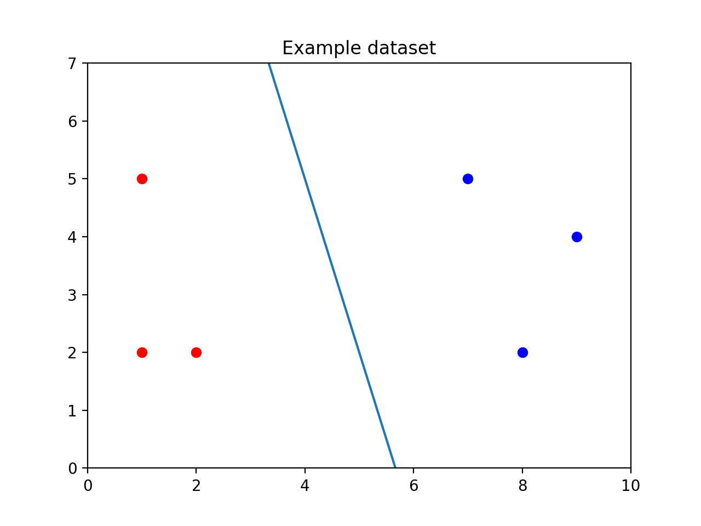
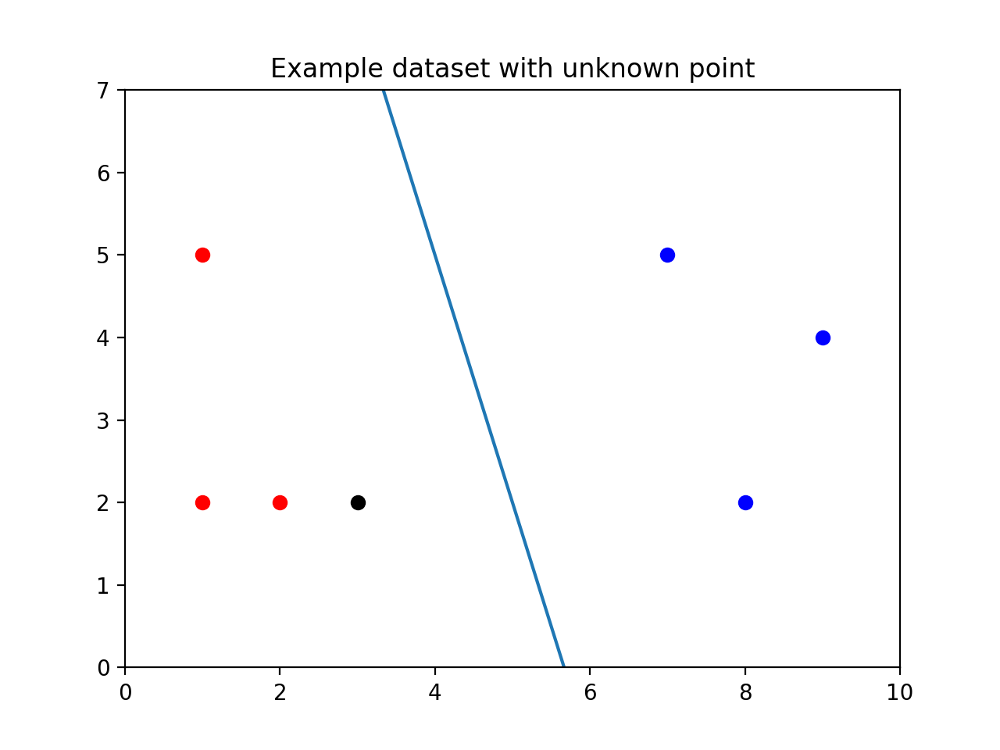

# [Support Vector Machines](https://www.codecademy.com/paths/machine-learning/tracks/advanced-supervised-learning-skill-path/modules/support-vector-machines-skill-path/lessons/machine-learning-support-vector-machine/exercises/decision-boundary)

A **Support Vector Machine (SVM)** is a powerful supervised machine learning model used for classification. 
An SVM makes classifications by defining a decision boundary and then seeing what side of the boundary an unclassified point falls on. 
In the next few exercises, we’ll learn how these decision boundaries get defined, but for now, know that they’re defined by using a training set of classified points. 
That’s why SVMs are supervised machine learning models.

Decision boundaries are easiest to wrap your head around when the data has two features. 
In this case, the decision boundary is a line.



This SVM is using data about fictional games of Quidditch from the Harry Potter universe! 
The classifier is trying to predict whether a team will make the playoffs or not. 
Every point in the training set represents a “historical” Quidditch team. 
Each point has two features — the average number of goals the team scores and the average number of minutes it takes the team to catch the Golden Snitch.

After finding a decision boundary using the training set, you could give the SVM an unlabeled data point, and it will predict whether or not that team will make the playoffs.

Decision boundaries exist even when your data has more than two features. 
If there are three features, the decision boundary is now a plane rather than a line.



As the number of dimensions grows past 3, it becomes very difficult to visualize these points in space. 
Nonetheless, SVMs can still find a decision boundary. 
However, rather than being a separating line, or a separating plane, the decision boundary is called a separating hyperplane.

## [Optimal Decision Boundaries](https://www.codecademy.com/paths/machine-learning/tracks/advanced-supervised-learning-skill-path/modules/support-vector-machines-skill-path/lessons/machine-learning-support-vector-machine/exercises/optimal-decision-boundary)

One problem that SVMs need to solve is figuring out what decision boundary to use. 
After all, there could be an infinite number of decision boundaries that correctly separate the two classes. 



There are so many valid decision boundaries, but which one is best? 
In general, we want our decision boundary to be as far away from training points as possible.

Maximizing the distance between the decision boundary and points in each class will decrease the chance of false classification.



The decision boundary is close to the blue class, so it is possible that a new point close to the blue cluster would fall on the red side of the line.

Out of all the graphs shown here, graph F has the best decision boundary.

## [Support Vectors and Margins](https://www.codecademy.com/paths/machine-learning/tracks/advanced-supervised-learning-skill-path/modules/support-vector-machines-skill-path/lessons/machine-learning-support-vector-machine/exercises/support-vector)

We now know that we want our decision boundary to be as far away from our training points as possible. 
Let’s introduce some new terms that can help explain this idea.

The support vectors are the points in the training set closest to the decision boundary. 
In fact, these vectors are what define the decision boundary. 
But why are they called vectors? 
Instead of thinking about the training data as points, we can think of them as vectors coming from the origin.



These vectors are crucial in defining the decision boundary — that’s where the “support” comes from. 
If you are using `n` features, there are at least `n+1` support vectors.

The distance between a support vector and the decision boundary is called the margin. 
We want to make the margin as large as possible. 
The support vectors are highlighted in the image below:


Because the support vectors are so critical in defining the decision boundary, many of the other training points can be ignored. 
This is one of the advantages of SVMs. 
Many supervised machine learning algorithms use every training point in order to make a prediction, even though many of those training points aren’t relevant. 
SVMs are fast because they only use the support vectors!

## [scikit-learn](https://www.codecademy.com/paths/machine-learning/tracks/advanced-supervised-learning-skill-path/modules/support-vector-machines-skill-path/lessons/machine-learning-support-vector-machine/exercises/sklearn)

Now that we know the concepts behind SVMs we need to write the code that will find the decision boundary that maximizes the margin. 
All of the code that we’ve written so far has been guessing and checking — we don’t actually know if we’ve found the best line. 
Unfortunately, calculating the parameters of the best decision boundary is a fairly complex optimization problem. 
Luckily, Python’s scikit-learn library has implemented an SVM that will do this for us.

Note that while it is not important to understand how the optimal parameters are found, you should have a strong conceptual understanding of what the model is optimizing.

To use scikit-learn’s SVM we first need to create an SVC object. 
It is called an SVC because scikit-learn is calling the model a Support Vector Classifier rather than a Support Vector Machine.
```
classifier = SVC(kernel = 'linear')
```
Next, the model needs to be trained on a list of data points and a list of labels associated with those data points. 
The labels are analogous to the color of the point — you can think of a `1` as a red point and a `0` as a blue point. 
The training is done using the `.fit()` method:
```
training_points = [[1, 2], [1, 5], [2, 2], [7, 5], [9, 4], [8, 2]]
labels = [1, 1, 1, 0, 0, 0]
classifier.fit(training_points, labels) 
```



Calling `.fit()` creates the line between the points.

Finally, the classifier predicts the label of new points using the `.predict()` method. 
The `.predict()` method takes a list of points you want to classify. 
Even if you only want to classify one point, make sure it is in a list: 
```
print(classifier.predict([
  [3, 2]
]))
```
In the image below, you can see the unclassified point `[3, 2]` as a black dot. 
It falls on the red side of the line, so the SVM would predict it is red.



In addition to using the SVM to make predictions, you can inspect some of its attributes. 
For example, if you can print `classifier.support_vectors_` to see which points from the training set are the support vectors.

In this case, the support vectors look like this:
```
[
  [7, 5],
  [8, 2],
  [2, 2]
]
```

## [Outliers](https://www.codecademy.com/paths/machine-learning/tracks/advanced-supervised-learning-skill-path/modules/support-vector-machines-skill-path/lessons/machine-learning-support-vector-machine/exercises/outliers)


