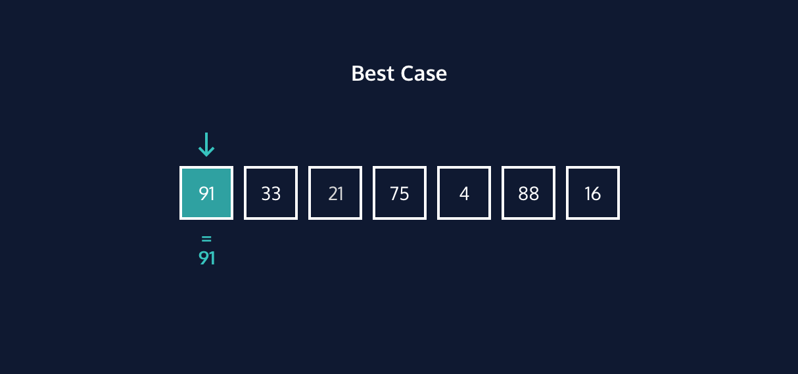
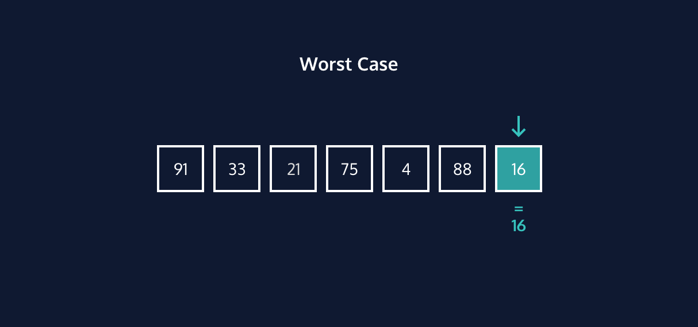
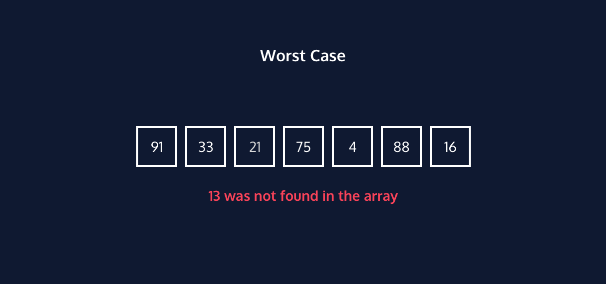

#### LINEAR SEARCH: CONCEPTUAL

# [Linear Search](https://www.codecademy.com/courses/search-algorithms/lessons/linear-conceptual/exercises/introduction-linear)

Imagine that you are a DJ at a party. 
The diagram on the right shows your playlist for the event.

A party guest wants to know if “Uptown Funk” by Bruno Mars is a song on your playlist. 
You would scan the entire playlist and find that it is not on your playlist.

Another party guest wants to know if “Single Ladies” by Beyonce is a song on your playlist. 
You would scan the list until you locate “Single Ladies” as the fifth song on your playlist. 
With this information, you could inform the party guest that the song is on the playlist and that it will be the fifth song that it will be played.

In computer science, search algorithms are step-by-step procedures used to locate and retrieve information from a set of data. 
This method in the example is similar to a search algorithm called linear search.

The linear search, or sequential search, algorithm sequentially checks whether a given value is an element of a specified list by scanning the elements of a list one-by-one. 
It checks every item in the list in order from the beginning to end until it finds a target value.

If it finds the target value in the list, the linear search algorithm stops and returns the position in the list corresponding to the target value. 
If it does not find the value, the linear search algorithm returns a message stating that the target value is not in the list.

# [Finding Elements in Lists](https://www.codecademy.com/courses/search-algorithms/lessons/linear-conceptual/exercises/find-elements-linear)

Linear search can be used to search for a desired value in a list. 
It achieves this by examining each of the elements and comparing it with the search element starting with the first element to the last element in the list until it finds a match.

The steps are:
1. Examine the first element of the list.
2. If the first element is equal to the target value, stop.
3. If the first element is not equal to the target value, check the next element in the list.
4. Continue steps 1-3 until the element is found or the end of the list is reached.

# [Best Case Performance](https://www.codecademy.com/courses/search-algorithms/lessons/linear-conceptual/exercises/best-case-linear)

Linear search is not considered the most efficient search algorithm, especially for lists of large magnitudes. 
However, linear search is a great choice if you expect to find the target value at the beginning of the list, or if you have a small list.

  

The best case performance for linear search occurs when the target value exists in the list and is in the first position of the list. 
In this case, the linear search algorithm will only be required to make one comparison. 
The time complexity for linear search in its best case is O(1).

# [Worst Case Performance](https://www.codecademy.com/courses/search-algorithms/lessons/linear-conceptual/exercises/worst-case-linear)

There are two worst cases for linear search.

**Case 1**: when the target value at the end of the list.

  

**Case 2**: when the target value does not exist in the list.

  

In both cases, the linear search algorithm is required to scan the entire list of N elements and, therefore, makes N comparisons.

For this reason, the time complexity for linear search in its worst case is O(N).

# [Average Case Performance](https://www.codecademy.com/courses/search-algorithms/lessons/linear-conceptual/exercises/average-case-linear)

If this search was used 1000 times on 1000 different lists, some of them would be the best case, some the worst. 
For most searches, it would be somewhere in between.

On average it would be in the middle of the list, that search would take `O(N/2)` time. 
Let’s prove this.

Each element of the list on the right requires a different number of comparisons to be located in a list. 
Using linear search, the first element is located with one comparison, the second element is located with two comparisons, and so on until the last element is located in N, the size of the list, comparisons.

The average case performance is the average number of comparisons. 
To calculate this, you use this formula:

**`N/2`**

We would expect on average for the linear search algorithm to search halfway through the list. 
Therefore the time complexity for linear search in its average case is `O(N/2)`.

Based on Big O simplification rules, which you can learn about in the Big O lesson, we simplify the time complexity in this case to `O(N)`.

# [Time Complexity of Linear Search](https://www.codecademy.com/courses/search-algorithms/lessons/linear-conceptual/exercises/time-complexity-linear)

Linear search runs in linear time. 
Its efficiency can be expressed as a linear function, with the number of comparisons to find a target increasing linearly as the size of the list, N, increases.

The time complexity for linear search in Big-O notation is `O(N)`.

A time complexity of `O(N)` means the number of comparisons is proportional to the number of elements, `N`, in the list. 
With a list with twice as many elements, linear search will take at most twice as long to perform the search. 
The time complexity of linear search is also dependent on the best case, worst case, and average case scenarios.

# [Review](https://www.codecademy.com/courses/search-algorithms/lessons/linear-conceptual/exercises/review-linear)

* Linear search is a search algorithm that sequentially checks whether a given value is an element of a specified list by scanning the elements of a list one-by-one until it finds the target value.

* The time complexity for linear search is `O(N)`, but its performance is dependent on its input:
  * **Best Case**: The algorithm requires only 1 comparison to find the target value in the first position of the list.
  * **Worst Case**: The algorithm requires only `n` comparison to find the target value in the last position of the list or does not exist in the list.
  * **Average Case**: The algorithm makes `N/2` comparisons.
* Linear search is a good choice for a search algorithm when:
  * You expect the target value to be positioned near the beginning of the list.
  * A search needs to be performed on an unsorted list because linear search traverses the entire list from beginning to end, regardless of its order.
