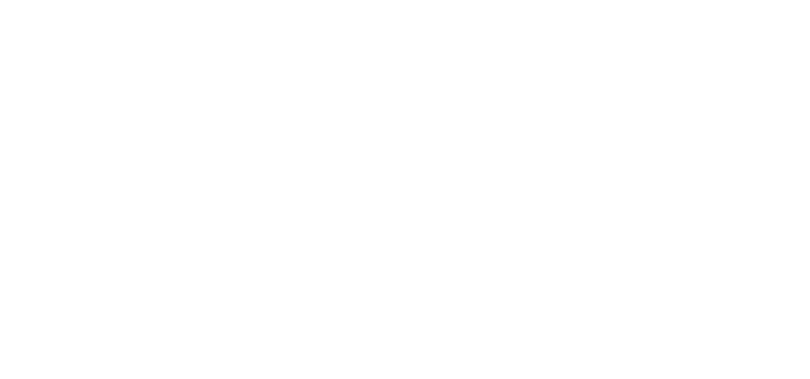

#### LINEAR SEARCH: CONCEPTUAL

# [Linear Search](https://www.codecademy.com/courses/search-algorithms/lessons/linear-conceptual/exercises/introduction-linear)

Imagine that you are a DJ at a party. 
The diagram on the right shows your playlist for the event.

A party guest wants to know if “Uptown Funk” by Bruno Mars is a song on your playlist. 
You would scan the entire playlist and find that it is not on your playlist.

Another party guest wants to know if “Single Ladies” by Beyonce is a song on your playlist. 
You would scan the list until you locate “Single Ladies” as the fifth song on your playlist. 
With this information, you could inform the party guest that the song is on the playlist and that it will be the fifth song that it will be played.

In computer science, search algorithms are step-by-step procedures used to locate and retrieve information from a set of data. 
This method in the example is similar to a search algorithm called linear search.

The linear search, or sequential search, algorithm sequentially checks whether a given value is an element of a specified list by scanning the elements of a list one-by-one. 
It checks every item in the list in order from the beginning to end until it finds a target value.

If it finds the target value in the list, the linear search algorithm stops and returns the position in the list corresponding to the target value. 
If it does not find the value, the linear search algorithm returns a message stating that the target value is not in the list.

# [Finding Elements in Lists](https://www.codecademy.com/courses/search-algorithms/lessons/linear-conceptual/exercises/find-elements-linear)

Linear search can be used to search for a desired value in a list. 
It achieves this by examining each of the elements and comparing it with the search element starting with the first element to the last element in the list until it finds a match.

The steps are:
1. Examine the first element of the list.
2. If the first element is equal to the target value, stop.
3. If the first element is not equal to the target value, check the next element in the list.
4. Continue steps 1-3 until the element is found or the end of the list is reached.

For example, we can use the linear search algorithm to find the target value 22 in a list. 
The algorithm iteratively moves through the list until it finds a 22 in the 7th position of the list.

