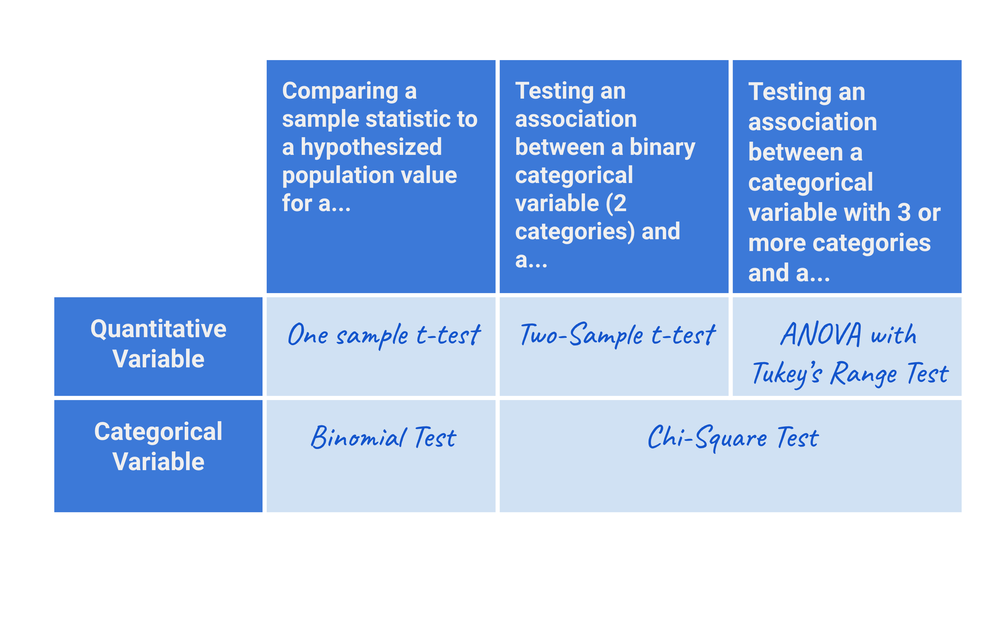

# [How to Choose a Hypothesis Test](https://www.codecademy.com/courses/hypothesis-testing-python/articles/how-to-choose-a-hypothesis-test)

Learn how to choose an appropriate hypothesis test for your data and questions.

## Introduction

In this module we’ll cover some of the key considerations for designing an experiment. 
One of the first things to consider is which statistical test is appropriate for the question you are trying to answer. 
Sometimes this will depend on the data you have available, and sometimes you will have the opportunity to decide this before starting to collect data.

There are many different types of hypothesis tests that should be used in different situations. 
In this article, we are going to briefly review some of them and when they are appropriate.

Here is a summary table of some of the hypothesis tests we’ll cover:



## Comparing a sample statistic to a hypothesized population value

In some situations, we may want to compare a sample statistic to a hypothesized population value. 
In this scenario, we have a sample of data from some population and have calculated a sample statistic (eg., a sample mean, frequency, or proportion). 
Based on this observed sample statistic, we then want to know whether the sample was likely to be drawn from a population with some hypothesized or target value of that same statistic.

For example, suppose we hypothesize that 5% of all people who access a website will buy a product. 
In order to understand if this is the case, we might find a sample of people who accessed that website and calculate that 4.3% of our sample bought a product. 
Finally, we can use a hypothesis test to determine the likelihood that, if we could observe ALL people who ever access the website, 5% of them will buy a product (even though only 4.3% of our sample did).

If we have a sample of **quantitative data**, such as *height*, *weight*, or *amount spent*, we should use a **one-sample t-test**. 
If we have a sample of **binary data**, such as *whether or not someone made a purchase* or *clicked a link*, we should use a **binomial test**.

### Example: one sample t-test

Suppose we want to compare exam scores for students who attended a test prep program to the global average score of 35 points. 
Do students who attend this program score higher than 35 points? 
The global average is the hypothesized population value and the average of the exam scores of students who attended the program is the sample statistic 
(in this case, sample mean).

Below is the code to run a one-sample t-test to address the above question. 
In this example the **alternative hypothesis** is that *the sample mean is significantly different than 35*, and the **null hypothesis** is that *the sample mean is 35*.
```python
from scipy.stats import ttest_1samp
 
global_average_score = 35
sample_scores = [12, 42, 37, 18, 23, 39, 45, … , 52]
 
t_stat, p_value = ttest_1samp(sample_scores, global_average_score)
```

### Example: binomial test

If we instead have a sample of **binary data** and want to compare a sample proportion/frequency to an underlying probability (population value), a binomial test is appropriate. 
The classic example of a binomial test is tossing a coin to determine if it’s fair (fair means that the probability of either heads or tails is exactly 50%).

For example, suppose that you collect sample data from a coin by tossing it 100 times, and find that 45 flips result in heads. 
Based on this sample, what is the probability that the coin is actually fair (if you flipped it infinitely many times, exactly half those flips would be heads)? 
The following code runs the binomial test to answer this question:
```python
from scipy.stats import binom_test
 
p_value = binom_test(45, 100, p = 0.50)
```
The **alternative hypothesis** for this test is that the *probability is different than p = 0.50*, and the **null** is that it is *equal to 0.50*.

Here are some other examples of situations where a binomial test would be useful
* Is the number of passengers who show up for a flight fewer than normal?
* Is the open rate on a marketing email different from the company target?

## Testing for an association between two variables at the population level

When we have a sample of **data with two variables**, and **want to know if there is an association between those variables** at the population level, 
we’ll need a different set of hypothesis tests. 
For example, we might be interested in the relationship between:
* claw size and species of bear (black vs grizzly bears)
* tree height and the species of tree (for pine, oak, and spruce trees)
* subscription rates for 2 versions of a web page among all site visitors

In each of these examples, we cannot observe the entire population of interest (eg., the entire wild population of each species of bear). 
Instead, we can collect data for a smaller sample and then use a hypothesis test to understand the likelihood that a similar association exists among the population we care about.

### Example: two-sample t-test

A **two-sample t-test** is used to investigate an association **between a quantitative variable and a binary categorical variable**. 
For example, suppose we want to test if there is an association between claw size (quantitative) and species: black or grizzly bear (binary categorical). 
To answer this question, we could sample a selection of black bears and grizzly bears, then calculate the average claw size for each species. 
Then, we can use a two-sample t-test to determine the probability that the claw sizes for these two species are significantly different (among the entire population of black and grizzly bears). 
The data might look like this:

| | Species |	Claw size (in)
| --- | --- | :---:
| 0 |	black |	1.48
| 1 |	grizzly |	2.01
| 2 |	grizzly |	1.89
| 3 |	black |	1.65
| 4 |	black |	1.58

And the code to run the two-sample t-test will look like this:
```python
from scipy.stats import ttest_ind
 
#separate out claw lengths for two species
grizzly_bear = data.claw_length[data.species == 'grizzly']
black_bear = data.claw_length[data.species == 'black']
 
#run the t-test here:
tstat, pval = ttest_ind(grizzly_bear, black_bear)
```
Other examples of two-sample t-tests include studies like drug trials or psychology studies with a control and experimental group or A/B Testing with quantitative data like “time spent on a website”. 

### Example: ANOVA and Tukey’s range test

In cases similar to the two-sample t-test, but **when the categorical variable has three or more categories**, 
an **ANOVA** can be used *to see if there is a significant difference between any of the groups*. 
Then, if at least one pair of groups are significantly different, **Tukey’s range test** can be used *to determine which groups are different*. 
This is better than running multiple two-sample t-tests because it leads to a lower probability of making a type I error.

For example, if we want to compare the heights of three different tree species, in order to test the hypothesis that average tree heights vary by species, 
we can use an ANOVA. 
Then, if the p-value from the ANOVA is below our significance threshold, we can run Tukey’s range test to determine which tree species have significantly different heights.

The code to run these tests is as follows:
```python
# ANOVA Test
from scipy.stats import f_oneway

fstat, pval = f_oneway(heights_pine, heights_oak, heights_spruce)
 
# Tukey’s Range Test
from statsmodels.stats.multicomp import pairwise_tukeyhsd

tukey_results = pairwise_tukeyhsd(tree_data.height, tree_data.species, 0.05)
```

### Example: Chi-Square test

When looking at the **relationship between two categorical variables**, we can run a **Chi-Square Test** to see if there is a significant association between the variables. 
**Both variables can have any number of categories.** 
Some examples include testing an association between:
* Smoking and lung cancer
* Website version and whether or not someone subscribed
* Education level and tax income bracket (multiple categories such as “under 40k”, ”40k-60k”, ”60-80k”, etc)

For example, suppose we are interested in understanding whether there is an association between the version of a website someone sees and whether or not they subscribe. 
The data may look something like this:

| | Web Version |	Subscribed? 
| --- | :---:| :---:
| 0 |	A |	yes
| 1 |	A |	yes
| 2 |	B |	yes
| 3 |	B |	no
| 4 |	A |	no

These variables can then be summarized using a contingency table:

| Subscribed |	no |	yes
| --- | :---: | :---:
| Web Version		
| A |	23 |	27
| B |	16 |	34

Finally, a Chi-Square test evaluates whether the observed contingency table is significantly different from the table that would be expected 
if there were no association between the variables. 
The code to create the contingency table and run the Chi-Square test looks something like this:
```python
import pandas as pd
from scipy.stats import chi2_contingency
 
# create contingency table
ab_contingency = pd.crosstab(data.Web_Version, data.Subscribed)
 
# run a Chi-Square test
chi2, pval, dof, expected = chi2_contingency(ab_contingency)
```

## Finding a representative sample

Beyond choosing a hypothesis test, it is important to understand whether the data you have meets the assumptions of the test you want to run. 
Each hypothesis test has a unique set of assumptions, which we won’t cover in detail in this article; 
however, there is one assumption that all hypothesis tests share: **the data was randomly sampled from the population of interest**.

This is important because random sampling ensures that the sample is representative of the population in terms of observed (and unobserved) characteristics. 
Unfortunately, there may be situations where random sampling is impossible, but it is important to understand how this can bias results of a test.

For example, let’s return to the example with the yogurt company “The Dairy Culture”. 
Let’s say the company had multiple factories, but the quality assurance team only collected yogurts from one specific factory. 
The data is thus not randomly sampled from the entire population that we care about (all factories), and could be biased if the quality of yogurt differs at each one.

There can also be ethical issues that arise when a sample is not representative of a population. 
When developing and testing a vaccine, for example, researchers must make sure to find volunteers from an appropriate proportion of 
genders, races, age ranges, pre-existing conditions, and so on to test efficacy for the entire population that the vaccine will be used on. 
If the vaccine manufacturers test on a sample that doesn’t include sufficient data for one race, there is a risk that there could be reduced 
(if during the initial research phase) or unknown efficacy for that group.

It can often be challenging to find a representative sample or even to recognize when there is biased data, but it is essential to think about when designing an experiment.

## Next steps

Now that you’ve learned to choose a **hypothesis test** and have thought about the sample you’ll need to answer your questions, 
you’re well on your way to designing your own experiments! 
The next step in the design process is to choose a sample size and figure out the details of how and when you’re going to collect your data.


