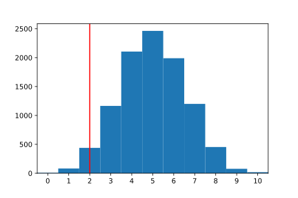

#### SIMULATING A BINOMIAL TEST

# [Introduction](https://www.codecademy.com/courses/hypothesis-testing-python/lessons/simulating-a-binomial-test/exercises/introduction)

Binomial tests are useful for comparing the frequency of some outcome in a sample to the expected probability of that outcome. 
For example, if we expect 90% of ticketed passengers to show up for their flight but only 80 of 100 ticketed passengers actually show up, 
we could use a binomial test to understand whether 80 is significantly different from 90.

Binomial tests are similar to one-sample t-tests in that they test a sample statistic against some population-level expectation. 
The difference is that:
* binomial tests are used for binary categorical data to compare a sample frequency to an expected population-level probability
* one-sample t-tests are used for quantitative data to compare a sample mean to an expected population mean.

In Python, as in many other programming languages used for statistical computing, 
there are a number of libraries and functions that allow a data scientist to run a hypothesis test in a single line of code. 
However, a data scientist will be much more likely to spot and fix potential errors and interpret results correctly 
if they have a conceptual understanding of how these functions work.

# [Summarizing the Sample](https://www.codecademy.com/courses/hypothesis-testing-python/lessons/simulating-a-binomial-test/exercises/summarizing-the-sample)

The marketing department at Live-it-LIVE reports that, during this time of year, about 10% of visitors to Live-it-LIVE.com make a purchase.

The monthly report shows every visitor to the site and whether or not they made a purchase. 
The checkout page had a small bug this month, so the business department wants to know whether the purchase rate dipped below expectation. 
They’ve asked us to investigate this question.

In order to run a hypothesis test to address this, we’ll first need to know two things from the data:
* The number of people who visited the website
* The number of people who made a purchase on the website

Assuming each row of our dataset represents a unique site visitor, 
we can calculate the number of people who visited the website by finding the number of rows in the data frame. 
We can then find the number who made a purchase by using a conditional statement to add up the total number of rows where a purchase was made.

For example, suppose that the dataset `candy` contains a column named `chocolate` with `'yes'` recorded for every candy that has chocolate in it and `'no'` otherwise. 
The following code calculates the sample size (the number of candies) and the number of those candies that contain chocolate:
```python
## sample size (number of rows): 
samp_size = len(candy)
 
## number with chocolate: 
total_with_chocolate = np.sum(candy.chocolate == 'yes')
```

# [Simulating Randomness](https://www.codecademy.com/courses/hypothesis-testing-python/lessons/simulating-a-binomial-test/exercises/simulating-randomness)

In the last exercise, we calculated that there were 500 site visitors to live-it-LIVE.com this month and 41 of them made a purchase. 
In comparison, if each of the 500 visitors had a 10% chance of making a purchase, we would expect around 50 of those visitors to buy something. 
Is 41 different enough from 50 that we should question whether this months’ site visitors really had a 10% chance of making a purchase?

To conceptualize why our **expectation (50)** and **observation (41)** might not be equal
— EVEN IF there was no dip in the purchase probability — 
let’s turn to a common probability example: flipping a fair coin. 
We can simulate a coin flip in Python using the `numpy.random.choice()` function:
```python
flip = np.random.choice(
    ['heads', 'tails'], 
    size = 1, 
    p = [0.5, 0.5]
)
print(flip) 
## output is either ['heads'] or ['tails']
```
If we run this code (or flip a real coin) a few times, we’ll find that 
— just like we can’t know ahead of time whether any single visitor to Live-it-LIVE.com will make a purchase — we can’t predict the outcome of any individual coin flip.

If we flip a fair coin 10 times in a row, we expect about 5 of those coins to come up heads (50%). 
We can simulate this in python by changing the `size` parameter of `numpy.random.choice()`:
```python
flip = np.random.choice(
    ['heads', 'tails'], 
    size = 10, 
    p = [0.5, 0.5]
)
print(flip)
## output is something like: ['heads' 'heads' 'heads' 'tails' 'tails' 'heads' 'heads' 'tails' 'heads' 'heads']
```
If you try this yourself, it’s perfectly reasonable that you’ll get only four heads, or maybe six or seven! 
Because this is a random process, we can’t guarantee that exactly half of our coin flips will come up heads. 
Similarly, even if each Live-it-LIVE visitor has a 10% chance of making a purchase, that doesn’t mean we expect **exactly 10%** to do so in any given sample.

# [Simulating the Null Distribution I](https://www.codecademy.com/courses/hypothesis-testing-python/lessons/simulating-a-binomial-test/exercises/simulating-the-null-distribution-part-1)

The first step in running a hypothesis test is to form a ***null hypothesis***. 
For the question of whether the purchase rate at Live-it-LIVE.com was different from 10% this month, 
the null hypothesis describes a world in which the true probability of a visitor making a purchase was exactly 10%, 
but by random chance, we observed that only 41 visitors (8.2%) made a purchase.

Let’s return to the coin flip example from the previous exercise. 
We can simulate 10 coin flips and print out the number of those flips that came up heads using the following code:
```python
flips = np.random.choice(
    ['heads', 'tails'], 
    size = 10, 
    p = [0.5, 0.5]
)
num_heads = np.sum(flips == 'heads')
print(num_heads)
## output: 4
```
If we run this code a few times, we’ll likely see different results each time. 
This will give us get a sense for the range in the number of heads that could occur by random chance, even if the coin is fair. 
We’re more likely to see numbers like four, five, or six, but maybe we’ll see something more extreme every once in a while — ten heads in a row, or even zero!

# [Simulating the Null Distribution II](https://www.codecademy.com/courses/hypothesis-testing-python/lessons/simulating-a-binomial-test/exercises/simulating-the-null-distribution-part-2)

In the last exercise, we simulated a random sample of 500 visitors, where each visitor had a 10% chance of making a purchase. 
When we pressed “Run” a few times, we saw that the number of purchases varied from sample to sample, but was **around 50**.

Similarly, we simulated a single random sample of 10 coin flips, where each flip had a 50% chance of coming up heads. 
We saw that the number of simulated heads was not necessarily 5, but somewhere around 5.

By running the same simulated experiment many times, we can get a sense for how much a particular outcome (like the number of purchases, or heads) varies by random chance. Consider the following code:
```python
outcomes = []
for i in range(10000): 
    flips = np.random.choice(
        ['heads', 'tails'], 
        size = 10, 
        p = [0.5, 0.5]
    )
    num_heads = np.sum(flips == 'heads')
    outcomes.append(num_heads)
print(outcomes)
## output is something like: [3, 4, 5, 8, 5, 6, 4, 5, 3, 2, 8, 5, 7, 4, 4, 5, 4, 3, 6, 5,...]
```
In this code chunk, we’ve done the following:
* initialized an empty list named `outcomes` to store the number of ‘heads’ from simulated samples of coin flips
* set up a for-loop to repeat the steps below 10000 times:
    * flip a fair coin 10 times
    * calculate the number of those 10 flips that came up heads
    * append that number onto `outcomes`

Note that 10000 is an arbitrarily chosen large number — it’s big enough that it will yield almost all possible outcomes of our experiment, 
and small enough that the simulation still runs quickly. 
From inspecting the output, we can see that the number of ‘heads’ varied between 0 and 10:
```python
min_heads = np.min(outcomes) 
print(min_heads) #output: 0
 
max_heads = np.max(outcomes)
print(max_heads) #output: 10
```
Thus, if we flip a fair coin 10 times, we could observe anywhere between 0 and 10 heads by random chance.

# [Inspecting the Null Distribution](https://www.codecademy.com/courses/hypothesis-testing-python/lessons/simulating-a-binomial-test/exercises/inspecting-the-null-distribution)

In the previous exercise, we simulated 10000 different samples of 500 visitors, 
where each visitor had a 10% chance of making a purchase, and calculated the number of purchases per sample. 
Upon further inspection, we saw that those numbers ranged from around 25 to 75. 
This is useful information, but we can learn even more from inspecting the full distribution.

For example, recall our 10000 coin flip experiments: 
for each experiment, we flipped a fair coin 10 times and recorded the number of heads in a list named `outcomes`. 
We can plot a histogram of `outcomes` using `matplotlib.pyplot.hist()`. 
We can also add a vertical line at any x-value using `matplotlib.pyplot.axvline()`:
```python
import matplotlib.pyplot as plt
plt.hist(outcomes)
plt.axvline(2, color = 'r')
plt.show()
```
Output:



This histogram shows us that, over 10000 experiments, we observed as few as 0 and as many as 10 heads out of 10 flips. 
However, we were most likely to observe around 4-6 heads. 
It would be unlikely to observe only 2 heads (where the vertical red line is).

# [Confidence Intervals](https://www.codecademy.com/courses/hypothesis-testing-python/lessons/simulating-a-binomial-test/exercises/confidence-intervals)

So far, we’ve inspected the null distribution and calculated the minimum and maximum values. 
While the number of purchases in each simulated sample ranged roughly from 25 to 75 by random chance, upon further inspection of the distribution, we saw that those extreme values happened very rarely.

By reporting an interval covering 95% of the values instead of the full range, we can say something like: 
“we are 95% confident that, if each visitor has a 10% chance of making a purchase, a random sample of 500 visitors will make between 37 and 63 purchases.” 
We can use the `np.percentile()` function to calculate this 95% interval as follows:
```python
np.percentile(
    outcomes, 
    [2.5,97.5]
)
# output: [37. 63.]
```
We calculated the 2.5th and 97.5th percentiles so that exactly 5% of the data falls outside those percentiles 
(2.5% above the 97.5th percentile, and 2.5% below the 2.5th percentile). 
This leaves us with a range covering 95% of the data.

If our observed statistic falls outside this interval, then we can conclude it is unlikely that the null hypothesis is true. 
In this example, because 41 falls within the 95% interval (37 - 63), 
it is still reasonably likely that we observed a lower purchase rate by random chance, even though the null hypothesis was true.


