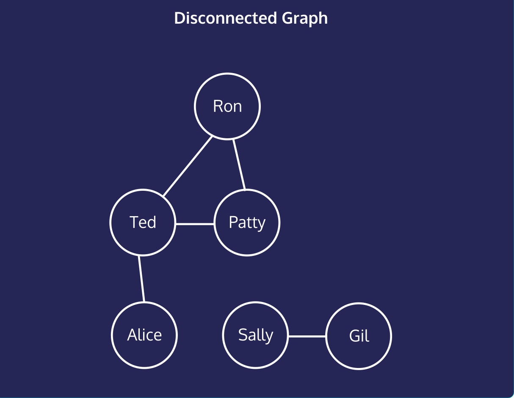
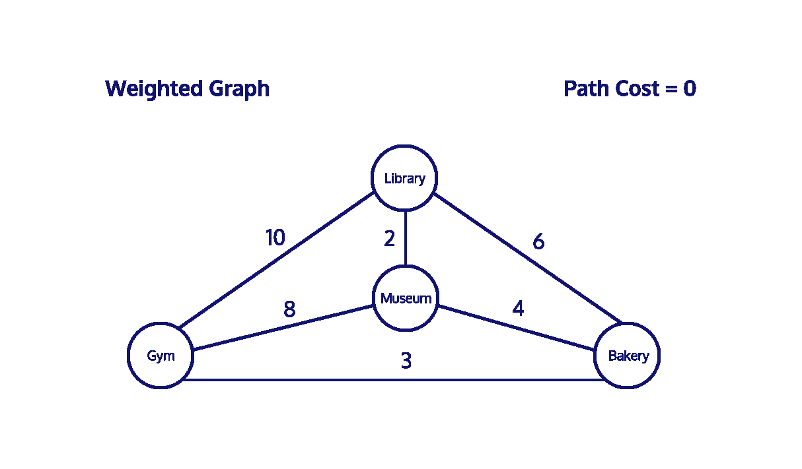

#### GRAPHS: CONCEPTUAL

# [Introduction to Graphs](https://www.codecademy.com/courses/complex-data-structures/lessons/conceptual-graphs/exercises/conceptual-graphs-intro)

Graphs are the perfect data structure for modeling networks, which make them an indispensable piece of your data structure toolkit. 
They’re composed of nodes, or vertices, which hold data, and edges, which are a connection between two vertices. 
A single node is a vertex.

Consider a map of the area where you live. 
As a graph, we could model bus stops as vertices, with bus routes between stops functioning as the edges.

What about the internet? 
Web pages can be vertices, and the hyperlinks which connect them are edges.

Real-world relationships modeled as graphs are numerous, making them an essential concept to master.

  

# [To Connect, or Not to Connect?](https://www.codecademy.com/courses/complex-data-structures/lessons/conceptual-graphs/exercises/conceptual-graphs-connected)

Graphs have varying degrees of connection. 
The higher the ratio of edges to vertices, the more connected the graph.

This graph represents a social network; 
people are vertices and edges are friendships. 
`Ted` is adjacent to `Patty`, `Ron`, and `Alice` because an edge **directly connects** them.

We use a single line for an edge, but these friendships are **bi-directional**. 
`Patty` is friends with `Ron` and `Ron` is friends with `Patty`.

A ***path*** is vertices which are connected by any number of intermediate edges. 
The paths from `Alice` to `Patty` could go 
* `Alice` to `Ted` to `Patty` 
* **or**, `Alice` to `Ted` to `Ron` to `Patty`.

No path exists between `Sally` and `Ted`. 
When *no path exists between two vertices*, a graph is ***disconnected***.

  

# [You're Going to Carry that Weight](https://www.codecademy.com/courses/complex-data-structures/lessons/conceptual-graphs/exercises/conceptual-graphs-weight)

We’re building a graph of favorite neighborhood destinations (vertices) and routes (edges), but not all edges are equal. 
It takes longer to travel between `Gym` and `Museum` than it does to travel between `Museum` and `Bakery`.

This is a ***weighted graph***, where edges have a number or cost associated with traveling between the vertices. 
When tallying the cost of a path, we add up the **total cost** of the edges used.

These costs are essential to algorithms that find the shortest distance between two vertices.

`Gym` and `Library` are adjacent, there’s one edge between them, but there’s less total cost to travel from `Gym` to `Bakery` to `Library` (10 vs. 9).

In a weighted graph, **the shortest path is not always the least expensive**.

  

# [Directed Graphs](https://www.codecademy.com/courses/complex-data-structures/lessons/conceptual-graphs/exercises/conceptual-graphs-direction) 

Imagine you’re a superhero escaping a villain’s lair. 
As you move from perilous room to perilous room, the doors close immediately behind you, barring any return.

For this dramatic example, we need a directed graph, where edges restrict the direction of movement between vertices.

We can move from `spikes` to `lasers`, but not from `lasers` to `spikes`. 
This differs from earlier examples when every edge was bi-directional.

Note the path `spikes` to `lasers` to `piranhas` to `spikes`. 
This path is a **cycle**, because it *ends* on the vertex *where* it *began*: `spikes`.

  <directed_graph.svg" width="800" alt="directed graph" />

