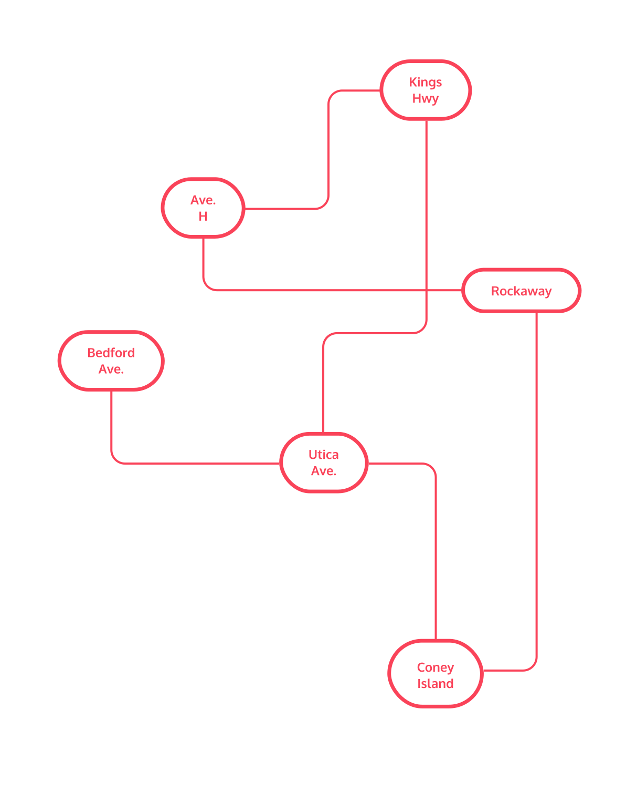

#### GRAPHS: CONCEPTUAL

# [Introduction to Graphs](https://www.codecademy.com/courses/complex-data-structures/lessons/conceptual-graphs/exercises/conceptual-graphs-intro)

Graphs are the perfect data structure for modeling networks, which make them an indispensable piece of your data structure toolkit. 
They’re composed of nodes, or vertices, which hold data, and edges, which are a connection between two vertices. 
A single node is a vertex.

Consider a map of the area where you live. 
As a graph, we could model bus stops as vertices, with bus routes between stops functioning as the edges.

What about the internet? 
Web pages can be vertices, and the hyperlinks which connect them are edges.

Real-world relationships modeled as graphs are numerous, making them an essential concept to master.

