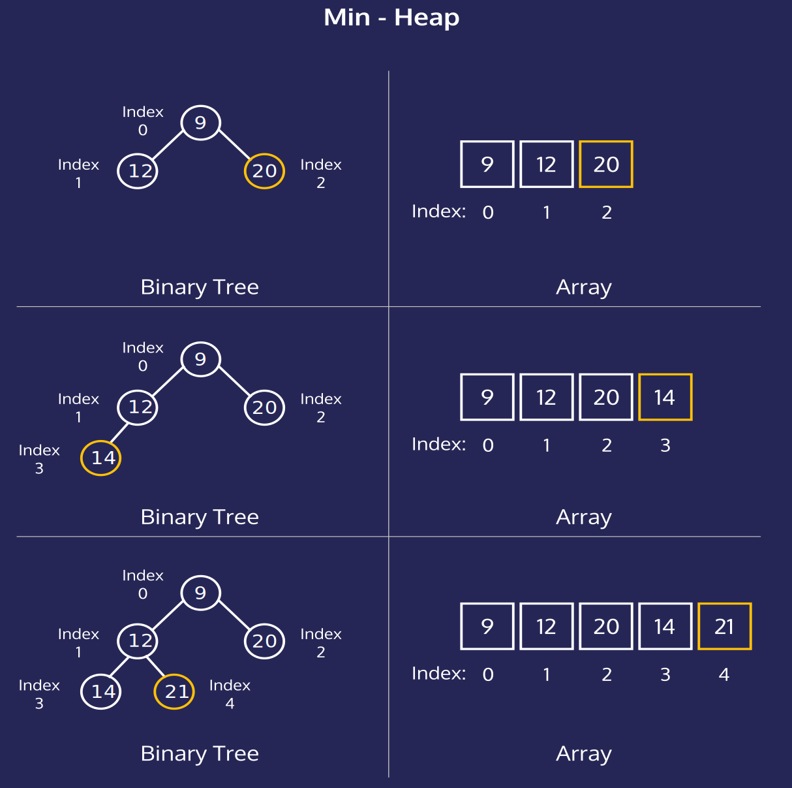
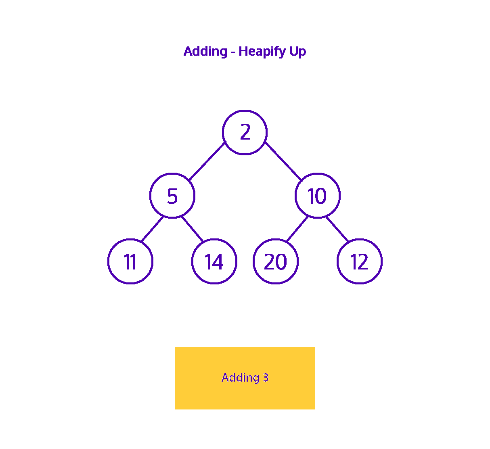

#### HEAPS: CONCEPTUAL

# [Heap Representations](https://www.codecademy.com/courses/complex-data-structures/lessons/conceptual-heaps/exercises/conceptual-heaps-representation)

Heaps are used to maintain a maximum or minimum value in a dataset. 
Our examples use numbers since this is a straight-forward value, but heaps have many practical applications.

Imagine you have a demanding boss (hopefully this is theoretical!). 
They always want the most important thing done. 
Of course, once you finish the most important task, another one takes its place.

You can manage this problem using a priority queue to ensure you’re always working on the most pressing assignment and heaps are commonly used to create a priority queue.

Heaps tracking the maximum or minimum value are max-heaps or min-heaps. 
We will focus on min-heaps, but the concepts for a max-heap are nearly identical.

Think of the min-heap as a binary tree with two qualities:
* The root is the **minimum value** of the dataset.
* Every **child**’s value is **greater than** its **parent**.

These two properties are the defining characteristics of the min-heap. 
By maintaining these two properties, we can efficiently retrieve and update the minimum value.

# [Heap Representations](https://www.codecademy.com/courses/complex-data-structures/lessons/conceptual-heaps/exercises/conceptual-heaps-representation)

We can picture min-heaps as binary trees, where each node has at most two children. 
As we add elements to the heap, they’re added from left to right until we’ve filled the entire level.

At the top, we’ve filled the level containing `12` and `20`. 
The next addition comes as the left child of `12`, starting a new level in the tree. 
We would continue filling this level from left to right until `20` had its right child filled.

Conceptually, the tree representation is beneficial for understanding. 
Practically, we implement heaps in a sequential data structure like an array or list for efficiency.

Notice how by filling the tree from left to right; 
we’re leaving no gaps in the array. 
The location of each child or parent derives from a formula using the index.
* left child: `(index * 2) + 1`
* right child: `(index * 2) + 2`
* parent: `(index - 1) / 2` — **not used on the root!**

# [Adding an Element: Heapify Up](https://www.codecademy.com/courses/complex-data-structures/lessons/conceptual-heaps/exercises/conceptual-heaps-heapify-up)

Sometimes you will add an element to the heap that violates the heap’s essential properties.

We’re adding `3` as a left child of `11`, which violates the min-heap property that **children must be larger or equal to their parent**.

We need to restore the fundamental heap properties. 
This restoration is known as ***heapify or heapifying***. 
We’re adding an element to the bottom of the tree and moving upwards, so we’re heapifying up.

As long as we’ve violated the heap properties, we’ll swap the offending child with its parent until we restore the properties, or until there’s no parent left. 
If there is no parent left, that element becomes the new root of the tree.

`3` swaps with `11`, but there’s still work to do because now `3` is a child of `5`. 
One more swap and we’ve restored the heap properties. 
The parent value, `2`, is lesser than the child, `3`. 
We can see that `3`‘s children `5` and `14` are also greater.

