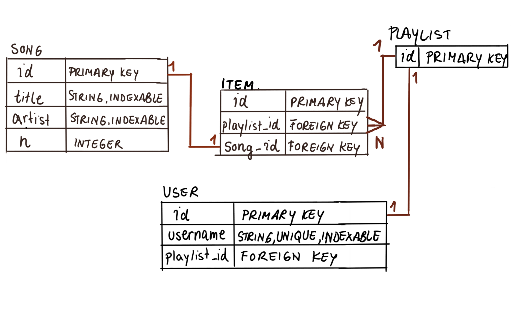

#### LEARN FLASK

# [FlaskFM](https://www.codecademy.com/courses/learn-flask/projects/flask-database-music)

You probably often encountered the concept of personalizing your taste in products you find online. 
For example, users create wishlists or shopping lists of various products, a personal book library as they buy and read books, sewing fabric preferences, or song library they listen to often. 
Your personal ‘wishlist’ is stored in a database so you can view it when needed.

In this project, you will create a web service, called FlaskFM, that will allow users to add songs to their personalized list from a song library curated by an administrator through a dashboard page. 
You will model users and playlists that can be changed by users who add or remove songs. 
The project work will focus on the database aspect, but you will create a functional web service for your users with us providing you templates, routes, and guidance. 
Your task will be to create a database with the schema below:

You will do a simplified version, but imagine users listening to songs on their music applications and your web service can track which songs/genre they listen to most often. 
Given the collected data, your web app can recommend new music to the users based on their listening preferences. 
We will start with the basics, but the sky is the limit. Let’s go!
