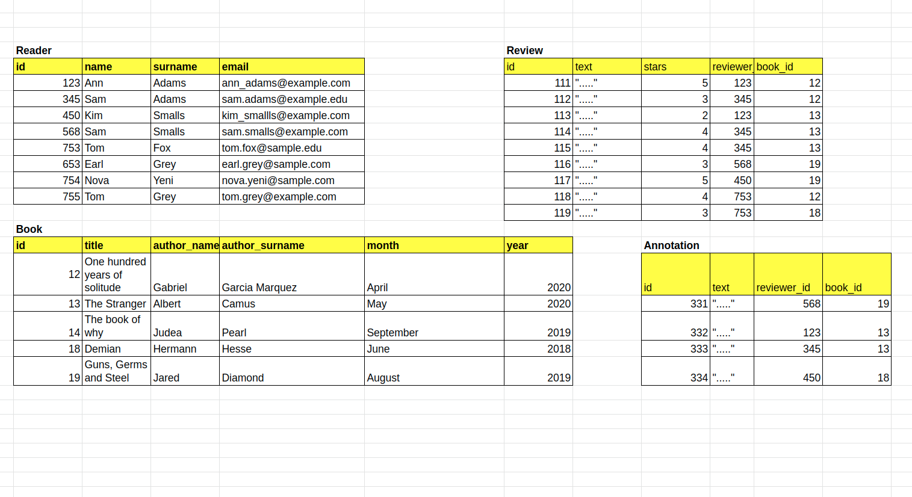

# Databases in Flask - Reading, Updating and Deleting

## [Interacting with a Database](https://www.codecademy.com/courses/learn-flask/lessons/flask-read-update-delete-database/exercises/interacting-with-database)

Your database has a number of readers who subscribed to your book club and some books you already assigned to be read. 
Also some of your readers wrote reviews about the books and some of them might have some annotations made while reading their books on an eReader. 
The schema representing the database:


What can you do with the database?

Say you want to list all the books you suggested or list all the subscribed readers. 
Or let each subscriber see only the reviews they wrote. 
When new people subscribe to your web service, you need to add them to your database, or when they unsubscribe delete them. 
If you made a mistake in changing your database, you probably want to undo the changes or ‘rollback’ to the previous correct state. 
When your subscribers change their e-mail, you need to update your database. 
Or you need to filter out the books your club read in the year 2019 and only calculate average ratings of those. 
These are all the most common interactions with a database, and in this lesson, you will learn how to perform them in Flask-SQLAlchemy.

## [Queries: query.all() and query.get()](https://www.codecademy.com/courses/learn-flask/lessons/flask-read-update-delete-database/exercises/query-all-and-query-get)

Querying a database table with Flask SQLAlchemy is done through the `query` property of the `Model` class. 
To get all entries from a model called TableName we run `TableName.query.all()`. 
Often you know the primary key (unique identifier) value of entries you want to fetch. 
To get an entry with some primary key value ID from model `TableName` you run: `TableName.query.get(ID)`.

For example, to get all the entries from the `Reader` table we do the following:
```
readers = Reader.query.all()
```
Similarly, to get a reader with `id = 123` we do the following:
```
reader = Reader.query.get(123)
```
We assign the result of the `.get()` method to a variable because through that variable we can access the entry’s attributes. 
For example:
```
reader = Reader.query.get(450)
print(reader.name)
```
Now you see the amazing convenience of using ORM: database tables are simply treated as Python classes and database entries are Python objects. 
For example, you can easily use a `for` loop to loop through all the readers and print their name:
```
readers = Reader.query.all()
for reader in readers: 
    print(reader.name)
```


## [Queries: retrieve related objects](https://www.codecademy.com/courses/learn-flask/lessons/flask-read-update-delete-database/exercises/queries-related-objects)

The models we declared contain relationships. 
Readers write multiple reviews and have multiple annotations. 
Similarly, books have multiple reviews and multiple annotations. 
In this exercise we will see how we can fetch all the reviews made by a reader, and to fetch the author of a review.

### Fetching many objects

We fetch related objects of some object by accessing its attribute defined with `.relationship()`. 
For example, to fetch all reviews of a reader with `id = 123` we do the following:
```
reader = Reader.query.get(123)
reviews_123 = reader.reviews.all()
```
Note that `reviews` attribute was defined as a column in the model for `Reader` using the `.relationship()` method (see **app.py** to remind yourself). 
```
reviews = db.relationship(
    'Review', 
    backref = 'reviewer', 
    lazy = 'dynamic'
)
```

### Fetching one object

For `Review` object we can fetch its authoring `Reader` through the backref field specified in `Reader`’s `.relationship()` attribute.  
`backref = 'reviewer'`  
For example, to fetch the author of review `id = 111` we do the following:
```
review = Review.query.get(111)
reviewer_111 = review.reviewer
```
You can modify the examples above so not to have temporary variables (`reader` and `review_1`) by chaining the operations:
```
reviews_123 = Reader.query.get(123).reviews.all()
```
and
```
reviewer_111 = Review.query.get(111).reviewer
```
Notice the subtle difference between the examples above. 
The first needs `.all()` because one reader can have many reviews. 
In the second example, we do not use `.all()` since each review is associated with only one reader. 
That is our one-to-many relationship.

## [Queries: filtering](https://www.codecademy.com/courses/learn-flask/lessons/flask-read-update-delete-database/exercises/queries-filtering)

Often times you don’t want to retrieve all the entries from a table but select only those that satisfy some criterion. 
Criteria are usually based on the values of the table’s columns. 
To filter a query, SQLAlchemy provides the `.filter()` method.

For example, to select books from a specific year from the `Book` table we use the following command:
```
Book.query.filter(Book.year == 2020).all()
```
Notice the additional `.all()` method. 
`.filter()` returns a `Query` object that needs to be further refined. 
This can be done by using several additional methods like `.all()` that returns a list of all results, `.count()` that counts the number of fetched entries, or `.first()` that returns only one result, namely the first one.
```
Book.query.filter(Book.year == 2020).first()
```
Multiple criteria may be specified as comma separated and the interpretation of a comma is a Boolean `and`:
```
Review.query.filter(Review.stars <= 3, Review.book_id == 1).all()
```
This query will return all entries in the `Review` table that have fewer than 3 stars for the book with `id = 1`.

Note: there is also the `.filter_by()` method that uses only a simple attribute-value test for filtering.

## [Queries: more advanced filtering](https://www.codecademy.com/courses/learn-flask/lessons/flask-read-update-delete-database/exercises/queries-advanced-filtering)

Flask-SQLALchemy allows more complex queries and operations such as checking whether a column starts, or ends, with some string. 
One can also order retrieved queries by some criterion. 
There are many more possible queries, but here we cover only some of them.

For example, to retrieve e-mails that end with `edu` we do:
```
education = Reader.query.filter(Reader.email.endswith('edu')).all()
```
To retrieve all the readers with e-mails that contain a ‘`.`’ before the ‘`@`’ symbol we use `.like()`:
```
emails = Reader.query.filter(Reader.email.like('%.%@%')).all()
```
You might recognize the `like` operator from SQL. 
It is used to search for a specified pattern in a column. 
The wildcard `%` represents zero, one, or multiple characters.

In the two examples above, we used methods on the column of the table (SQLAlchemy’s `ColumnElement`).

To order books by year we use the `.order_by()` method on `Query`:
```
ordered_books = Book.query.order_by(Book.year).all()
```
We suggest checking the [SQLAlchemy Core + ORM documentation](https://docs.sqlalchemy.org/en/13/orm/tutorial.html#querying) 
to see other querying options.

## [Session: add and rollback](https://www.codecademy.com/courses/learn-flask/lessons/flask-read-update-delete-database/exercises/session-add-rollback)

A set of operations such as ***addition, removal, or updating*** database entries is called a **database transaction**. 
A **database session** consists of ***one or more transactions***. 
The act of **committing** ends a transaction by ***saving the transactions*** permanently to the database. 
In contrast, **rollback** ***rejects the pending transactions*** and changes are not permanently saved in the database.

In Flask-SQLAlchemy, a database is changed in the context of a session, which can be accessed as the `session` attribute of the database instance. 
An entry is added to a session with the `add()` method. 
The changes in a session are permanently written to a database when `.commit()` is executed.

For example, we create new readers and would like to add them to our database:
```
from app import db, Reader

new_reader1 = Reader(name = "Nova", surname = "Yeni", email = "nova.yeni@example.com")
new_reader2 = Reader(name = "Nova", surname = "Yuni", email = "nova.yeni@example.com")
new_reader3 = Reader( name = "Tom", surname = "Grey", email = "tom.grey@example.edu")
```
Note that we didn’t specify the primary key `id` value. 
**Primary keys don’t have to be specified explicitly**, and the values are automatically generated after the transaction is committed.

Adding each new entry to the database has the same pattern:
```
db.session.add(new_reader1)
try:
    db.session.commit()
except:
    db.session.rollback()
```
Notice that we surrounded `db.session.commit()` with a try-except block. 
Why did we do that? 
If you look more carefully, `new_reader1` and `new_reader2` have the same e-mail, and when we declared the `Reader` model, we made the e-mail column unique (see the **app.py** file).  
`email = db.Column(db.String(120), unique = True, index = True, nullable=False)`  
As a consequence, we want to undo the most recent addition to the transaction by using `db.session.rollback()` and continue with other additions without interruption.

## [Session: updating existing entries](https://www.codecademy.com/courses/learn-flask/lessons/flask-read-update-delete-database/exercises/session-updating-entries)

Sometimes you will need to update a certain column value of an entry in your database. 
This is rather easy in the context of SQLAlchemy ORM and is done in the same way you would change Python object’s attribute.

The commands below change the email of a reader with `id = 3` and commit the changes to the database:
```
reader = Reader.query.get(3)
reader.email = “new_email@example.com”
db.session.commit()
```
If you want to undo the update, you can use `db.session.rollback()` instead of committing.

## [Session: Removing database entries](https://www.codecademy.com/courses/learn-flask/lessons/flask-read-update-delete-database/exercises/removing-with-cascading)

Removing entries is an important aspect of database management and is used often in real-world applications. 
Users unsubscribe from services, products are removed from web applications, and some relationships are lost (unfollowing other users).

However, before we proceed, we need to be careful about one-to-many relationships. 
If we remove a reader, we would expect that all the reader’s reviews are also removed from our database. 
Similarly, removing a book should also remove all the reviews for that book. 
This procedure is called ***cascading deletion***. 
Unfortunately, the way we previously declared our `Reader` and `Book` models will not perform the cascading deletion by default. 
To enable cascading deletions, we did a naive solution in this exercise by changing our models and re-initializing the database. 
In practice, database migration management is used to update a database schema.

To enable cascade deletions, we changed the models in the **app.py** by adding the `cascade` parameter to the `.relationship()` fields of `Reader` and `Book` models:
```
reviews = db.relationship(
    'Review', 
    backref = 'reviewer', 
    lazy = 'dynamic', 
    cascade = 'all, delete, delete-orphan'
)
```
In contrast, removing a review does not have any other cascading consequences on `Book` and `Reader` tables. 
Hence, specifying the cascading deletion option in `Review` is not needed.

Finally, to remove a reader with `id = 753` we use the following command:
```
db.session.delete(Reader.query.get(753))
```
You can notice that when the reader with `id = 753` is deleted, all their reviews are deleted as well.

## [Queries and templates](https://www.codecademy.com/courses/learn-flask/lessons/flask-read-update-delete-database/exercises/queries-in-views)

In this exercise we combine database queries with Jinja templates. 
In the **routes.py** file, besides the `home()` route listing all the books in the database, we also added several routes for displaying web pages with filtered entries from the database. For example,
```
@app.route('/books/<year>')
def books(year):
   books = Book.query.filter_by(year = year)
   return render_template('display_books.html', year = year, books = books)
```
is a dynamic route with the `year` variable that can be set to some valid year in the URL. 
Next, we filter out the books from the asked year and display them using the **display_books.html** file (you can find in the templates folder). 
The template expects the provided `year` and a list of `books` to display.

Type or copy-paste the following: [http://localhost:8000/books/2020](http://localhost:8000/books/2020). 
You see all the books suggested in 2020, together with all the reviews for each book. ``

If the list of the retrieved queries is empty, we handle that in the **display_books.html** template by outputting that there are no books suggested in that year. 
```

...

    <p> Sorry. There are no books suggested in the year {{year}}</p>

```
Alternatively, one can use `.first_or_404()` as we do in the following:
```
reader = Reader.query.filter_by(id = user_id).first_or_404(description = "There is no user with this ID.")
```
If a reader with some `id` does not exist in the database, *404 error is returned with a custom made message*.

## [Review](https://www.codecademy.com/courses/learn-flask/lessons/flask-read-update-delete-database/exercises/flask-review)

In this lesson you learned how to:
1. query all entries with `query.all()`, or fetch an entry based on the value of its primary key with `query.get(id)`.
2. retrieve related objects by using the attributes instantiated with `db.relationship()` in your model: `Reader.query.get(123).reviews.all()`.
3. use `filter` and `filter_by` to select database entries based on some criterion: `Book.query.filter(Book.year = 2020).all()`.
4. filter database entries by analyzing the patterns in their column values: `emails = Reader.query.filter(Reader.email.like('%.%@%')).all()`.
5. add new entries to a database, or how to rollback in case the transaction had erroneous entries.
6. update existing entries in the database: `Reader.query.get(3).email = “new_email@example.com”`.
7. remove database entries: `db.session.delete(Reader.query.get(753))`.
8. combine databases with your web application’s templates (views).
