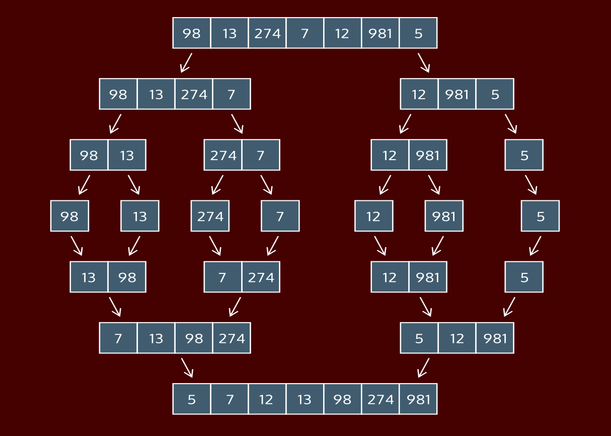

#### [Cheatsheet](https://www.codecademy.com/learn/sorting-algorithms/modules/cs-merge-sort/cheatsheet)

#### MERGE SORT: CONCEPTUAL

# [What Is A Merge Sort?](https://www.codecademy.com/courses/sorting-algorithms/lessons/merge-sort-conceptual/exercises/what-is-a-merge-sort)

Merge sort is a sorting algorithm created by John von Neumann in 1945. 
Merge sort’s “killer app” was the strategy that breaks the list-to-be-sorted into smaller parts, sometimes called a divide-and-conquer algorithm.

In a divide-and-conquer algorithm, the data is continually broken down into smaller elements until sorting them becomes really simple.

Merge sort was the first of many sorts that use this strategy, and is still in use today in many different applications.

