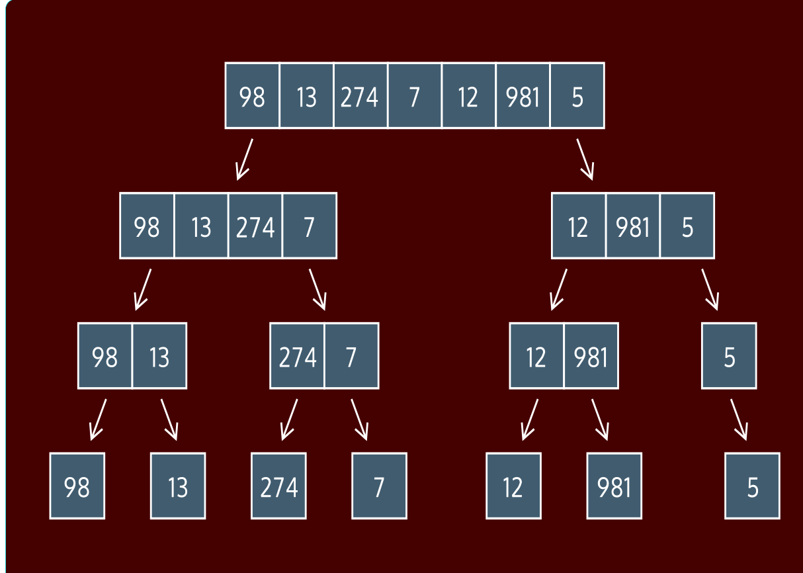
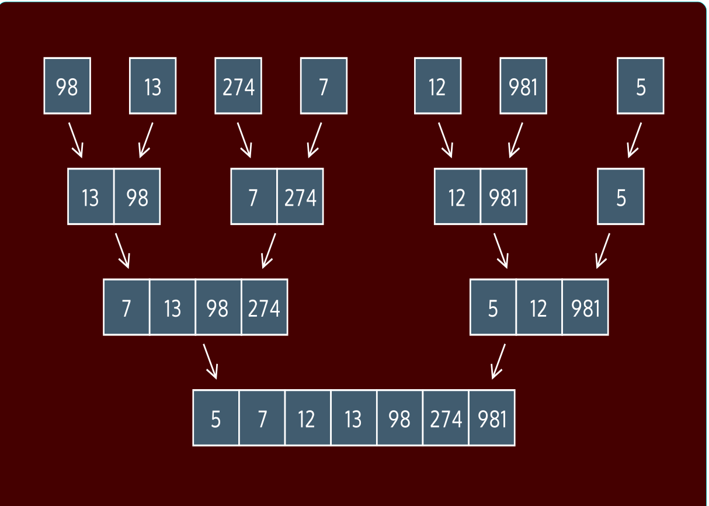

#### [Cheatsheet](https://www.codecademy.com/learn/sorting-algorithms/modules/cs-merge-sort/cheatsheet)

#### MERGE SORT: CONCEPTUAL

# [What Is A Merge Sort?](https://www.codecademy.com/courses/sorting-algorithms/lessons/merge-sort-conceptual/exercises/what-is-a-merge-sort)

Merge sort is a sorting algorithm created by John von Neumann in 1945. 
Merge sort’s “killer app” was the strategy that breaks the list-to-be-sorted into smaller parts, sometimes called a divide-and-conquer algorithm.

In a divide-and-conquer algorithm, the data is continually broken down into smaller elements until sorting them becomes really simple.

Merge sort was the first of many sorts that use this strategy, and is still in use today in many different applications.

# [How To Merge Sort:](https://www.codecademy.com/courses/sorting-algorithms/lessons/merge-sort-conceptual/exercises/how-to-merge-sort)

Merge sorting takes two steps: 
1. splitting the data into “runs” or smaller components, 
2. and the re-combining those runs into sorted lists (the “merge”).

When splitting the data, we divide the input to our sort in half. 
We then recursively call the sort on each of those halves, which cuts the halves into quarters. 
This process continues until all of the lists contain only a single element. 
Then we begin merging.

When merging two single-element lists, we check if the first element is smaller or larger than the other. 
Then we return the two-element list with the smaller element followed by the larger element.

# [Merging](https://www.codecademy.com/courses/sorting-algorithms/lessons/merge-sort-conceptual/exercises/merging)

When merging larger pre-sorted lists, we build the list similarly to how we did with single-element lists.

Let’s call the two lists `left` and `right`. 
Both `left` and `right` are already sorted. 
We want to combine them (to merge them) into a larger sorted list, let’s call it `both`. 
To accomplish this we’ll need to iterate through both with two indices, `left_index` and `right_index`.

At first `left_index` and `right_index` both point to the start of their respective lists. 
`left_index` points to the smallest element of `left` (its first element) and `right_index` points to the smallest element of `right`.

Compare the elements at `left_index` and `right_index`. 
The smaller of these two elements should be the first element of `both` because it’s the smallest of both! 
It’s the smallest of the two smallest values.

Let’s say that smallest value was in `left`. 
We continue by incrementing `left_index` to point to the next-smallest value in `left`. 
Then we compare the 2nd smallest value in `left` against the smallest value of `right`. 
Whichever is smaller of these two is now the 2nd smallest value of `both`.

This process of “look at the two next-smallest elements of each list and add the smaller one to our resulting list” continues on for as long as both lists have elements to compare. 
Once one list is exhausted, say every element from `left` has been added to the result, then we know that all the elements of the other list, `right`, 
should go at the end of the resulting list (they’re larger than every element we’ve added so far).

