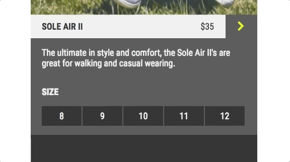

#### [Cheatsheet](https://www.codecademy.com/learn/learn-jquery/modules/learn-jquery-effects/cheatsheet)

#### LEARN JQUERY: EFFECTS

# [Introduction](https://www.codecademy.com/courses/learn-jquery/lessons/jquery-effects/exercises/effects-introduction)

jQuery Effects are a group of methods in the jQuery library that are responsible for adding dynamic behavior to websites. 
You may have seen many of these effects on modern websites without even realizing it. 
For example, you are seeing jQuery Effects in action when drop-down menus slide into place or a warning message appears after entering an incorrect password.

While adding dynamic behavior is possible using only JavaScript, the code to do so is somewhat long and confusing. 
The beauty of jQuery is how one or two lines of jQuery can replace long JavaScript code blocks.

In this course, you’ll learn how to make elements appear and disappear, fade in and out, and slide around the page. 
Let’s get started!

# [.hide()](https://www.codecademy.com/courses/learn-jquery/lessons/jquery-effects/exercises/hide)

The first tool you will add to your jQuery effects tool belt is the `.hide()` method. 
When you hide an element, your browser will render the HTML as if the hidden element does not exist. 
It will disappear from the page and the space that it was taking up will disappear as well. 
Take a look at the code below to learn how to use the `.hide()` method:
```javascript
$('.hide-arrow').on('click', () => {
  $('.shoe-information').hide();
});
```
In the example above, the event handler gets triggered whenever an element with a class of `hide-arrow` is `click`ed. 
That element could be a button, some text, an image, or any other HTML element. 
When the event is triggered, we target all elements of the class `shoe-information` and call `.hide()` on them. 
Check out the gif below to see an example.



In this gif, the `shoe-information` element hides when the `hide-arrow` button is clicked. 
Notice that the HTML elements below the `shoe-information` element move up to fill the space left by the hidden element.

# [.show()](https://www.codecademy.com/courses/learn-jquery/lessons/jquery-effects/exercises/show)

Now that we’ve learned how to hide elements on our page, we want to know how to make them reappear. 
Luckily, the `.show()` method does the opposite of `.hide()`. 
If an element on your page is hidden, `.show()` will make it appear.
```javascript
$('.show-arrow').on('click', () => {
  $('.shoe-information-2').show();
});
```
The code above should look similar to the code you wrote using `.hide()`. 
The only difference is that we are calling a different method on the targeted elements. 
This time we are calling the `.show()` method on the shoe’s textual information.

Check out the gif below to see `.show()` in action!


In this gif, all elements of class `shoe-information-2` appear when an element of class `show-arrow` is clicked.


