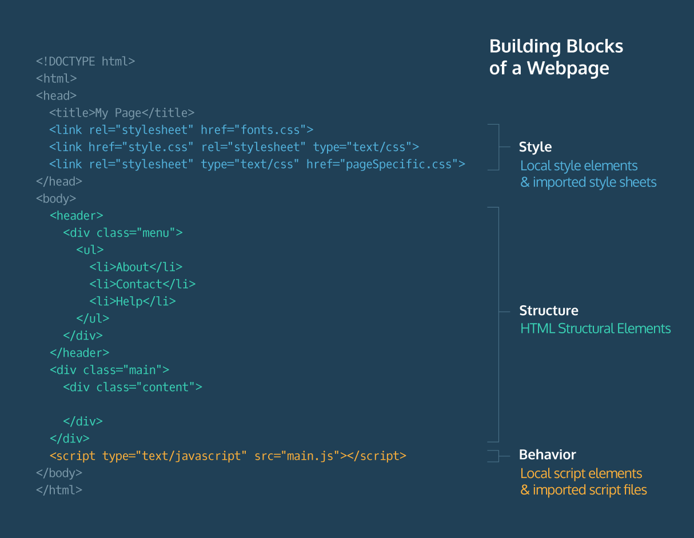

#### JQUERY SETUP

# [Why jQuery?](https://www.codecademy.com/courses/learn-jquery/lessons/jquery-setup/exercises/why-jquery)

JavaScript is the most widely-used language for adding dynamic behavior to web pages. 
The JavaScript community contributes to a collection of libraries that extend and ease its use. 
In this course, you will learn about jQuery, a JavaScript library that makes it easy to add dynamic behavior to HTML elements.

Let’s look at an example of how JavaScript is used to add dynamic behavior to a web page (don’t worry about understanding the code).
```JavaScript
const login = document.getElementById('login');
const loginMenu = document.getElementById('loginMenu');
 
login.addEventListener('click', () => {
  if(loginMenu.style.display === 'none'){
    loginMenu.style.display = 'inline';
  } else {
    loginMenu.style.display = 'none';
  }
});
```
In this example, JavaScript is used to apply behavior to an HTML element with id `login`. 
The behavior allows a user to click a **LOGIN** button that toggles a login form.

The code below accomplishes the same behavior with jQuery.
```JavaScript
$('#login').click(() => {
  $('#loginMenu').toggle()
});
```
In this example, the same toggle functionality is accomplished using just three lines of code.

# [jQuery Methods](https://www.codecademy.com/courses/learn-jquery/lessons/jquery-setup/exercises/jquery-methods)

In the last exercise, you used jQuery to cut twelve lines of code down to three.

Let’s use Legos as an analogy for understanding how jQuery works. 
With an infinite number of Legos, you could build an entire city — of course, this would take a long time. 
What if you were given pre-made Lego buildings, Lego roads, Lego parks, etc? 
You could build a city much faster.

The JavaScript language represents an infinite supply of Lego blocks — the possibilities are endless but time-consuming. 
The pre-made Lego structures are like jQuery methods. 
You can use these methods to add dynamic behavior, such as `.hide()`, `.show()`, `.fadeIn()`, `.fadeOut()` etc., to HTML elements.

The example in the last exercise took twelve lines of JavaScript, but was achieved with only three lines of jQuery’s `.click()` and `.toggle()` methods.

# [jQuery Library](https://www.codecademy.com/courses/learn-jquery/lessons/jquery-setup/exercises/jquery-library)

We are going to use jQuery to add some interactivity to the MOVE Gear site, an online marketplace for athletic apparel.

To use the jQuery library, **index.html** must load it with the other dependencies. 
Take a look at the attached diagram to see where various dependencies load in an HTML document.

The document is loaded from top to bottom. 
So the 
* style dependencies in the `<head>` will load first, 
* then the structural elements in the `<body>` will load next. 

It has become common practice to link the main JavaScript file at the bottom of the HTML document 
because a good deal of the content of the script will require that the dependencies, style sheets and elements exist 
before the browser can run the JavaScript that uses and references those things.

When you add the jQuery library to your project in the next exercise, you will do so on the line before the `</body>` tag. 
Because HTML files load from top to bottom, adding the jQuery library at the bottom of your project will ensure that it will not affect the HTML (structure) and CSS (style) load times.

The image below displays the structural separation of JavaScript, HTML, and CSS in an HTML file.




