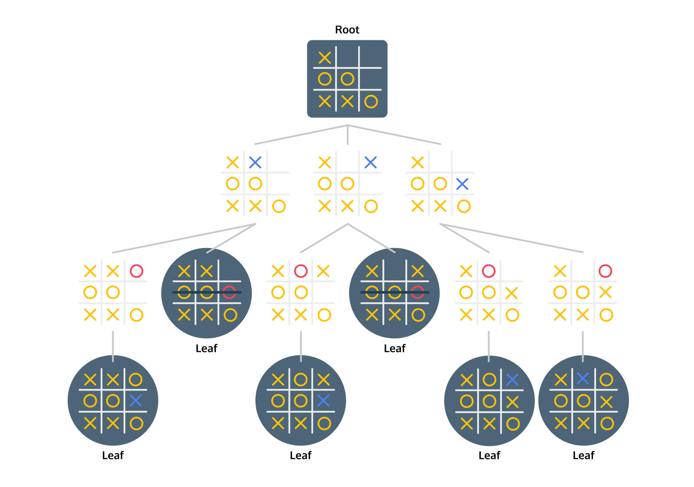

# [Games as Trees](https://www.codecademy.com/courses/machine-learning/lessons/minimax/exercises/tree)

Have you ever played a game against someone and felt like they were always two steps ahead? 
No matter what clever move you tried, they had somehow envisioned it and had the perfect counterattack. 
This concept of thinking ahead is the central idea behind the *minimax algorithm*.

The minimax algorithm is a decision-making algorithm that is used for finding the best move in a two player game. 
It’s a recursive algorithm — it calls itself. 
In order for us to determine if making move `A` is a good idea, we need to think about what our opponent would do if we made that move.

We’d guess what our opponent would do by running the minimax algorithm from our opponent’s point of view. 
In the hypothetical world where we made move `A`, what would they do? 
Surely they want to win as badly as we do, so they’d evaluate the strength of their move by thinking about what we would do if they made move `B`.

As this process repeats, we can start to make a tree of these hypothetical game states.
We’ll eventually reach a point where the game is over — we’ll reach a leaf of the tree.
Either we won, our opponent won, or it was a tie. 
At this point, the recursion can stop. 
Because the game is over, we no longer need to think about how our opponent would react if we reached this point of the game.

# [Tic-Tac-Toe](https://www.codecademy.com/courses/machine-learning/lessons/minimax/exercises/tic-tac-toe)

A board is represented as a list of lists. To print this board, use the `print_board()` function using `my_board` as a parameter.

Next, we want to be able to take a turn. 
The `select_space()` function lets us do this. Select space takes three parameters:
* The `board` that you want to take the turn on.
* The `space` that you want to fill in. This should be a number between `1` and `9`.
* The `symbol` that you want to put in that space. This should be a string — either an `"X"` or an `"O"`.

We can also get a list of the available spaces using `available_moves()` and passing the board as a parameter.

Finally, we can check to see if someone has won the game. 
The `has_won()` function takes the board and a symbol (either `"X"` or `"O"`). 
It returns `True` if that symbol has won the game, and `False` otherwise.

# [Detecting Tic-Tac-Toe Leaves](https://www.codecademy.com/courses/machine-learning/lessons/minimax/exercises/tic-tac-toe-leaves)

An essential step in the minimax function is *evaluating* the strength of a leaf.
If the game gets to a certain leaf, we want to know if that was a better outcome for player `"X"` or for player `"O"`.

Here’s one potential ***evaluation function***: 
* a leaf where player `"X"` wins evaluates to a `1`, 
* a leaf where player `"O"` wins evaluates to a `-1`, 
* and a leaf that is a tie evaluates to `0`.

First, we need to detect whether a board is a leaf — we need know if the game is over.
A game of Tic-Tac-Toe is over if either player has won, or if there are no more open spaces.
We can write a function that uses `has_won()` and `available_moves()` to check to see if the game is over.

If the game is over, we now want to evaluate the state of the board.
If `"X"` won, the board should have a value of `1`. 
If `"O"` won, the board should have a value of `-1`. 
If neither player won, it was a tie, and the board should have a value of `0`.

# [Evaluating Leaves](https://www.codecademy.com/courses/machine-learning/lessons/minimax/exercises/evaluate-leaves)

Let’s imagine a situation where you’re playing as the `"X"` player in a game of Tic-Tac-Toe and the game is almost over. 
The game board isn’t a leaf but it’s close. 
You have three possible moves. 
All three moves will immediately end the game — each of those future boards will be leaves.

Let’s say picking move A will result in you winning and moves B and C will each result in a tie. 
You’d clearly pick move A.

By picking move A, you’ve picked the move that led to the board with the highest value. 
You were picking between a `1` (an `"X"` win) or two `0`s (the moves that would lead to a tie). 
Because you picked the move with the highest value, we can say that `"X"` is the ***maximizing player***.

Let’s say you were playing a the `"O"` player under the same circumstances. 
Picking move A would somehow immediately lead to `"X"` winning, while moves B and C would lead to a tie. 
You’d pick one of the boards that would lead to a tie. 
`"O"` is the ***minimizing player***. 
You would love to pick a board with the value of `-1` (an `"O"` win), but unfortunately, that board doesn’t exist. 
You’ll have to settle with picking a board with the value of `0`. 
At least you prevent `X"` from winning.  

