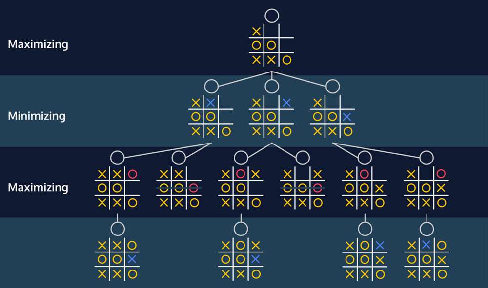

# [Games as Trees](https://www.codecademy.com/courses/machine-learning/lessons/minimax/exercises/tree)

Have you ever played a game against someone and felt like they were always two steps ahead? 
No matter what clever move you tried, they had somehow envisioned it and had the perfect counterattack. 
This concept of thinking ahead is the central idea behind the *minimax algorithm*.

The minimax algorithm is a decision-making algorithm that is used for finding the best move in a two player game. 
It’s a recursive algorithm — it calls itself. 
In order for us to determine if making move `A` is a good idea, we need to think about what our opponent would do if we made that move.

We’d guess what our opponent would do by running the minimax algorithm from our opponent’s point of view. 
In the hypothetical world where we made move `A`, what would they do? 
Surely they want to win as badly as we do, so they’d evaluate the strength of their move by thinking about what we would do if they made move `B`.

As this process repeats, we can start to make a tree of these hypothetical game states.
We’ll eventually reach a point where the game is over — we’ll reach a leaf of the tree.
Either we won, our opponent won, or it was a tie. 
At this point, the recursion can stop. 
Because the game is over, we no longer need to think about how our opponent would react if we reached this point of the game.


# [Tic-Tac-Toe](https://www.codecademy.com/courses/machine-learning/lessons/minimax/exercises/tic-tac-toe)

A board is represented as a list of lists. To print this board, use the `print_board()` function using `my_board` as a parameter.

Next, we want to be able to take a turn. 
The `select_space()` function lets us do this. Select space takes three parameters:
* The `board` that you want to take the turn on.
* The `space` that you want to fill in. This should be a number between `1` and `9`.
* The `symbol` that you want to put in that space. This should be a string — either an `"X"` or an `"O"`.

We can also get a list of the available spaces using `available_moves()` and passing the board as a parameter.

Finally, we can check to see if someone has won the game. 
The `has_won()` function takes the board and a symbol (either `"X"` or `"O"`). 
It returns `True` if that symbol has won the game, and `False` otherwise.

# [Detecting Tic-Tac-Toe Leaves](https://www.codecademy.com/courses/machine-learning/lessons/minimax/exercises/tic-tac-toe-leaves)

An essential step in the minimax function is *evaluating* the strength of a leaf.
If the game gets to a certain leaf, we want to know if that was a better outcome for player `"X"` or for player `"O"`.

Here’s one potential ***evaluation function***: 
* a leaf where player `"X"` wins evaluates to a `1`, 
* a leaf where player `"O"` wins evaluates to a `-1`, 
* and a leaf that is a tie evaluates to `0`.

First, we need to detect whether a board is a leaf — we need know if the game is over.
A game of Tic-Tac-Toe is over if either player has won, or if there are no more open spaces.
We can write a function that uses `has_won()` and `available_moves()` to check to see if the game is over.

If the game is over, we now want to evaluate the state of the board.
If `"X"` won, the board should have a value of `1`. 
If `"O"` won, the board should have a value of `-1`. 
If neither player won, it was a tie, and the board should have a value of `0`.

# [Evaluating Leaves](https://www.codecademy.com/courses/machine-learning/lessons/minimax/exercises/evaluate-leaves)

Let’s imagine a situation where you’re playing as the `"X"` player in a game of Tic-Tac-Toe and the game is almost over. 
The game board isn’t a leaf but it’s close. 
You have three possible moves. 
All three moves will immediately end the game — each of those future boards will be leaves.

Let’s say picking move A will result in you winning and moves B and C will each result in a tie. 
You’d clearly pick move A.

By picking move A, you’ve picked the move that led to the board with the highest value. 
You were picking between a `1` (an `"X"` win) or two `0`s (the moves that would lead to a tie). 
Because you picked the move with the highest value, we can say that `"X"` is the ***maximizing player***.

Let’s say you were playing a the `"O"` player under the same circumstances. 
Picking move A would somehow immediately lead to `"X"` winning, while moves B and C would lead to a tie. 
You’d pick one of the boards that would lead to a tie. 
`"O"` is the ***minimizing player***. 
You would love to pick a board with the value of `-1` (an `"O"` win), but unfortunately, that board doesn’t exist. 
You’ll have to settle with picking a board with the value of `0`. 
At least you prevent `X"` from winning.  
  
The root of the tree ends up with a value of `0`. This means that the best move for the current player is the move that corresponded with the value of `0`.

# [Copying Boards](https://www.codecademy.com/courses/machine-learning/lessons/minimax/exercises/copy)

One of the central ideas behind the minimax algorithm is the idea of exploring future hypothetical board states. 
Essentially, we’re saying if we were to make this move, what would happen. 
As a result, as we’re implementing this algorithm in our code, we don’t want to actually make our move on the board. 
We want to make a copy of the board and make the move on that one.
```
new_board = my_board
```
This won’t work the way we want it to! 
Python objects are saved in memory, and variables point to a location in memory. 
In this case, new_board, and my_board are two variables that point to the same object in memory. 
If you change a value in one, it will change in the other because they’re both pointing to the same object.

One way to solve this problem is to use the `deepcopy()` function from Python’s `copy` library.
```
new_board = deepcopy(my_board)
```
`new_board` is now a copy of my_board in a different place in memory.
When we change a value in `new_board`, the values in `my_board` will stay the same!

# [The Minimax Function](https://www.codecademy.com/courses/machine-learning/lessons/minimax/exercises/recursion)

The result of this function will be the “value” of the best possible move.
If the function returns a `1`, that means a move exists that guarantees that `"X"` will win.
If the function returns a `-1`, that means that there’s nothing that `"X"` can do to prevent `"O"` from winning.
If the function returns a `0`, then the best `"X"` can do is force a tie (assuming `"O"` doesn’t make a mistake).

Our `minimax()` function has two parameters:
* The first is the game state that we’re interested in finding the best move. 
When the `minimax()` function first gets called, this parameter is the current state of the game. 
We’re asking “what is the best move for the current player right now?”
* The second parameter is a boolean: `is_maximizing` representing whose turn it is.
If `is_maximizing` is `True`, then we know we’re working with the maximizing player. 
This means when we’re picking the “best” move from the list of moves, we’ll pick the move with the *highest value*.
If `is_maximizing` is `False`, then we’re the minimizing player and want to pick the *minimum value*.

## [Recursion In Minimax](https://www.codecademy.com/courses/machine-learning/lessons/minimax/exercises/recursion-ii)

We have our variable called `best_value`.
We’ve made a hypothetical board where we’ve made one of our potential moves.
We now want to know whether the value of that board is better than our current `best_value`.

In order to find the value of the hypothetical board, we’ll call `minimax()`.
But this time our parameters are different! 
The first parameter isn’t the starting board.
Instead, it’s `new_board`, the hypothetical board that we just made.

The second parameter is dependent on whether we’re the maximizing or minimizing player.
If `is_maximizing` is `True`, then the new parameter should be `False`.
If `is_maximizing` is `False`, then we should give the recursive call `True`.

It’s like we’re taking the new board, passing it to the other player, and asking “what would the value of this board be if we gave it to you?”

To give the recursive call the opposite of `is_maximizing`, we can give it `not is_maximizing`.

That call to `minimax()` will return the value of the hypothetical board.
We can then compare the value to our `best_value`.
If the value of the hypothetical board was better than `best_value`, then we should make that value the new `best_value`.

## [Which Move?](https://www.codecademy.com/courses/machine-learning/lessons/minimax/exercises/getting-move)
Our `minimax()` function is returning the value of the best possible move.
If our final answer is a `1`, we know that `"X"` should be able to win the game.

We first need to set up a variable to keep track of the best move (let’s call it `best_move`).
Whenever the algorithm finds a new `best_value`, `best_move` variable should be updated to be whatever move resulted in that value.

We want the algorithm to return best_move at the very end.
We’ll now return a list of two numbers — `[best_value, best_move]`.

# [Play a Game](https://www.codecademy.com/courses/machine-learning/lessons/minimax/exercises/play)

Our `minimax()` function is now returning a list of `[value, move]`.
`move` gives you the number you should pick to play an optimal game of Tic-Tac-Toe for any given game state.

This line of code instructs the AI to make a move as the "X" player:
```
select_space(my_board, minimax(my_board, True)[1], "X")
```

# [Review](https://www.codecademy.com/courses/machine-learning/lessons/minimax/exercises/review)

* A game can be represented as a tree. 
The current state of the game is the root of the tree, and each potential move is a child of that node. 
The leaves of the tree are game states where the game has ended (either in a win or a tie).
* The minimax algorithm returns the best possible move for a given game state. 
It assumes that your opponent will also be using the minimax algorithm to determine their best move.
* Game states can be evaluated and given a specific score. 
This is relatively easy when the game is over — the score is usually a 1, -1 depending on who won. 
If the game is a tie, the score is usually a 0.

