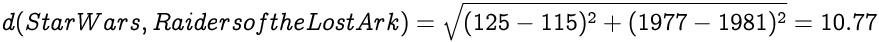
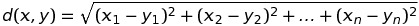

### K-NEAREST NEIGHBORS
# [K-Nearest Neighbors Classifier](https://www.codecademy.com/courses/machine-learning/lessons/knn/exercises/knn)
**K-Nearest Neighbors (KNN)** is a classification algorithm. 
The central idea is that data points with similar attributes tend to fall into similar categories.

If you have a dataset of points where the class of each point is known, you can take a new point with an unknown class, find it’s nearest neighbors, and classify it.

# [Introduction](https://www.codecademy.com/courses/machine-learning/lessons/knn/exercises/movies)
Consider a dataset of movies. 
Let’s brainstorm some features of a movie data point. 
A feature is a piece of information associated with a data point.

Let’s think about how we might want to classify a movie.
We’re going to be classifying movies as either good or bad.
In our dataset, we’ve classified a movie as good if it had an IMDb rating of 7.0 or greater.
Every “good” movie will have a class of `1`, while every bad movie will have a class of `0`.

# [Distance Between Points - 2D](https://www.codecademy.com/courses/machine-learning/lessons/knn/exercises/distance-two-d)
We need to define what it means for two points to be close together or far apart. 
To do this, we’re going to use the [Distance Formula](https://github.com/lendoo73/Challenge-Project-of-CodeCademy/tree/master/python/Learn_the_Basics_of_Machine_Learning/Classification_K_Nearest_Neighbors/Distance_formula).

For this example, the data has two dimensions:
* The length of the movie
* The movie’s release date

Consider Star Wars and Raiders of the Lost Ark. 
Star Wars is 125 minutes long and was released in 1977. 
Raiders of the Lost Ark is 115 minutes long and was released in 1981.

The distance between the movies is computed below:


# [Distance Between Points - 3D](https://www.codecademy.com/courses/machine-learning/lessons/knn/exercises/distance-three-d)
Making a movie rating predictor based on just the length and release date of movies is pretty limited. 
There are so many more interesting pieces of data about movies that we could use! So let’s add another dimension.

Let’s say this third dimension is the movie’s budget.
We now have to find the distance between these two points in three dimensions.

What if we’re not happy with just three dimensions?

The generalized distance formula between points `x` and `y` is as follows:



Using this formula, we can find the K-Nearest Neighbors of a point in N-dimensional space!
We now can use as much information about our movies as we want.
```
[(movie1[i] - movie2[i]) ** 2 for i in range(len(movie1))]) ** 0.5
```

We’ll implement the three steps of the K-Nearest Neighbor Algorithm:
* Normalize the data
* Find the k nearest neighbors
* Classify the new point based on those neighbors

# [1. Data with Different Scales: Normalization](https://www.codecademy.com/courses/machine-learning/lessons/knn/exercises/normalize)
When we added the dimension of budget, you might have realized there are some problems with the way our data currently looks.

The maximum difference between two movies’ release dates is about 125 years (The Lumière Brothers were making movies in the 1890s).
However, the difference between two movies’ budget can be millions of dollars.

The problem is that the distance formula treats all dimensions equally, regardless of their scale. The difference in one year is exactly equal to the difference in one dollar of budget.

The solution to this problem is to [normalize the data](https://github.com/lendoo73/Challenge-Project-of-CodeCademy/tree/master/python/Learn_the_Basics_of_Machine_Learning/Classification_K_Nearest_Neighbors/Normalization) so every value is between 0 and 1.
We’re going to be using *min-max normalization*.
```
def min_max_normalize(lst):
  minimum = min(lst)
  maximum = max(lst)
  normalized = []

  return [(val - minimum) / (maximum - minimum) for val in lst]
```
# [2. Finding the Nearest Neighbors](https://www.codecademy.com/courses/machine-learning/lessons/knn/exercises/find-neighbors)
Now that our data has been normalized and we know how to find the distance between two points, we can begin classifying unknown data!

We want to find the k nearest neighbors of the unclassified point.

In order to find the 5 nearest neighbors, we need to compare this new unclassified movie to every other movie in the dataset.
This means we’re going to be using the distance formula again and again.
We ultimately want to end up with a sorted list of distances and the movies associated with those distances.
```
def classify(unknown, dataset, k):
  distances = []
  
  for title in dataset:
    distance_to_point = distance(dataset[title], unknown)
    distances.append([distance_to_point, title])

  distances.sort()

  neighbors = distances[ : k]

  return neighbors
```
