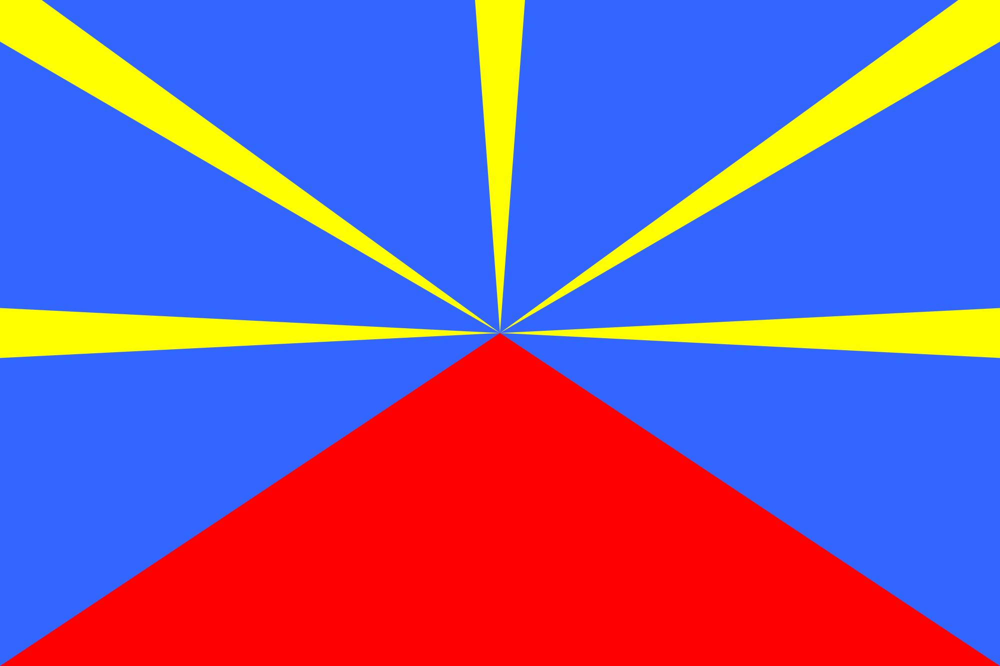

#### LEARN THE BASICS OF MACHINE LEARNING
# [Find the Flag](https://www.codecademy.com/courses/machine-learning/projects/ml-decision-trees-flags)

Can you guess which continent this flag comes from?  
  
What are some of the features that would clue you in? 
Maybe some of the colors are good indicators. 
The presence or absence of certain shapes could give you a hint. 
In this project, we’ll use decision trees to try to predict the continent of flags based on several of these features.

We’ll explore which features are the best to use and the best way to create your decision tree.
