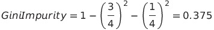
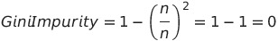
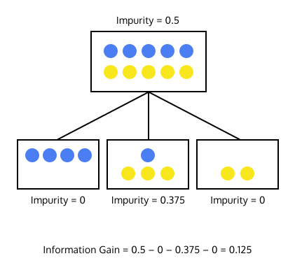

# [Decision Trees](https://www.codecademy.com/courses/machine-learning/lessons/ml-decision-trees/exercises/trees)

Decision trees are machine learning models that try to find patterns in the features of data points.

## [Making Decision Trees](https://www.codecademy.com/courses/machine-learning/lessons/ml-decision-trees/exercises/creating-trees)

If we’re given this magic tree, it seems relatively easy to make classifications.
Decision trees are supervised machine learning models, which means that they’re created from a training set of labeled data.
Creating the tree is where the *learning* in machine learning happens.


We begin with every point in the training set at the top of the tree.
These training points have labels — the red points represent students that didn’t get an A on a test and the green points represent students that did get an A on a test.

We then decide to split the data into smaller groups based on a feature.

Once we have these subsets, we repeat the process — we split the data in each subset again on a different feature.

Eventually, we reach a point where we decide to stop splitting the data into smaller groups. 
We’ve reached a leaf of the tree. We can now count up the labels of the data in that leaf. 
If an unlabeled point reaches that leaf, it will be classified as the majority label.

## [Gini Impurity](https://www.codecademy.com/courses/machine-learning/lessons/ml-decision-trees/exercises/impurity)

To find the Gini impurity, start at 1 and subtract the squared percentage of each label in the set.
```
impurity = 1
```
For example, if a data set had three items of class `A` and one item of class `B`, the Gini impurity of the set would be:  


If a data set has only one class, you’d end up with a Gini impurity of 0. The lower the impurity, the better the decision tree!  


```
def gini(labels):
  label_keys = set(labels)
  total_number_of_labels = len(labels)
  impurity = 1
  for label in label_keys:
    probability_of_label = labels.count(label) / total_number_of_labels
    impurity = impurity - probability_of_label ** 2
  return impurity
```

## [Information Gain](https://www.codecademy.com/courses/machine-learning/lessons/ml-decision-trees/exercises/information-gain)

We know that we want to end up with leaves with a low Gini Impurity, but we still need to figure out which features to split on in order to achieve this. 

To answer this question, we can calculate the information gain of splitting the data on a certain feature.
Information gain measures difference in the impurity of the data before and after the split.  
  


