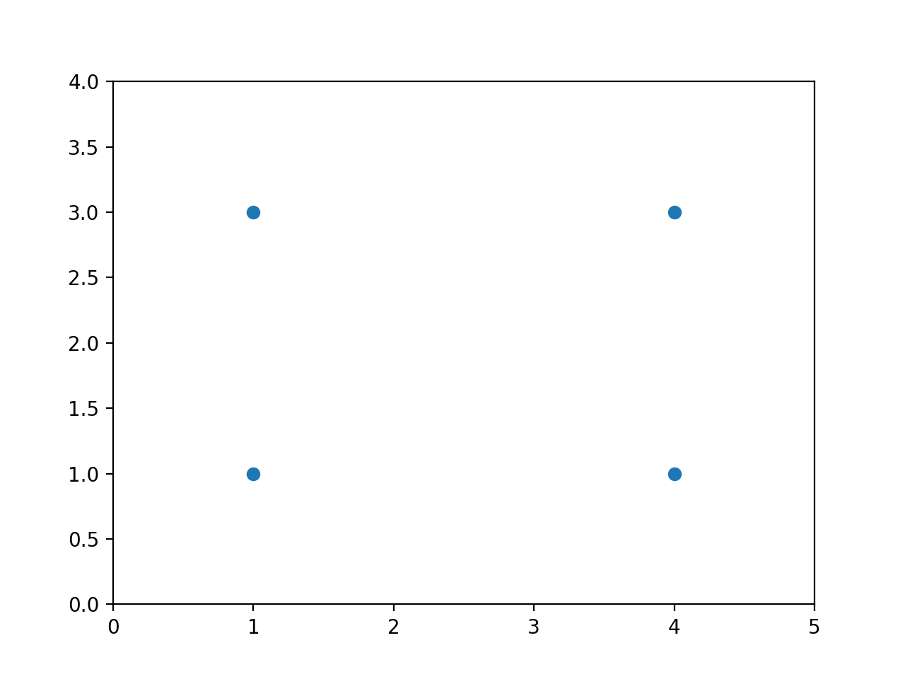

# K-Means++ Clusterin

## [Introduction to K-Means++](https://www.codecademy.com/courses/machine-learning/lessons/machine-learning-k-means-plus-plus/exercises/introduction)

The K-Means clustering algorithm is the most popular clustering algorithm for Machine Learning.

However, there can be some problems with its first step. 
In the traditional K-Means algorithms, the starting postitions of the centroids are intialized completely randomly.
This can result in suboptimal clusters.

K-Means++ changes the way centroids are initalized to try to fix this problem.

## [Poor Clustering](https://www.codecademy.com/courses/machine-learning/lessons/machine-learning-k-means-plus-plus/exercises/poor-clustering)

Suppose we have four data samples that form a rectangle whose width is greater than its height:

If you wanted to find two clusters (k = 2) in the data, which points would you cluster together?
You might guess the points that align vertically cluster together, since the height of the rectangle is smaller than its width.

Let’s say we use the regular K-Means algorithm to cluster the points, where the cluster centroids are initialized randomly.
We get unlucky and those randomly initialized cluster centroids happen to be the midpoints of the top and bottom line segments of the rectangle formed by the four data points.
