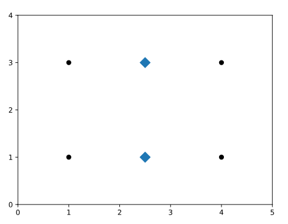
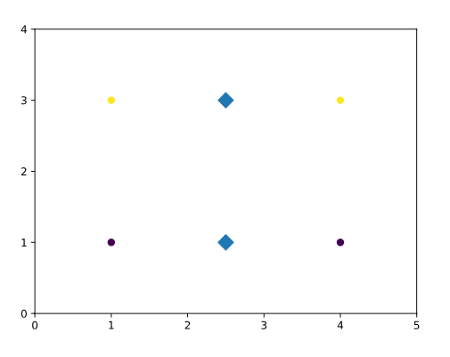

# K-Means++ Clustering

## [Introduction to K-Means++](https://www.codecademy.com/courses/machine-learning/lessons/machine-learning-k-means-plus-plus/exercises/introduction)

The K-Means clustering algorithm is the most popular clustering algorithm for Machine Learning.

However, there can be some problems with its first step. 
In the traditional K-Means algorithms, the starting postitions of the centroids are intialized completely randomly.
This can result in suboptimal clusters.

K-Means++ changes the way centroids are initalized to try to fix this problem.

## [Poor Clustering](https://www.codecademy.com/courses/machine-learning/lessons/machine-learning-k-means-plus-plus/exercises/poor-clustering)

Suppose we have four data samples that form a rectangle whose width is greater than its height:  


If you wanted to find two clusters (k = 2) in the data, which points would you cluster together?
You might guess the points that align vertically cluster together, since the height of the rectangle is smaller than its width.

Let’s say we use the regular K-Means algorithm to cluster the points, where the cluster centroids are initialized randomly.
We get unlucky and those randomly initialized cluster centroids happen to be the midpoints of the top and bottom line segments of the rectangle formed by the four data points.  
  
The algorithm would converge immediately, without moving the cluster centroids.
The two top data points are clustered together (yellow points) and the two bottom data points are clustered together (purple points).  
  
This is a suboptimal clustering because the width of the rectangle is greater than its height. 
The optimal clusters would be the two left points as one cluster and the two right points as one cluster, as we thought earlier.

## [What is K-Means++?](https://www.codecademy.com/courses/machine-learning/lessons/machine-learning-k-means-plus-plus/exercises/k-means-plus-plus)

**Step 1** of the K-Means algorithm is “Place k random centroids for the initial clusters”.

The K-Means++ algorithm replaces Step 1 of the K-Means algorithm and adds the following:
* **1.1** The first cluster centroid is randomly picked from the data points.
* **1.2** For each remaining data point, the distance from the point to its nearest cluster centroid is calculated.
* **1.3** The next cluster centroid is picked according to a probability proportional to the distance of each point to its nearest cluster centroid. 
This makes it likely for the next cluster centroid to be far away from the already initialized centroids.

**Repeat 1.2 - 1.3** until `k` centroids are chosen.

## [K-Means++ using Scikit-Learn](https://www.codecademy.com/courses/machine-learning/lessons/machine-learning-k-means-plus-plus/exercises/sklearn)

Using the [scikit-learn library](https://scikit-learn.org/stable/)
and its `cluster` module , you can use the `KMeans()` method to build an original K-Means model that finds 6 clusters like so:
```
model = KMeans(
  n_clusters = 6, 
  init = 'random'
)
```
The `init` parameter is used to specify the initialization and `init='random'` specifies that initial centroids are chosen as random (the original K-Means).

To  implement K-Means++:
* **Option 1:** You can adjust the parameter to `init='k-means++'`.
* **Option 2:** Simply drop the parameter. `KMeans(n_clusters=6)`; This is because that init=k-means++ is actually default in scikit-learn.

## [Review](https://www.codecademy.com/courses/machine-learning/lessons/machine-learning-k-means-plus-plus/exercises/review)

K-Means++ improves K-Means by placing initial centroids more strategically.
As a result, it can result in more optimal clusterings than K-Means.

It can also outperform K-Means in speed.
If you get very unlucky initial centroids using K-Means, the algorithm can take a long time to converge. 
K-Means++ will often converge quicker!

You can implement K-Means++ with the [scikit-learn library](https://scikit-learn.org/stable/modules/generated/sklearn.cluster.KMeans.html) 
similar to how you implement K-Means.

The `KMeans()` function has an init parameter, which specifies the method for initialization:
* `"random"`
* `"k-means++"` 

scikit-learn’s `KMeans()` uses `'k-means++'` by default


