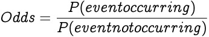
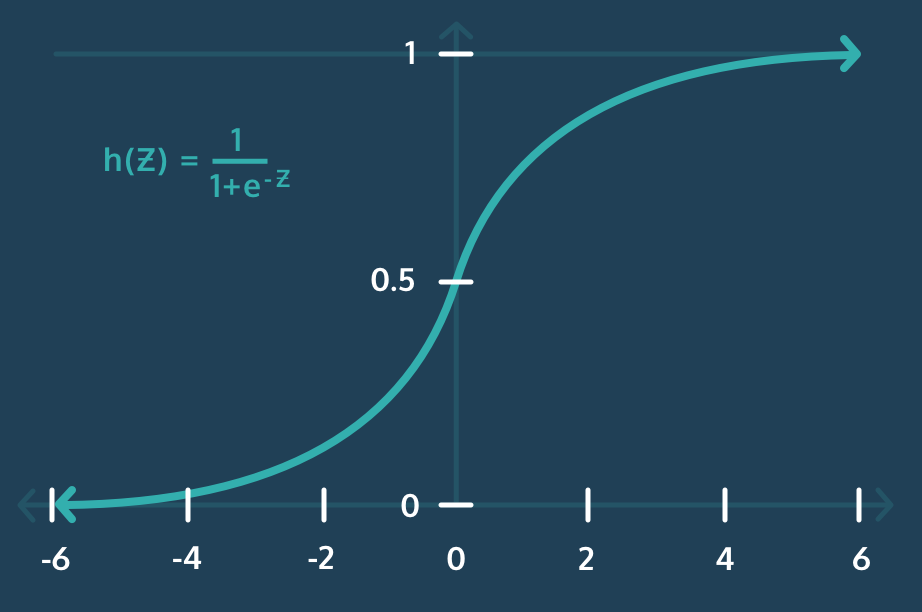
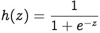

# [Introduction](https://www.codecademy.com/courses/machine-learning/lessons/logistic-regression/exercises/introduction)
Logistic Regression is a supervised machine learning algorithm that uses regression to predict the continuous probability, ranging from `0` to `1`, of a data sample belonging to a specific category, or class.
Then, based on that probability, the sample is classified as belonging to the more probable class, ultimately making Logistic Regression a classification algorithm.

The output of a Linear Regression model ranges from -∞ to +∞.
The output of a Linear Regression model does not provide the probabilities we need to predict (`0` or `1`).

# [Logistic Regression](https://www.codecademy.com/courses/machine-learning/lessons/logistic-regression/exercises/logistic)
In Logistic Regression we are also looking to find coefficients for our features, but this time we are fitting a logistic curve to the data so that we can predict probabilities.

To predict the probability of a data sample belonging to a class, we:
1. initialize all feature coefficients and intercept to `0`
2. multiply each of the feature coefficients by their respective feature value to get what is known as the *log-odds*
3. place the log-odds into the sigmoid function to link the output to the range `[0, 1]`, giving us a probability

By comparing the predicted probabilities to the actual classes of our data points, we can evaluate how well our model makes predictions and use [gradient descent](https://github.com/lendoo73/Challenge-Project-of-CodeCademy/tree/master/python/Analyze_Financial_Data_with_Python/Regression/Linear%20Regression/Tutorial) to update the coefficients and find the best ones for our model.

To then make a final classification, we use a classification threshold to determine whether the data sample belongs to the positive class or the negative class.

# [Log-Odds](https://www.codecademy.com/courses/machine-learning/lessons/logistic-regression/exercises/log-odds)
In Linear Regression we multiply the coefficients of our features by their respective feature values and add the intercept, resulting in our prediction, which can range from -∞ to +∞.

In Logistic Regression, we make the same multiplication of feature coefficients and feature values and add the intercept, but instead of the prediction, we get what is called the **log-odds**.

The log-odds are another way of expressing the probability of a sample belonging to the positive class, or a student passing the exam.
In probability, we calculate the odds of an event occurring as follows:



The odds tell us how many more times likely an event is to occur than not occur.

The log-odds are then understood as the logarithm of the odds!
```
def log_odds(features, coefficients, intercept):
  return np.dot(features, coefficients) + intercept
```

# [Sigmoid Function](https://www.codecademy.com/courses/machine-learning/lessons/logistic-regression/exercises/sigmoid)



The Sigmoid Function is a special case of the more general Logistic Function, where Logistic Regression gets its name.
By plugging the log-odds into the Sigmoid Function, defined below, we map the log-odds `z˙˙ to the range `[0, 1]`.



* e<sup>-z</sup> is the exponential function, which can be written in `numpy` as `np.exp(-z)`

This enables our Logistic Regression model to output the probability of a sample belonging to the positive class.
```
def sigmoid(z):
  denominator = 1 + np.exp(-z)
  return 1 / denominator
```

# [Log-Loss](https://www.codecademy.com/courses/machine-learning/lessons/logistic-regression/exercises/log-loss-i)
We need a way to evaluate how well a given model fits the data we have.

The function used to evaluate the performance of a machine learning model is called a *loss function*, or a *cost function*.
To evaluate how “good a fit” a model is, we calculate the loss for each data sample (how wrong the model’s prediction was) and then average the loss across all samples.
The loss function for Logistic Regression, known as **Log Loss**.
