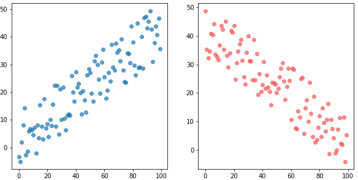

# [Introduction to Multiple Linear Regression](https://www.codecademy.com/courses/machine-learning/lessons/multiple-linear-regression-streeteasy/exercises/introduction)
Linear regression is useful when we want to predict the values of a variable from its relationship with other variables.
There are two different types of linear regression models: 
* simple linear regression and 
* multiple linear regression

In predicting the price of a home, one factor to consider is the size of the home. 
The relationship between those two variables, price and size, is important, but there are other variables that factor in to pricing a home: 
location, air quality, demographics, parking, and more.
When making predictions for price, our dependent variable, we’ll want to use multiple independent variables. 
To do this, we’ll use Multiple Linear Regression. 
**Multiple Linear Regression** uses two or more independent variables to predict the values of the dependent variable.
It is based on the following equation:
### *y = b + m<sub>1</sub>x<sub>1</sub> + m<sub>2</sub>x<sub>2</sub> + ... + m<sub>n</sub>x<sub>n</sub>*

# [Training Set vs. Test Set](https://www.codecademy.com/courses/machine-learning/lessons/multiple-linear-regression-streeteasy/exercises/training-vs-test)
We have to split our dataset into:
* **Training set:** the data used to fit the model
* **Test set:** the data partitioned away at the very start of the experiment (to provide an unbiased evaluation of the model)

 Putting 80% of your data in the training set and 20% of your data in the test set is a good place to start.
 ```
 from sklearn.model_selection import train_test_split
 
x_train, x_test, y_train, y_test = train_test_split(
  x, 
  y, 
  train_size = 0.8, 
  test_size = 0.2
)
 ```
* `train_size`: the proportion of the dataset to include in the train split (between 0.0 and 1.0)
* `test_size`: the proportion of the dataset to include in the test split (between 0.0 and 1.0)
* `random_state`: the seed used by the random number generator [optional]

To learn more, here is a [Training Set vs Validation Set vs Test Set article](https://www.codecademy.com/articles/training-set-vs-validation-set-vs-test-set).

# [Multiple Linear Regression: Scikit-Learn](https://www.codecademy.com/courses/machine-learning/lessons/multiple-linear-regression-streeteasy/exercises/scikit-learn)
The steps for multiple linear regression in scikit-learn are identical to the steps for simple linear regression. 
We need to import LinearRegression from the linear_model module:
```
from sklearn.linear_model import LinearRegression
```
Then, create a LinearRegression model, and then fit it to your x_train and y_train data:
```
mlr = LinearRegression()
 
mlr.fit(x_train, y_train)
```
We can also use the .predict() function to pass in x-values. It returns the y-values that this plane would predict:
```
y_predicted = mlr.predict(x_test)
```

# [Visualizing Results with Matplotlib](https://www.codecademy.com/courses/machine-learning/lessons/multiple-linear-regression-streeteasy/exercises/visualization)
Graphs can be created using Matplotlib’s pyplot module. 
```
# Create a scatter plot
plt.scatter(x, y, alpha=0.4)
 
# Create x-axis label and y-axis label
plt.xlabel("the x-axis label")
plt.ylabel("the y-axis label")
 
# Create a title
plt.title("title!")
 
# Show the plot
plt.show()
```

# [Multiple Linear Regression Equation](https://www.codecademy.com/courses/machine-learning/lessons/multiple-linear-regression-streeteasy/exercises/equation)
Now that we have implemented Multiple Linear Regression, we will learn how to tune and evaluate the model.

### Equation 6.1 
The equation for multiple linear regression that uses two independent variables:  
#### *y = b + m<sub>1</sub>x<sub>1</sub> + m<sub>2</sub>x<sub>2</sub>*

### Equation 6.2 
The equation for multiple linear regression that uses three independent variables:
#### *y = b + m<sub>1</sub>x<sub>1</sub> + m<sub>2</sub>x<sub>2</sub> + m<sub>3</sub>x<sub>3</sub>*

### Equation 6.3 
As a result, since multiple linear regression can use any number of independent variables, its general equation becomes:
#### *y = b + m<sub>1</sub>x<sub>1</sub> + m<sub>2</sub>x<sub>2</sub> + ... + m<sub>n</sub>x<sub>n</sub>*

* *m<sub>1</sub>, m<sub>2</sub>, m<sub>3</sub>, … m<sub>n</sub>* refer to the **coefficients**
* *b* refers to the intercept that you want to find.

You can plug these values back into the equation to compute the predicted y values.

The `.fit()` method gives the model two variables that are useful to us:
* `.coef_`: contains the coefficients
* `.intercept_`: contains the intercept

Coefficients are most helpful in determining which independent variable carries more weight. 
For example, a coefficient of -1.345 will impact the rent more than a coefficient of 0.238, with the former impacting prices negatively and latter positively.

# [Correlations](https://www.codecademy.com/courses/machine-learning/lessons/multiple-linear-regression-streeteasy/exercises/correlations)
In our Manhattan model, we used 14 variables, so there are 14 coefficients:
```
[[ 
  -302.73009383            # bedrooms - number of bedrooms
  1199.3859951             # bathrooms - number of bathrooms 
  4.79976742               # size_sqft - size in square feet
  -24.28993151             # min_to_subway - distance from subway station in minutes
  24.19824177              # floor - floor number
  -7.58272473              # building_age_yrs - building’s age in years
  -140.90664773            # no_fee - has no broker fee (0 for fee, 1 for no fee)
  48.85017415              # has_roofdeck - has roof deck (0 for no, 1 for yes)
  191.4257324              # has_washer_dryer - has in-unit washer/dryer (0/1)
  -151.11453388            # has_doorman - has doorman (0/1)
  89.408889                # has_elevator - has elevator (0/1)
  -57.89714551             # has_dishwasher - has dishwasher (0/1)
  -19.31948556             # has_patio - has patio (0/1)
  -38.92369828             # has_gym - has gym (0/1)
]]
```
To see if there are any features that don’t affect price linearly, let’s graph the different features against `rent`.

## Interpreting graphs
In regression, the independent variables will either have
* a *positive linear relationship* to the dependent variable,
* a *negative linear relationship*,
* or *no relationship*.

A negative linear relationship means that as X values increase, Y values will decrease. 
Similarly, a positive linear relationship means that as X values increase, Y values will also increase.

Graphically, when you see a downward trend, it means a negative linear relationship exists. 
When you find an upward trend, it indicates a positive linear relationship.  


# [Evaluating the Model's Accuracy](https://www.codecademy.com/courses/machine-learning/lessons/multiple-linear-regression-streeteasy/exercises/model-accuracy)
When trying to evaluate the accuracy of our multiple linear regression model, one technique we can use is **Residual Analysis**.

The difference between the actual value y, and the predicted value ŷ is the residual e.
#### *e = y - ŷ*
* *y*: the actual rent
* *ŷ*: the predicted rent
