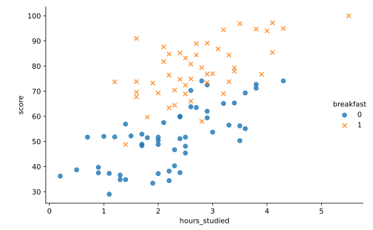

#### MULTIPLE LINEAR REGRESSION

# [Introduction to Multiple Regression](https://www.codecademy.com/courses/linear-regression-mssp/lessons/stats-multiple-linear-regression/exercises/introduction-to-multiple-regression)

Simple linear regression may be used to understand and make predictions about the relationship between two variables. 
But what happens when there are more than two variables?

When we want to understand the relationship between a quantitative variable and two or more predictor variables, we use multiple linear regression. 
In multiple linear regression, the response variable must be quantitative, while the predictors may be either quantitative, categorical, or a mix of both. 
For example, we might ask:
* How is blood pressure associated with exercise and anxiety level?
* What is the relationship between happiness scores and income level, family size, and marital status?

We can use the following code to create a plot to explore a dataset called survey. 
This fictional survey data measures students’ math scores (score), hours spent studying (hours_studied), and whether they ate breakfast on test day (breakfast).
```py
import seaborn as sns
import matplotlib.pyplot as plt
 
sns.lmplot(
    x = 'hours_studied', 
    y = 'score', 
    hue = 'breakfast', 
    markers = ['o', 'x'], 
    fit_reg = False, 
    data = survey
)
plt.show()
```

Note that we set `fit_reg` to `False` here. 
The `lmplot()` function will automatically fit and plot a regression line for us unless we specify otherwise.



Plot showing hours studied on the x-axis and score on the y-axis. 
Points colored blue for breakfast = 0 are mostly lower on both axes, while points colored orange for breakfast = 1 are mostly higher on both axes.

According to the plot:

1. More hours of studying seems to be associated with higher test scores.
2. The group that ate breakfast (` breakfast = 1`) appears to have a higher average test score than the group that didn’t (`breakfast = 0`).

Performing a multiple linear regression using these variables will allow us to quantify these relationships and understand whether they are likely to persist for new data.

