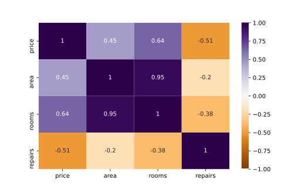

#### MULTIPLE LINEAR REGRESSION

# [Assumptions of Multiple Regression](https://www.codecademy.com/courses/linear-regression-mssp/lessons/stats-multiple-linear-regression/exercises/assumptions-of-multiple-regression)

When doing any type of statistical analysis, we should always keep the assumptions in mind. 
Multiple linear regression requires some of the same assumptions as simple linear regression:
1. Linear functional form, which can be assessed by plotting the outcome variable against the predictor variable and looking for a linear relationship
2. Normality, which can be assessed by plotting a histogram of the residuals and looking for an approximately normal distribution
3. Homoscedasticity, which can be assessed by plotting residuals against fitted values and confirming that there is no clear pattern

In addition, we also have to check that the predictors are not linearly related. 
This is referred to as **multicollinearity** and can lead to misleading results.

We can detect multicollinearity by checking the correlations between pairs of variables in our data. 
Correlations close to 1 or -1 may be considered too closely related to both be included in a model. 
The following code calculates the correlation pairs from dataset `df` and saves them as `corr_grid`.
```py
corr_grid = df.corr()
```
For easy visual detection, we can use Python’s `heatmap()` function from `seaborn` to create a heat map of correlations between quantitative variables in a dataset. 
The code to produce a heat map from `corr_grid` is shown below.
```py
sns.heatmap(
    corr_grid, 
    xticklabels = corr_grid.columns, 
    yticklabels = corr_grid.columns, 
    vmin = -1, 
    center = 0, 
    vmax = 1, 
    cmap = 'PuOr', 
    annot = True
)
plt.show()
```



Plot showing grid of paired correlations from   `-1` to `1` for variables `price`, `area`, `rooms`, and `repairs`. 
Higher absolute correlations are darker.

The heat map above is particularly dark purple (near 1) for the `area` and `rooms` variables, indicating a strong linear relationship (corr = 0.95). 
If we were running a multiple regression to predict `price`, we might decide to keep only one of those two variables in order to avoid multicollinearity.
