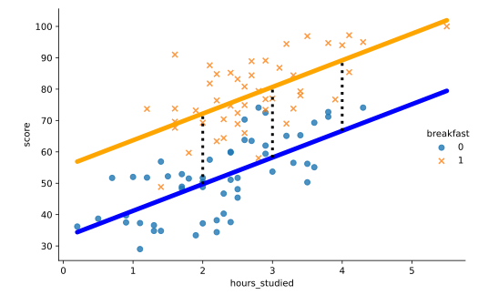

#### MULTIPLE LINEAR REGRESSION

# [Interpretation of Binary Categorical Variables](https://www.codecademy.com/courses/linear-regression-mssp/lessons/stats-multiple-linear-regression/exercises/interpretation-of-binary-categorical-variables)

While we can view a binary categorical variable as a way of creating two new regression equations with different intercepts, 
we don’t need to make these equations every time we want to interpret a binary predictor in a multiple regression equation.

In the `survey` dataset, `breakfast` is a binary variable that is equal to `1` for students who ate breakfast on test day and `0` for those who didn’t. 
For predicting `score` based on `hours_studied` and `breakfast`, the multiple regression equation is:
<h4>
    
<em><code>score = 32.7 + 8.5 * hours_studied + 22.5 * breakfast</code></em>

</h4>
Take a look at the scatter plot with regression lines on top:

Scatter plot showing hours studied on the x-axis and score on the y-axis. Parallel regression lines for each group of breakfast show a positive relationship between score and hours studied. Dashed vertical lines at 2, 3, and 4 hours studied show the same distance between the lines at these x values.
We can interpret the regression coefficients as follows:

The breakfast variable has a coefficient of 22.5. The interpretation is: holding all other variables constant, students who ate breakfast scored 22.5 points higher than students who did not. “Holding all other variables constant” means that we’re comparing breakfast groups among students who studied the same number of hours. Visually, this means that the distance between the two regression lines is always 22.5 for any value of hours_studied (the dotted lines in the picture above are all the same length).

The intercept (32.7) is the average value of the response variable when all predictors in the equation are equal to 0. According to our full regression equation, this means that students who didn’t study (hours_studied = 0) and didn’t eat breakfast (breakfast = 0) earned an average score of 32.7 (the y-intercept for the blue line).
