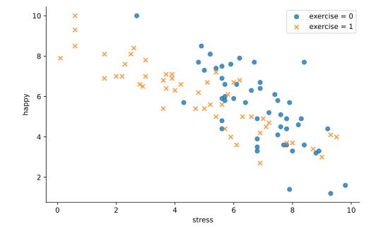
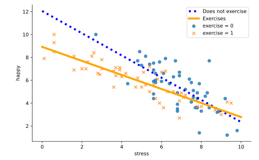
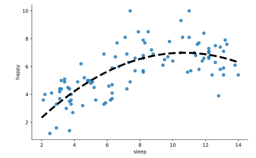

#### INTERACTIONS AND POLYNOMIAL TERMS

# [Why We Need Interaction and Polynomial Terms](https://www.codecademy.com/courses/linear-regression-mssp/lessons/stats-interactions-and-polynomial-terms-in-multiple-regression/exercises/why-we-need-interaction-and-polynomial-terms)

In the real world, most relationships between variables are difficult to describe with one simple straight line. 
For example, consider the code and scatter plot below showing happiness level (y-axis) versus stress level (x-axis) colored by exercise.
```py
import seaborn as sns
import matplotlib.pyplot as plt

sns.lmplot(
    x = 'stress', 
    y = 'happy', 
    hue = 'exercise', 
    markers = ['o','x'], 
    fit_reg = False, 
    data = happiness
)
plt.show()
``` 



Scatter plot showing happy level on the y-axis against stress level on the x-axis. 
Points for the exercise group are given as orange crosses and those for the non-exercise group are given as blue circles.

Imagine drawing two lines through the points: one for the orange crosses of the exercise group and one for the blue circles of the non-exercise group. 
Your lines might look something like this:



Scatter plot showing happy level on the y-axis against stress level on the x-axis. 
Points for the exercise group are given as orange crosses and those for the non-exercise group are given as blue circles. 
Two negatively sloped lines intersect starting at different intercepts: a solid orange line for the exercise group and a dotted blue line for the non-exercise group.

Note that the lines have both different intercepts AND different slopes. 
This means that exercise may modify the relationship between happiness and stress.

Other times, the relationship between two variables appears more CURVILINEAR, or curved in shape, than straight.



Scatter plot showing happy level verses amount of sleep. 
From left to right, the points increase, peak, and then begin to decrease. 
A dashed line follows the curve of the points.

When we are using multiple regression to investigate the relationship between more than two variables, 
we may use interaction and polynomial terms to capture more complex relationships among the variables. 
To do this in Python, we modify our regression model formula to include extra terms. 
As a result, we also have to adjust our interpretations to match the new complexity of the model.
