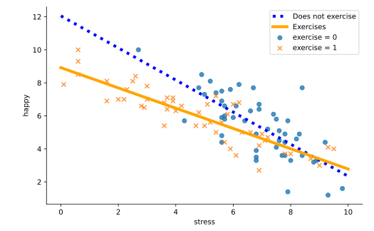
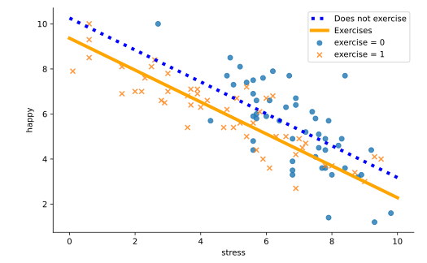

#### INTERACTIONS AND POLYNOMIAL TERMS

# [Visualizing Interactions: Binary and Quantitative](https://www.codecademy.com/courses/linear-regression-mssp/lessons/stats-interactions-and-polynomial-terms-in-multiple-regression/exercises/visualizing-interactions-binary-and-quantitative)

Let’s return to a plot we saw in Exercise #1.



Scatter plot showing happy level on the y-axis against stress level on the x-axis. 
Points for the exercise group are given as orange crosses and those for the non-exercise group are given as blue circles. 
Two negatively sloped lines intersect starting at different intercepts: a solid orange line for the exercise group and a dotted blue line for the non-exercise group.

The data for this plot is from a fictional study on happiness that measures the following variables about its participants:
* `happy` – their happiness level on a quantitative scale of 1 to 10
* `stress` – their stress level on a quantitative scale of 1-10
* `exercise` – whether they exercise regularly, where 1 = yes and 0 = no

We have drawn in a line estimating the relationship between stress and happiness for each exercise group. 
The line for the group that exercises appears flatter than that for the non-exercise group.

This indicates that `exercise` might modify the relationship between stress and happiness. 
Perhaps regular exercise buffers the effects of stress on happiness. 
Or perhaps people who exercise are also likely to do stress-reducing activities like meditation. 
While we don’t know the exact reason, we do see a potential difference when we examine the exercise groups separately.

If we fit a regression modeling `happy` from the quantitative predictor `stress` and the binary predictor `exercise`, we get the following results:
```py
import statsmodels.api as sm

model = sm.OLS.from_formula(
    'happy ~ stress + exercise', 
    data = happiness
).fit()

print(model.params)

# Output:
# Intercept    10.256296
# stress       -0.707925
# exercise     -0.894058
```
Using these coefficients, we can plot two lines with differing intercepts for each exercise group.



Scatter plot showing happy versus stress with two parallel lines: A lower one for the exercise group and a higher one for the non-exercise group.

Our lines have different intercepts, but seem to be missing the steeper slope of the points for the non-exercise group. 
Since a model for `happy` with just `stress` and `exercise` as predictors only allows for the intercepts to differ, 
we must add an interaction term to our model to capture the difference in slopes.
