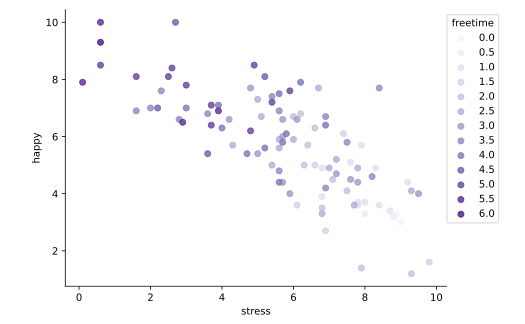

#### INTERACTIONS AND POLYNOMIAL TERMS

# [Interactions: Two Quantitative](https://www.codecademy.com/courses/linear-regression-mssp/lessons/stats-interactions-and-polynomial-terms-in-multiple-regression/exercises/interactions-two-quantitative)

In the last few exercises we examined interactions between a quantitative predictor and a binary predictor, 
but we may also wish to use an interaction term for two quantitative variables. 
Consider the scatter plot of `happy` versus `stress`, this time colored by the quantitative variable `freetime`, 
which represents the number of hours of free time a participant has on average each day.

Scatter plot showing happy versus stress colored by the number of hours of free time, ranging from 0 to 6, becoming progressively darker in color as the value increases. 
Darker points are found in the upper lefthand corner becoming progressively lighter as the points move in a negative direction across the plot.

If we divided the points into groups based on their `freetime` value and fit a regression line for each group, would all the lines have the same slope?
* If we wanted to fit a line amongst the darker points (`freetime` between 5 and 6), the line might have a flat but negative slope.
* In contrast, a line for lighter points (`freetime` between 0 and 2) might be steeper in slope.

Thus, if we wanted to fit a regression for this data, we might consider fitting several lines for different values of `freetime` rather than a single one across all points. 
Much like in the previous exercises, we can achieve this by adding a term to the model for the interaction of `stress` and `freetime`.
