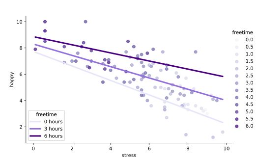

#### INTERACTIONS AND POLYNOMIAL TERMS

# [Interpreting and Visualizing Interactions: Two Quantitative](https://www.codecademy.com/courses/linear-regression-mssp/lessons/stats-interactions-and-polynomial-terms-in-multiple-regression/exercises/interpreting-and-visualizing-interactions-two-quantitative)

Now that you’ve seen that an interaction term for two quantitative variables creates regression lines for each value of one of the interacting variables, 
let’s visualize this in a plot. 
We start with code for a scatter plot of `happy` against `stress` colored by `freetime`:
```py
import seaborn as sns
import matplotlib.pyplot as plt

sns.lmplot(
    x = 'stress', 
    y = 'happy', 
    hue = 'freetime', 
    palette = 'Purples', 
    fit_reg = False, 
    data = happiness
)
```
Next, we’ll add lines to the plot for a few sample values of `freetime`: 0, 3, and 6 hours. 
Rather than write out each model coefficient, we can call them directly from `modelQ`, where we stored our regression results in the last exercise. 
Here is the code to add lines for 3 and 6 hours of free time:
```py
plt.plot(
    happiness.stress, 
    modelQ.params[0] + modelQ.params[1] * happiness.stress + modelQ.params[2] * 3 + modelQ.params[3] * happiness.stress * 3, 
    color = 'mediumpurple', 
    linewidth = 3
)
 
plt.plot(
    happiness.stress, 
    modelQ.params[0] + modelQ.params[1] * happiness.stress + modelQ.params[2] * 6 + modelQ.params[3] * happiness.stress * 6, 
    color = 'indigo', 
    linewidth = 3
)
 
# Add legend and show plot
plt.legend(['0 hours','3 hours','6 hours'])
plt.show()
```



Scatter plot showing happy versus stress colored by the number of hours of free time, ranging from 0 to 6, becoming progressively darker in color as the value increases. 
Darker points are found in the upper lefthand corner becoming progressively lighter as the points move in a negative direction across the plot. 
Additionally, 3 lines are plotted for 0, 3, and 6 hours of free time. 
The slopes of the lines become progressively flatter as free time increases.

Just as we saw in the regression equations in the last exercise, the intercepts and slopes both increase by 0.19 and 0.04, respectively, for each additional hour of free time. 
In context, the relationship between stress and happiness appears to be negative. 
However, this flattening of the slope with increasing amounts of free time might be interpreted as stress impacting happiness less negatively as people have more free time.

This is NOT to say that the data shows that stress CAUSES unhappiness, or that free time CAUSES stress to be less impactful on happiness, 
just that the association between happiness and stress looks different for people with different amounts of free time.
