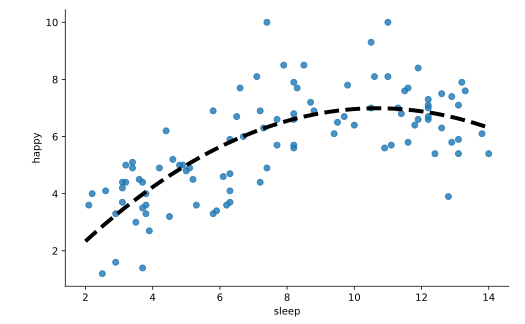

#### INTERACTIONS AND POLYNOMIAL TERMS

# [Fitting Polynomial Terms in Python](https://www.codecademy.com/courses/linear-regression-mssp/lessons/stats-interactions-and-polynomial-terms-in-multiple-regression/exercises/fitting-polynomial-terms-in-python)

At the beginning of this lesson, we mentioned that the relationship between variables often does not appear to be a straight line and may instead be somewhat curved. 
In this case, we may produce a better fitting regression model by adding a polynomial term that raises our predictor variable to a higher exponent 
to better account for the curving.

In the Python library `statsmodels.api`, polynomial terms can be added to a multiple regression model formula 
by adding a term with the predictor of interest raised to a higher power. 
This may be done using the NumPy function `np.power` and specifying the predictor name and degree.



Scatter plot showing happy level versus amount of sleep. 
From left to right, the points increase, peak, and then begin to decrease. 
A dashed line follows the curve of the points.

For example, the plot above suggests a curvilinear relationship between happiness (`happy`) and hours slept on average (`sleep`). 
We can add a quadratic (squared) term for the variable `sleep` by doing the following:
```py
import statsmodels.api as sm
import numpy as np

modelP = sm.OLS.from_formula(
    'happy ~ sleep + np.power(sleep,2)', 
    data = happiness
).fit()

print(modelP.params)
 
# Output:
# Intercept            -0.058995
# sleep                 1.320429
# np.power(sleep, 2)   -0.061827
```
This creates a second predictor term in the model with an additional coefficient. 
Correspondingly, the new term shows up in our model equation as `sleep` squared.

happy = -.06 + 1.32*sleep - .06*sleep2

We can check happiness scores by substituting in different values of sleep.

For 2 hours of sleep:

happy = -.06 + 1.32*2 - .06*22 = 2.34

For 10 hours of sleep:

happy = -.06 + 1.32*10 - .06*102 = 7.14

For 14 hours of sleep:

happy = -.06 + 1.32*14 - .06*142 = 6.66

Our curved model picks up on the pattern that beyond about 10 hours of sleep, more sleep is not associated with greater happiness. Perhaps the people who sleep a lot are ill so they need more sleep and are less happy, or perhaps sleeping too much causes problems in other parts of their lives that takes away from their happiness. We can’t know the exact cause from our model, just the association.

Note that we can use Python and our model results to perform the above computations for us. Below is code to compute happy when sleep is 10 and 14. Since we use exact rather than rounded numbers here, the results are slightly different but more accurate than our original work.

print(modelP.params[0] + modelP.params[1]*10 + modelP.params[2]*np.power(10,2))
# Output:
# 6.9626120786831445
print(modelP.params[0] + modelP.params[1]*14 + modelP.params[2]*np.power(14,2))
# Output:
# 6.308953414816589
