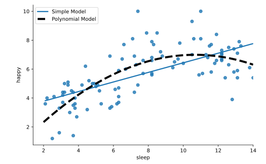

#### INTERACTIONS AND POLYNOMIAL TERMS

# [Interpreting Polynomial Terms](https://www.codecademy.com/courses/linear-regression-mssp/lessons/stats-interactions-and-polynomial-terms-in-multiple-regression/exercises/interpreting-polynomial-terms)

The results of the regression from the previous exercise, saved as `modelP`, modeled happiness level from hours of sleep with a polynomial term. 
The model coefficients are given below:
```py
import statsmodels.api as sm
import numpy as np

modelP = sm.OLS.from_formula(
    'happy ~ sleep + np.power(sleep,2)', 
    data = happiness
).fit()

print(modelP.params)
 
# Output:
# Intercept            -0.058995
# sleep                 1.320429
# np.power(sleep, 2)   -0.061827
```
It is generally difficult to interpret the coefficients on polynomial terms directly, 
but we can interpret the overall relationship if we visualize our regression line on the scatter plot. 
We can plot the regression line for `happy` predicted by `sleep` WITHOUT a polynomial term by excluding the `fit_reg = False` argument in `lmplot()`. 
However, note that we’ve added `ci = None` to prevent the function from plotting a confidence interval.
```py
import seaborn as sns
import matplotlib.pyplot as plt
import numpy as np

sns.lmplot(
    x = 'sleep', 
    y = 'happy', 
    ci = None, 
    data = happiness
)
```
To add our curved regression line to the scatter plot, we first create a dataset of 100 values of `sleep` ranging from 2 to 14 (saved as `x`) 
and 100 predicted values of `happy` from our regression equation (saved as `y`). 
Then we plot our `x` and `y` values using `plt.plot()` and add a legend.
```py
x = np.linspace(2, 14, 100)
y = modelP.params[0] + modelP.params[1] * x + modelP.params[2] * np.power(x, 2)
 
plt.plot(
    x, 
    y, 
    linestyle = 'dashed', 
    linewidth = 4, 
    color = 'black'
)

plt.legend(['Simple Model','Polynomial Model'])

plt.show()
```



Scatter plot of happy against sleep. 
A dashed line in black for the polynomial model follows the curved pattern of the points. 
A solid blue line runs straight across the plot in a positive direction for the simple regression model.

From the plot of the polynomial regression line, we see that happiness increases as sleep increases, 
but that the increase slows as sleep reaches around 10 hours and then begins to decrease with further hours of sleep.

The simple regression line misses these details and describes the relationship as a steady increase in happiness for any additional hour of sleep. 
Thus, the polynomial model captures a more detailed relationship that will make our predictions better.
