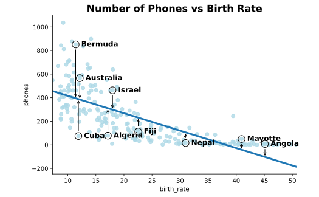

# [Log Transformations (and More)](https://www.codecademy.com/courses/linear-regression-mssp/articles/data-transformations-for-multiple-linear-regression)

Learn when to use a log transformation of the dependent variable of your linear regression and how to interpret the resulting regression equation.

## Introduction

When fitting a linear regression model, we use interaction and polynomial terms to capture complex relationships and improve predictive accuracy. 
We create these new terms by multiplying predictors together or by raising them to higher exponential powers and then add our new predictors to our model. 
These are examples of transformations of predictor variables, but sometimes we may want to transform the response (dependent) variable instead. 
This article will specifically explore when it might make sense to perform a log transformation of the response variable to improve a multiple linear regression model 
and how to interpret the resulting regression equation.

## When to use a log transform

Using a logarithm to transform the response variable may make sense if we notice either or both of the following when checking the assumptions for linear regression:
1. The residuals appear skewed, violating the normality assumption. 
This can happen if the relationship we are trying to model is non-linear.
2. There appears to be a pattern or asymmetry in the plot of residuals vs. fitted values, violating the homoscedasticity assumption. 
This can (also) happen due to a non-linear relationship or if there is more variation in the outcome variable for particular values of a predictor.

Somtimes, violated regression assumptions (as described above) indicate that we simply should not use a linear regression model; 
but if transforming the response variable appears to correct these violations, we may be justified in (carefully) proceeding!

## Example Dataset

As an example, we’ll use a dataset called `countries` which is a cleaned subset of larger dataset from [Kaggle](https://www.kaggle.com/fernandol/countries-of-the-world). 
This dataset contains variables for 221 countries for the years 1970-2017, including the following:
* **`birth_rate`** – a country’s birth rate as births per 1000 people
* **`phones`** – a country’s number of phones per 1000 people

Though the concepts in this article certainly apply to multiple linear regression, we’ll use a simple linear regression as an example. 
Let’s say we are interested in predicting `phones` from `birth_rate` using a linear model. 
First, let’s read in the dataset, examine the first few observations, and look at a scatter plot of **number of phones versus birth rate**.
```py
import pandas as pd
import seaborn as sns
import matplotlib.pyplot as plt
 
countries = pd.read_csv('countries.csv')
print(countries.head())
 
# Scatter plot with regression line
sns.lmplot(
    x = 'birth_rate',
    y = 'phones',
    ci = None,
    data = countries
)

plt.title('Number of Phones vs Birth Rate', fontsize = 16, weight = 'bold')
plt.show()
```
|  | country |	birth_rate |	phones |
| ---- | --- | --- | --- |
| 0 |	Afghanistan |	46.60 |	3.2 |
| 1 |	Albania |	15.11 |	71.2 |
| 2 |	Algeria |	17.14 |	78.1 |
| 3 |	AmericanSamoa |	22.46 |	259.5 |
| 4 |	Andorra |	8.71 |	497.2 |



Scatter plot of phones on the y-axis plotted against birth rate on the x-axis. The pattern appears negative, but the points are widely dispersed on the left and narrow to almost a flat line of points as we move right. The automatically plotted regression line shows a negative relationship, but cuts through curves in the pattern of points. The points of nine countries are highlighted and their residuals are drawn in. From left to right across the plot the countries are: Bermuda, Cuba, Australia, Algeria, Israel, Fiji, Nepal, Mayotte, and Angola.

The scatter plot shows a negative correlation between phones and birth_rate. However, there are some indications that a simple linear regression may not be appropriate for this data:

The relationship between phones and birth_rate is more curved than linear
There is more variation in phones for small values of birth_rate than for large values
To highlight this, we’ve circled some countries in the plot and have drawn arrows from the points down to the regression line–these are the residuals for these points. We can see a lot of variability in the size of residuals for low birth rates, with very minimal variability for higher birth rates.

To better check our regression assumptions, we can fit the regression in Python using the following code and save both the residuals and predicted response values as the objects residuals1 and fitted_values1, respectively.

import statsmodels.api as sm
 
# Fit regression model
model1 = sm.OLS.from_formula('phones ~ birth_rate', data=countries).fit()
# Save fitted values and residuals
'fitted_values1' = model1.predict(countries)
'residuals1' = countries.phones - fitted_values1
Now we’ll produce some plots to check the modeling assumptions of normality and homoscedasticity of the residuals.

# Check normality of residuals
plt.hist(residuals1)
plt.title('Model 1: Histogram of Residuals', fontsize=16, weight='bold')
plt.show()
 
# Check variance of residuals
plt.scatter(fitted_values1, residuals1)
plt.axhline(y=0, color='black', linestyle='-', linewidth=3)
plt.title('Model 1: Residuals vs Fitted Values', fontsize=16, weight='bold')
plt.show()
Histogram of residuals that is right skewed.

Scatter plot of residuals versus fitted values that shows points clustered close together on the left, widening dramatically as we move from left to right.

In the histogram, we see some right skewing caused by the few very high residuals for countries like Bermuda, indicating we may not be meeting the normality assumption. Perhaps more concerning, the scatter plot of residuals against fitted values shows a wave-like pattern from narrow to wide, rather than the constant spread we look for to indicate that homoscedasticity has been met. We’ve additionally highlighted the same countries in the scatter plot again so we can see how their residuals map out in this plot compared to where we saw them in the original.

Log Transformation in Python
Since we see two potential assumption violations, we are going to try a log transformation of the phones variable and check if it improves our concerns. In Python, we can easily take the log of phones using the NumPy function log(). Let’s add this new variable to our dataset and see how it looks compared to phones. Note that, generally, when we see log with no specified base in a statistics equation, we can assume the base is e (the mathematical constant 2.718…). In other words, log with no base means we are taking the natural log, or ln. Also, note that we can only take the log of a variable with values greater than zero; the log of values less than or equal to zero are undefined.

import numpy as np
# Save log_phones to dataset
countries['log_phones'] = np.log(countries.phones)
print(countries.head())
country	birth_rate	phones	log_phones
0	Afghanistan	46.60	3.2	1.163151
1	Albania	15.11	71.2	4.265493
2	Algeria	17.14	78.1	4.357990
3	AmericanSamoa	22.46	259.5	5.558757
4	Andorra	8.71	497.2	6.208992
We can see that this transformation has drastically reduced the range of values for our dependent variable. Let’s run a second model predicting log_phones from birth_rate and see what else has changed.

# Fit regression model
model2 = sm.OLS.from_formula('log_phones ~ birth_rate', data=countries).fit()
# Save fitted values and residuals
'fitted_values2' = model2.predict(countries)
'residuals2' = countries.log_phones - fitted_values2
If we examine the scatter plot of log_phones against birth_rate, we can see a big change in the appearance of our data:

Scatter plot of log phones versus birth rate. The pattern is still negative, but the points now fit closer to the regression line and are more evenly spaced around it.

While there’s some crowding in the upper lefthand corner, the pattern now appears much more linear and more evenly spaced about the regression line. Specifically, countries that had larger residuals earlier (like Bermuda and Australia) are now much closer to the line and each other vertically. Likewise, countries that had small residuals earlier (like Mayotte and Angola) are now further from the line and each other vertically. This change is reflected in both the histogram of the residuals (now much less skewed) and the scatter plot of the residuals versus the fitted values (now much more evenly spaced across the line y = 0).

Histogram of residuals that is more bell-shaped than the first skewed histogram.

Scatter plot of residuals against fitted values that shows a more even spread of points about the line y = 0 compared to the first model's scatter plot of residuals against fitted values.

Interpretation
While it’s great that our new variable seems to be better meeting our model assumptions, how do we interpret the coefficients in our model now that logs are involved? First, let’s look at the output of the model predicting log_phones from birth_rate and write out the regression equation:

print(model2.params)
# Output:
# Intercept     7.511024
# birth_rate   -0.130456
log(phones) = 7.51 - 0.13*birth\_ratelog(phones)=7.51−0.13∗birth_rate
We can always interpret the coefficient on birth_rate in the traditional way: for every increase of one birth per 1000 people, the natural log of phones decreases by 0.13 phones per 1000 people. While this is accurate, it’s not very informative about the relationship between phones and birth_rate. To examine this relationship, we need to do a little math with logs and exponentiation.

To get a more direct relationship between phones and birth_rate, we first have to exponentiate the coefficient on birth_rate. This means we raise e to the power of the coefficient on birth_rate. We may write this as e-0.13, or more simply as exp(-0.13), and we can use NumPy to compute this in Python. In short, we’re doing this because exponentiating both sides of the regression equation cancels out the log on phones, but we’ll save the more thorough explanation for the bonus section at the end of this article.

import numpy as np
np.exp(-0.13)
# Output
# 0.8780954309205613
Then we also subtract 1 to change our coefficient into an easily readable percentage change:

np.exp(-0.13)-1
# Output:
# -0.1219045690794387
We are now ready to interpret this coefficient: for every additional birth per 1000 people, the number of phones per 1000 people decreases by about 12.2 PERCENT. Our interpretation changes from the traditional additive relationship, where increases in the predictor are associated with differences in UNITS of the outcome, to a multiplicative relationship, where increases in the predictor are associated with differences in the PERCENTAGE of the outcome.

We also see this change in the interpretation of the intercept: rather than the arithmetic mean, the exponentiated intercept exp(7.51) is the geometric mean number of phones for countries with a birth rate of 0. The arithmetic mean is computed by SUMMING values, while the geometric mean is computed by MULTIPLYING values.

Conclusion
Log transformations of the dependent variable are a way to overcome issues with meeting the requirements of normality and homoscedasticity of the residuals for multiple linear regression. Unfortunately, a log transformation won’t fix these issues in every case (it may even make things worse!), so it’s important to reassess normality and homoscedasticity after making the transformation and running the new model. Log transformations can also be performed on predictors, and there are other dependent variable transformations available as well (e.g., square-rooting). To learn more about some of these transformations, check out the Penn State Statistics Department’s website.

Bonus: Logs in more detail
Why did taking the log of the dependent variable help?
As we recall from the scatter plot of phones versus birth_rate, there were a lot of large positive residuals for lower birth rates and a lot of smaller residuals for higher birth rates. Taking the log of phones brought the large residuals lower and the small residuals higher, which gave us a more even spread with less extremes. But why did this happen? Let’s take a quick look at what happens as e is raised to higher exponents. Note that we use 2.718 as an approximation of e here.

power	epower	multiplied	output	difference
1	e1	2.718	2.718	—
2	e2	2.718*2.718	7.388	4.670
3	e3	2.718*2.718*2.718	20.079	15.409
4	e4	2.718*2.718*2.718*2.718	54.576	34.497
5	e5	2.718*2.718*2.718*2.718*2.718	148.336	93.760
6	e6	2.718*2.718*2.718*2.718*2.718*2.718	403.178	254.842
As we can see from the table, every time the power e is raised to increases, the output nearly triples. This means the difference in the outputs between low powers is smaller than the difference in outputs between larger powers. Taking the log of the output column “undoes” this process, returning the corresponding value in the power column (e.g., log(2.718) = 1, log(7.388) = 2, etc.).

In terms of our dataset, the output column is like the raw phones values, and the power column is the new log_phones variable. Big differences in the upper values of phones translate to the same size jump on the log_phones scale as small differences in the lower values of phones. Thus, translated to the log scale, the large values of phones (like those of Bermuda and Australia) pull in, while the small values of phones (like those of Mayotte and Angola) spread out.

Why do we interpret the exponentiated coefficients on the predictors as percentage differences of the dependent variable?
Let’s say birth_rate0 is a value of birth_rate and phones0 is the value of phones at birth_rate0 such that:

log(phones_0) = 7.51 - 0.13*birth\_rate_0log(phones 
0
​
 )=7.51−0.13∗birth_rate 
0
​
 
Let’s also say phones1 is the value of phones when birth_rate is increased by 1 birth from birth_rate0. Then,

log(phones_1) = 7.51 - 0.13*(birth\_rate_0 + 1)log(phones 
1
​
 )=7.51−0.13∗(birth_rate 
0
​
 +1)
Next, we distribute the -0.13 and substitute log(phones0) for 7.51 - 0.13*birth_rate0. Then we subtract log(phones0) from both sides to isolate the birth_rate coefficient of -0.13.

log(phones_1) = 7.51 - 0.13*birth\_rate_0 - 0.13log(phones 
1
​
 )=7.51−0.13∗birth_rate 
0
​
 −0.13
log(phones_1) = log(phones_0) - 0.13log(phones 
1
​
 )=log(phones 
0
​
 )−0.13
log(phones_1) - log(phones_0) = -0.13log(phones 
1
​
 )−log(phones 
0
​
 )=−0.13
Finally, by the quotient rule, we find that our coefficient on birth_rate is equal to a single log. We exponentiate both sides to find our exponentiated coefficient on birth_rate is equal to a simple quotient that gives the percentage change in the phones variable between phones0 and phones1.

log(\frac{phones_1}{phones_0}) = -0.13log( 
phones 
0
​
 
phones 
1
​
 
​
 )=−0.13
exp(log(\frac{phones_1}{phones_0})) = exp(-0.13)exp(log( 
phones 
0
​
 
phones 
1
​
 
​
 ))=exp(−0.13)
\frac{phones_1}{phones_0} = exp(-0.13) 
phones 
0
​
 
phones 
1
​
 
​
 =exp(−0.13)
